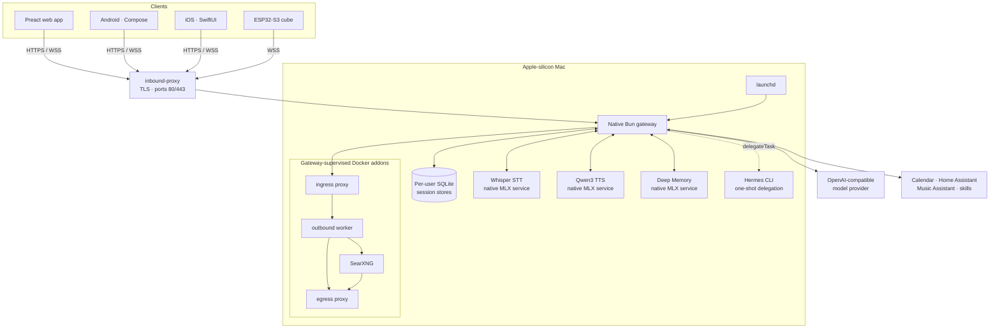
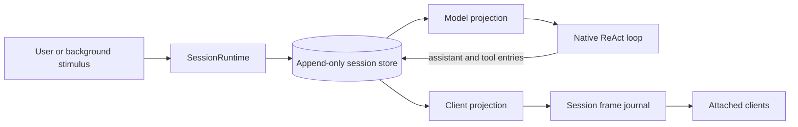

# Architecture

Sentient is a family voice and text assistant hosted on an Apple-silicon Mac.
The gateway, speech services, memory engine, clients, and addon containers live
in this repository.

## Runtime topology

Production runs the compiled gateway under `launchd`. The default GUI
LaunchAgent keeps releases below `~/.sentient/gateway`; the optional headless
LaunchDaemon uses `/opt/sentient`. The gateway supervises native addons and
Docker containers. Docker Compose builds addon images; it does not run the
production gateway. The Raspberry Pi deployment is retired.

## Gateway agent runtime

The Bun gateway is the agent runtime. It owns:

- prompt construction and OpenAI-compatible provider calls;
- the streamed ReAct loop and native function calls;
- prompt caching and gateway-side compaction;
- tool discovery, role checks, per-tool permissions, and confirmation;
- cancellation, background-task stimuli, and TTS streaming;
- durable sessions, reconnect replay, and multi-connection fan-out.

Hermes is not the runtime and is not a managed service. `delegateTask` may
launch a configured Hermes CLI process for one background task. The subprocess
exits when that task finishes, and its result returns to the owning session as
a stimulus.

## Sessions and storage

A server-minted `sessionId` identifies one `SessionRuntime`. Multiple authorized
connections may attach to that runtime as windows onto the same conversation.
The runtime serializes turns so only one ReAct loop writes a session at a time.
Input arriving during a turn can steer the next loop iteration; background
completion can steer the active turn or start a follow-up turn.

Each user has a separate SQLite store. Its append-only entry stream is the
source of truth for model context and client history:

Live frames are a rendering optimization. Once a turn settles, live output and
store replay must converge. Compaction appends a marker rather than rewriting
history: the model projection uses the compacted suffix while the client can
still render the complete conversation.

## Voice and memory

Clients send text or Opus audio to the gateway. Native Whisper performs speech
recognition; streamed assistant text feeds native Qwen3 TTS. Barge-in and Stop
abort the active turn and speech, while delegated background work continues.

Canonical long-term memory is Markdown plus session history. The optional Deep
Memory service maintains a derived local hybrid index for Spark recall and
`memory_recall`; it is not the canonical store. The gateway owns retrieval
policy, scope checks, content
screening, and nightly consolidation; the Python service owns local indexing
and MLX embeddings.

## Tools and authority

Identity becomes authority only through the `AccessManager`. An immutable
`UserPrincipal` is exchanged for attenuated capabilities held by resource
handles. Tools do not read an ambient current user.

A model-emitted tool call is a request, not authorization. The `ToolBroker`
checks the capability, role, configured permission, and any required human
confirmation at execution time. Tool and retrieval results are untrusted input
when they return to the model.

Native tools cover gateway-owned capabilities such as memory, skills,
calendar, Home Assistant, and Music Assistant. Containerized addons are reached
from the host over loopback or through the ingress proxy according to their
network policy. Internal-only containers leave through the egress path.

## Clients

- The Preact web app is the production household client.
- Android and iOS are thin native UIs over the shared Kotlin Multiplatform SDK
  and data layers. They implement chat, sessions, voice controls, settings,
  permissions, and task state; physical acoustic validation remains ongoing.
- The ESP32-S3 cube and its companion devtool are development clients. The cube
  still needs alignment with parts of the current session protocol.

The wire contract is documented in
[`shared/protocol/WIRE.md`](shared/protocol/WIRE.md).

## Deployment and state

The supported production path is
[`deploy/mac-prod/`](deploy/mac-prod/README.md). The health-gated installer
stages a release, atomically updates the active `current` symlink, restarts the
`launchd` job, and rolls back if gateway or edge health fails.

The default GUI install keeps mutable state, secrets, and releases under
`~/.sentient`; the optional system install keeps executable releases under
root-owned `/opt/sentient`. Native speech and memory services bind loopback.
Docker addon ports are loopback-only except for the dedicated public edge on
ports 80 and 443.

For implementation contracts, see the current designs for the
[native orchestrator](docs/superpowers/specs/2026-07-23-sentient-2.0-native-orchestrator-design.md),
[native host](docs/superpowers/specs/2026-07-29-native-stack-migration-design.md),
[session model](docs/superpowers/specs/2026-08-02-session-model-and-multi-surface-design.md),
and [memory system](docs/superpowers/specs/2026-08-08-memory-system-design.md).
