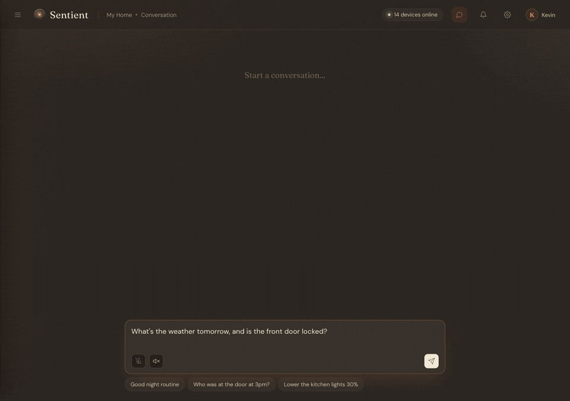
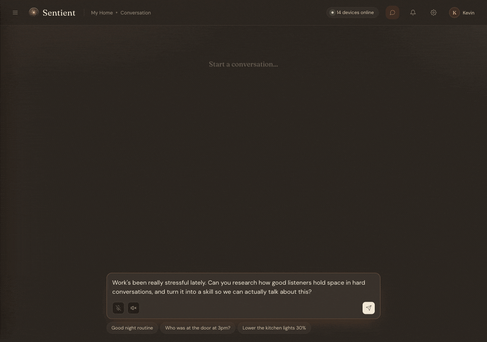
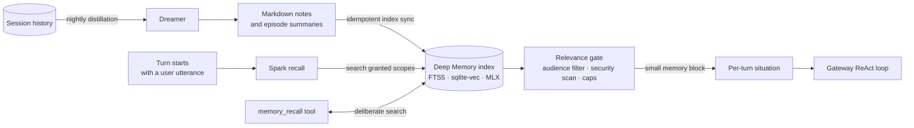
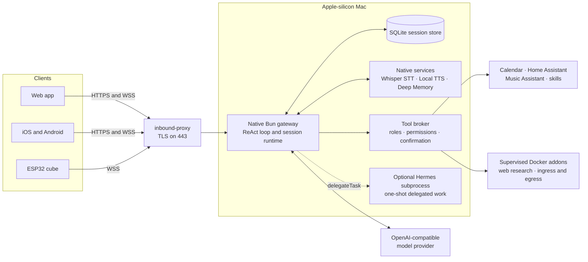

# Sentient

Sentient is an open-source voice and text assistant I run for my family. A
native Bun gateway on an Apple-silicon Mac connects the clients, local speech
and memory services, language-model providers, and household tools.

This repository contains the gateway, web and mobile clients, ESP32 firmware,
shared SDKs, local capability services, and the deployment used by the personal
production system.

> **Project status:** the gateway and web app serve one household in production.
> The iOS and Android apps are under active development. The ESP32 cube is a
> development client and is not yet aligned with the complete current wire
> protocol. The supported full-stack host is Apple-silicon macOS; the Raspberry
> Pi deployment is retired.

## Demo

These were recorded against the real local stack. Tool-call pauses are
shortened; the model responses, tool calls, and memory recall are not scripted.

**One request across web search and Home Assistant**



**Recall, research, and a reusable skill**



## What works

- Streaming speech with local Whisper STT and local Qwen3 TTS.
- Text chat with streamed replies and visible tool progress.
- Barge-in and explicit interruption.
- Durable, gateway-owned sessions that can be opened from more than one client,
  with REST history and WebSocket gap-fill after reconnects.
- Long-term personal and household memory. Indexed recall and background
  consolidation are available when the optional Deep Memory service is configured.
- Optional background delegation through a separately installed Hermes CLI.
  Delegated work can continue after the spoken response is stopped.
- First-class tools for web research, calendar, Home Assistant, Music Assistant,
  memory, and reusable skills.
- Role-aware, per-tool permissions with confirmation for actions that need a
  person in the loop.
- A browser setup wizard for model providers, household accounts, and optional
  integrations.

## Deep Memory and Spark

Most assistant memory is either always stuffed into the prompt or fetched only
when the model decides to call a tool. Sentient uses both durable notes and a
custom associative recall path called **Spark**.

The canonical memory is plain Markdown that can be inspected, edited, and backed
up. A derived local index combines SQLite FTS5 search with MLX multilingual
embeddings. At the start of each conversational turn, Spark searches with the
utterance that opened the turn, across private memory and any permitted
household memory. This happens before the first model call and uses no LLM call
of its own.



Spark is deliberately conservative. Relevance decides whether a memory may
surface; recency only orders the memories that passed, so an old but strongly
related experience can still return. At most three short snippets enter the
turn under the default rough 250-token estimate. Superseded memories are excluded,
child sessions filter adult-only family entries, and recalled text crosses the
same inbound security gate as other untrusted context. If nothing is relevant,
the index is unavailable, or the 500 ms deadline expires, the turn continues
without a memory block.

The model can still use `memory_recall` when it needs to search deliberately and
open the relevant part of an earlier conversation. The nightly Dreamer creates
episode summaries and reconciles durable facts. The index is derived rather than
canonical; the durable sources are the Markdown memory and session history. See the
[Memory System design](docs/superpowers/specs/2026-08-08-memory-system-design.md)
for the storage, scoring, safety, and household-scope contracts.

## Architecture



The gateway is the agent runtime. It owns provider calls, prompt construction,
tool dispatch, compaction, cancellation, and session state. Hermes is not a
standing worker or managed service; it is launched only for a delegated
one-shot task.

Security authority starts with an immutable user principal, passes through the
access manager, and reaches tools as an attenuated capability. A tool call
produced by a model is a request, not authorization. The tool broker checks the
person's role and tool permission again at execution time.

The gateway is also the host supervisor. It starts the native speech and memory
services as child processes and manages the Docker addons. Production runs the
gateway under `launchd`; Docker Compose is used to build addon images, not to
run the gateway.

## Clients

| Client | Current state |
|---|---|
| Web | Production use in one household. Supports chat, voice, history, calendar, settings, permissions, and administration. |
| iOS and Android | Active development. Text chat, history, settings, voice controls, permissions, and task state are implemented. Full acoustic voice-loop validation is still in progress. |
| ESP32 cube | Development hardware with a companion flashing and diagnostics tool. Its firmware still needs alignment with parts of the current session protocol. |

The shared protocol is documented in [`shared/protocol/WIRE.md`](shared/protocol/WIRE.md).

## Run the local stack

The full stack currently requires an Apple-silicon Mac. You also need:

- [Bun](https://bun.sh/)
- Docker Desktop
- JDK 21
- Python 3.14 for Whisper STT and Deep Memory
- Python 3.11 for Local TTS
- Homebrew `opus` and `ffmpeg`

Install the host and JavaScript dependencies first:

```bash
brew install openjdk@21 python@3.14 python@3.11 opus ffmpeg
```

Then clone the repository:

```bash
git clone <repo-url> sentient
cd sentient
source scripts/env.sh
bun install
```

The three native services need repository-local virtual environments and
user-owned config files before the first run. Their dependency sets are large
because they include the local MLX models and audio stack.

```bash
python3.14 -m venv capabilityServices/WhisperSTTService/.venv
capabilityServices/WhisperSTTService/.venv/bin/pip install \
  -r capabilityServices/WhisperSTTService/requirements.txt

python3.11 -m venv capabilityServices/LocalTTSService/.venv
capabilityServices/LocalTTSService/.venv/bin/pip install \
  -r capabilityServices/LocalTTSService/requirements.txt

python3.14 -m venv capabilityServices/DeepMemoryService/.venv
capabilityServices/DeepMemoryService/.venv/bin/pip install \
  -r capabilityServices/DeepMemoryService/requirements.txt

mkdir -p ~/.sentient/{whisper-stt,local-tts,deep-memory}/config
cp -n capabilityServices/WhisperSTTService/config/config.example.yaml \
  ~/.sentient/whisper-stt/config/config.yaml
cp -n capabilityServices/LocalTTSService/config/config.example.yaml \
  ~/.sentient/local-tts/config/config.yaml
cp -n capabilityServices/DeepMemoryService/config/config.example.yaml \
  ~/.sentient/deep-memory/config/config.yaml

bash scripts/dev-stage-code.sh

# Required only for indexed recall and background memory consolidation.
export DEEP_MEMORY_ADMIN_TOKEN="$(openssl rand -hex 32)"
export DEEP_MEMORY_DATA_TOKEN="$(openssl rand -hex 32)"

bun run dev
```

The first start downloads the configured speech and embedding models. File-based
memory works without the two Deep Memory tokens; indexed recall and background
consolidation do not.

Open **<https://localhost/>** and accept the development certificate. The setup
wizard collects the model-provider key and creates the first household account.
If it asks for the bootstrap unlock code:

```bash
cat ~/.sentient/.bootstrap-unlock
```

Secrets are stored in `~/.sentient/secrets/keys.yaml`, not in the repository.
Model prompts are sent to the configured provider. Ollama Cloud is the turnkey
default, and the wizard accepts custom OpenAI-compatible endpoints. OpenRouter
currently needs one additional setting after the wizard: set
`orchestrator.provider.base_url` to `https://openrouter.ai/api/v1` in
`gateway/config.yaml` for development, then restart the stack. Speech recognition
and synthesis run locally on the Mac.

Background delegation is also optional. It requires the upstream
[Hermes CLI](https://hermes-agent.nousresearch.com/docs/getting-started/installation)
on `PATH` and a configured profile. Verify it before starting Sentient:

```bash
hermes setup
hermes -p default -z "say ok"
```

The gateway continues to run without Hermes, but `delegateTask` is unavailable.

Useful stack commands:

```bash
bun run stack:status
bun run stack:down
```

`https://localhost:8888` is the gateway's loopback diagnostic endpoint. It is
not the URL to give another client.

## Production deployment

Production uses an Apple-silicon Mac mini. The release installer verifies the
bundle, stages native service environments, installs the gateway under
`launchd`, checks gateway and edge health, and rolls back a failed release.

Start with [`deploy/README.md`](deploy/README.md), which documents the current
native-host release and installer flow.

Do not use `docker compose up` for the current stack and do not hand-start a
production gateway. The gateway is a native host process; its lifecycle belongs
to `launchd` and `deploy/mac-prod/setup-prod.py`.

## Repository map

| Path | Purpose |
|---|---|
| `gateway/` | Native LLM runtime, WebSocket and REST gateway, tools, auth, session store, and service supervisor |
| `gateway/webui/` | Preact browser client |
| `shared/protocol/` | Wire messages and protocol contract |
| `shared/web-sdk/` | Browser SDK |
| `shared/mobile-sdk/`, `shared/mobile-data/` | Kotlin Multiplatform SDK and mobile data layer |
| `android/`, `ios/` | Thin native clients over the shared mobile layers |
| `esp32/cube/` | ESP32-S3 hardware client firmware |
| `esp32/devtool/` | Host-side flashing, logging, capture, and diagnostics tool |
| `capabilityServices/` | Local STT, TTS, and memory services |
| `deploy/mac-prod/` | Release packaging, installer, launchd definitions, and addon image builds |

## Design and development references

- [Native agent runtime design](docs/superpowers/specs/2026-07-23-sentient-2.0-native-orchestrator-design.md)
- [Native host and addon migration](docs/superpowers/specs/2026-07-29-native-stack-migration-design.md)
- [Session and multi-surface model](docs/superpowers/specs/2026-08-02-session-model-and-multi-surface-design.md)
- [Memory System design](docs/superpowers/specs/2026-08-08-memory-system-design.md)
- [Wire protocol](shared/protocol/WIRE.md)
- [Contributing](CONTRIBUTING.md)

Common checks:

```bash
source scripts/env.sh
bun run lint
bun run typecheck
bun run test:unit
# or all three
bun run ci
```

## License

Sentient is licensed under the [MIT License](LICENSE). Third-party software and
model licenses are listed in [`THIRD_PARTY_NOTICES.md`](THIRD_PARTY_NOTICES.md)
and the firmware's
[`THIRD_PARTY_NOTICES.md`](esp32/cube/firmware/THIRD_PARTY_NOTICES.md).
