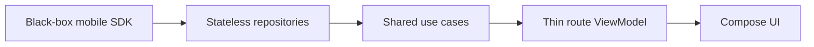

# Sentient — Android client

Native Android client for Sentient (the family voice assistant). A **thin Jetpack
Compose UI over the shared KMP SDK** (`shared/mobile-sdk`): transport, session/audio
state, reconnect, opus, and logging all live in the SDK — this module is UI + DI +
navigation only. STT/TTS are server-side; there is no on-device wake word in v1.

- **App id:** `io.dev32.sentient` (`.debug` suffix on debug builds) · **namespace:** `io.sentient.android`
- **Version:** `1.4.0` (`versionName` in `build.gradle.kts`)
- SDKs (compile/min/target) come from the version catalog (`gradle/libs.versions.toml`).

## Architecture

Layering — dependencies flow inward only:



- **ViewModels are thin** — per-screen + view-local state only. Stateless repositories
  pass through SDK surfaces; shared usecases fold `SdkEvent` and combine `timeline`,
  full-state `tasks`, and the VM-owned optimistic cache. A VM reaches those operations
  through `ChatComponent`, never the SDK or a repository directly.
- **A conversation is a route.** Top-level nav is a typed route graph
  (`navigation-compose`); changing the `sessionId` route arg rebuilds the screen + its
  VM. That recreation IS the per-screen cleanup boundary — never reset state in place.
- **Three scopes:** App (process-lived config/token) · **Connection** (the SDK + socket +
  usecase graph, alive while authenticated, survives navigation — `UserSessionManager`) ·
  Screen (the per-route VM).
- **DI = Koin** (runtime, no annotation processor). `UserSessionManager` owns one
  authenticated SDK + `ChatComponent` across navigation; Koin creates route VMs over it.
  The shared core remains framework-free. See `.claude/rules/android.md`.
- **Optimistic send:** `OutboundCache` is per-conversation, VM-owned, and in-memory.
  Entries remain `QUEUED` after send until their exact `pendingId` echo arrives; after
  10 seconds unechoed they become `FAILED`. Reconnect resend is safe because the gateway
  deduplicates by `pendingId`. Background keeps the socket; foreground probes/reconnects.

## Layout

```
android/src/main/kotlin/io/sentient/android/
  di/           Koin modules + UserSessionManager (connection scope)
  nav/          route graph (AppNavHost, ChatHost)
  presence/     PresenceCoordinator (ProcessLifecycle foreground/background relay)
  chat/         ChatViewModel + Compose (composer, message bubbles, banners, tool pills, voice)
  history/      HistoryViewModel + the side-drawer past-chats panel
  theme/        Dusk design tokens + typography
```

## Build & run

Source the project env first (provides `bun` + paths used by the gradle hooks):

```bash
source scripts/env.sh
./gradlew :android:assembleDebug          # build the debug APK
./gradlew :android:installDebug           # install to a connected device/emulator
./gradlew :android:testDebugUnitTest      # JVM unit tests (ViewModels, reducers, mappers)
```

Point the app at a gateway via the build config / in-app backend resolution; the default
is the dev gateway running on this host (see the root `deploy/` docs).

## Calendar V2 overlays

`settings/calendar/CalendarOverlays.kt` contains controlled preview, Add/Edit,
recurrence-scope, delete, conflict, offline, permission, and outcome sheets. The Compose
surface forwards exact shared `EffectiveOccurrence` and `CalendarMutationDraft` values;
it does not access storage or transport.

The V2 editor extends the reference Add sheet with the supported production fields:
description, all-day/timed start and end, UI-only input time zone, private/household
scope, visibility, importance, group, tags, and structured recurrence (frequency,
interval, weekdays, count/until). Identity, revision, recurrence mutation scopes,
conflict policy, and online write gates remain shared-owned. Unsupported prototype
place, reminder, member-owner, and color semantics are intentionally absent.

Visual review uses the consolidated served reference at
`design/prototype/calendar/index.html`, with `calendar.css` and `calendar.js` from
that directory, at both 390×844 and 430×932.
Open `CalendarOverlayPreviews.kt` and compare preview, Add, timed/all-day Edit,
recurrence scope, delete confirmation, conflict, offline, permission/error, and
large-font previews directly against those viewports. The adapted native contract keeps
the Dusk paper surface, 26dp top corners, 42×4 handle, 84% maximum height, 48dp actions,
Terra primary action, internal IME-safe scrolling, safe-area padding, and tonal scrim.

## Testing

- **JVM unit** (`testDebugUnitTest`): thin VMs, reducers, and pure usecases with fake
  boundaries — no Android framework; use `runTest` and test dispatchers for time.
- **Instrumentation** covers Android/platform boundaries. **Maestro** flows live under
  `qa/mobile/flows/android/` and run through `./qa/mobile/run-e2e.sh android --tags ...`
  against the real local stack. Debug-only faults are armed by the runner via `adb`.
- Fakes over mocks at boundaries; pass fakes through the same constructors production uses.

## Rules

Read `.claude/rules/android.md` and `.claude/rules/mobile-shared.md`; follow their
linked detail files under `agents/docs/` when a rule needs expansion.
