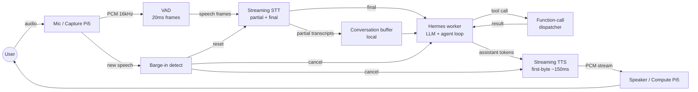

# Architecture diagram



Render this to `architecture.svg` (committed alongside) so renderers that
don't speak mermaid still see the picture. Use:

```bash
npx -y @mermaid-js/mermaid-cli -i architecture.md -o architecture.svg
```

The SVG rendering is part of the post-publish backlog (see `ROADMAP.md`)
and not blocking for the initial release.
