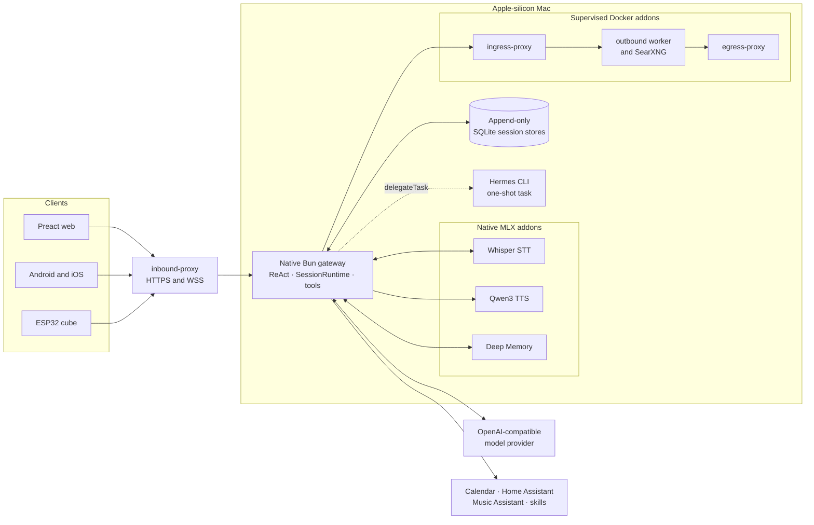

# Architecture diagram

The gateway is the native agent runtime and host supervisor. `launchd` owns its
production lifecycle; the gateway owns the ReAct loop, durable sessions, tool
authorization, native services, and Docker addon lifecycle. Hermes is optional
one-shot delegation, not a service.

See [`../../ARCHITECTURE.md`](../../ARCHITECTURE.md) for the architecture
contract and [`../../shared/protocol/WIRE.md`](../../shared/protocol/WIRE.md)
for the client wire protocol.
