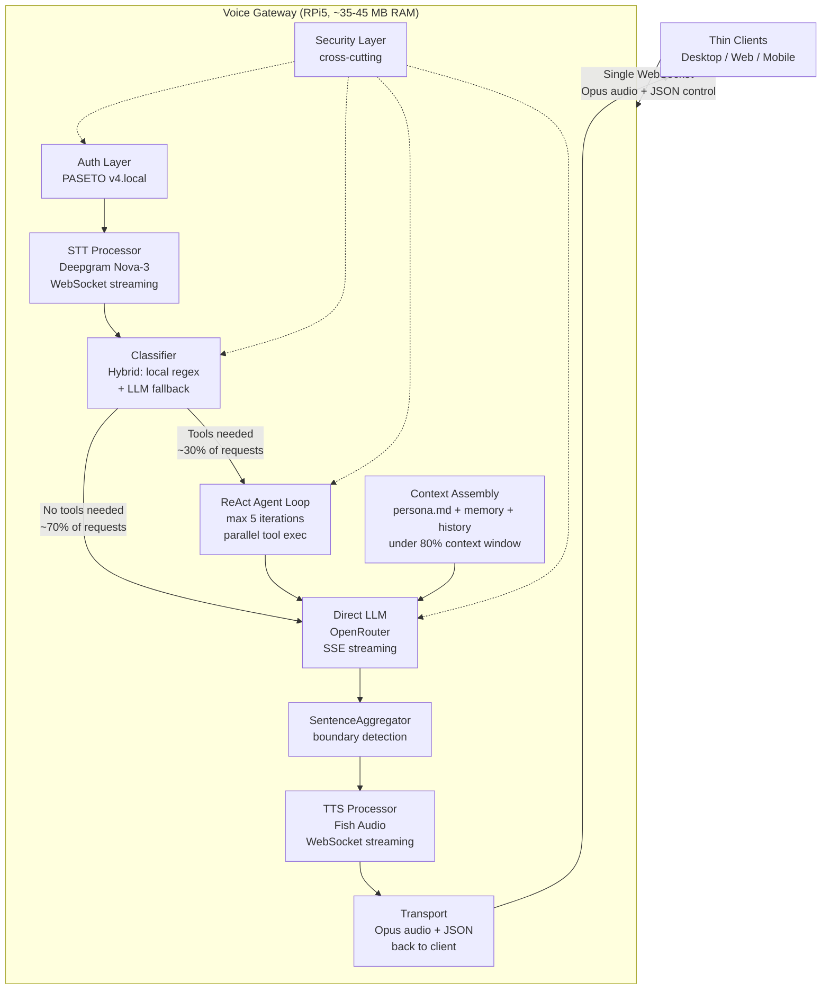
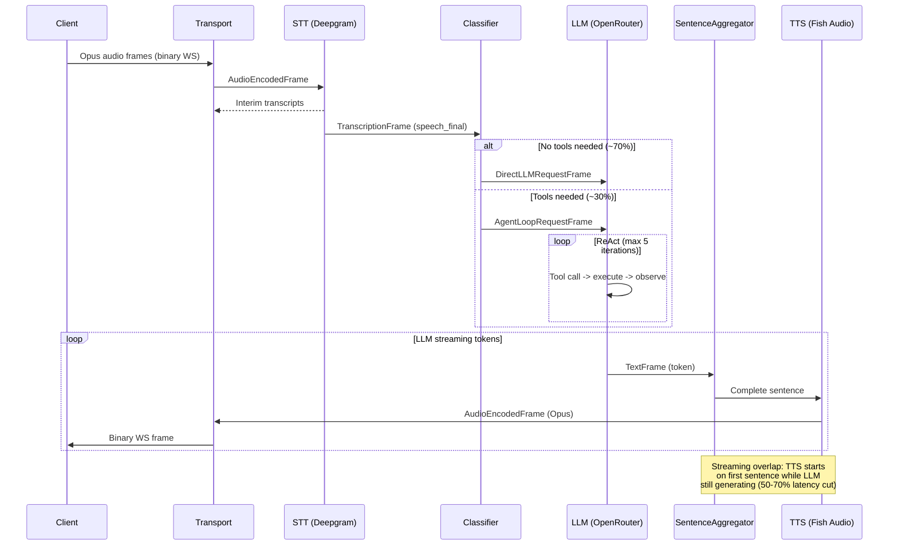

# Voice Gateway Architecture — Living Document

## Overview

A secure, extensible voice gateway for a family AI assistant (up to 5 users), running on Raspberry Pi 5 (8GB RAM, 500GB SSD). Routes audio/text from thin clients through an STT -> LLM -> TTS pipeline with a unified persona and per-user memory. All inference is cloud-based; the Pi handles orchestration, streaming coordination, and audio codec.

## System Diagram

## Pipeline Flow

**Key design principles:**
- **Streaming overlap**: TTS starts on first complete sentence while LLM still generating (50-70% perceived latency reduction)
- **Cancel propagation**: Barge-in broadcasts InterruptionFrame (SystemFrame priority) through all pipeline stages
- **Classifier-first**: ~70% of requests skip the agent loop entirely, saving 500ms-1s
- **UninterruptibleFrame mixin**: Tool results survive barge-in so they can be referenced in the next turn

---

## Decision Areas

### 1. Pipeline Architecture (`pipeline-architecture`)
**Status:** explored

Custom Python asyncio pipeline on RPi5. Workload is ~95% I/O-bound (waiting on cloud APIs), making asyncio ideal.

**Approaches:**

| Factor | A. Pure Asyncio | B. Worker/Session | C. Hybrid Asyncio + ThreadPool |
|--------|:-:|:-:|:-:|
| RAM (5 sessions) | ~30-35 MB | ~125-150 MB | ~35-45 MB |
| Implementation complexity | Low | High | Low-Medium |
| Failure isolation | Low (mitigable) | High | Medium |
| Multi-core usage | 1 core | 4 cores | 1 core + threads |
| Shared provider clients | Yes | No | Yes |
| Matches I/O-bound workload | Excellent | Overkill | Excellent |

**Emerging recommendation: Approach C (Hybrid)**
- Single process, single event loop, all sessions as concurrent coroutines
- `ThreadPoolExecutor(max_workers=4)` offloads Opus codec to threads (GIL released in C extension)
- ~35-45 MB total RAM for 5 concurrent sessions — well within 8GB budget
- Frame-based pipeline with Pipecat-inspired three-tier hierarchy (SystemFrame / DataFrame / ControlFrame)
- Per-processor async queues provide natural pipeline parallelism
- Session-scoped pipelines: interrupts don't cross sessions
- Shared provider connection pools across sessions

**Key design decisions:**
1. Frame hierarchy: System (priority, uninterruptible) / Data (ordered, cancellable) / Control (ordered, cancellable)
2. Per-processor `asyncio.PriorityQueue` — SystemFrames get priority 1, others priority 2
3. SentenceAggregator between LLM and TTS for streaming overlap
4. InterruptionFrame as SystemFrame propagates via priority queue
5. UninterruptibleFrame mixin for tool results that must survive barge-in

---

### 2. Client-Gateway Protocol (`client-gateway-protocol`)
**Status:** explored

How thin clients (desktop, web, mobile) communicate with the gateway.

**Approaches:**

| Factor | A. WebSocket-Only | B. Hybrid REST+WS | C. REST-Only |
|--------|:-:|:-:|:-:|
| Bidirectional streaming | Native | Split | Impossible |
| Barge-in support | Natural (send frame) | Cross-connection | Broken |
| Server complexity | Low | Medium-High | Medium |
| Client complexity | Low | Medium | Low-Medium |
| Connection count per client | 1 | 2+ | 2+ |
| Pipeline alignment | Excellent | Poor (adapter needed) | Poor |
| Tool confirmation flow | Natural (async message) | Awkward (cross-channel) | Broken (polling) |

**Emerging recommendation: Approach A (WebSocket-Only)**
- Single WebSocket per client carries audio, text, and control
- Binary frames = Opus audio (zero overhead on hot path at 50 frames/sec)
- Text frames = JSON messages with `type` field (human-readable, extensible)
- Auth via first-message PASETO token; 5-second timeout
- Reconnection: session ID + exponential backoff with jitter; server session survives 5 min
- Application-level ping/pong every 30s (browser JS can't access WS-level ping)
- Server: `aiohttp` (WebSocket + HTTP health/metrics in one server)

**Message types defined:**

| Direction | Type | Purpose |
|-----------|------|---------|
| C->G | `session.start` | Auth with PASETO token |
| C->G | `audio.start/end` | Turn-taking brackets |
| C->G | `text.input` | Text-only query |
| C->G | `barge_in` | User interrupts assistant |
| C->G | `tool.confirm` | Approve/deny tool execution |
| G->C | `session.ready` | Auth success + session ID |
| G->C | `transcript` | STT result (interim/final) |
| G->C | `response.text` | Streaming LLM text |
| G->C | `audio.start/end` | TTS audio brackets |
| G->C | `tool.confirm_request` | Ask user to approve tool |

**Audio codec: Opus** — 16-20kbps, 20ms frames, mono. Universal client support. 5 concurrent streams = ~37.5% of one RPi5 core (non-bottleneck).

---

### 3. Classifier-First Tool Routing (`tool-routing`)
**Status:** explored

Lightweight classifier determines if tools are needed, routing to an agent loop only when necessary.

**Classifier approaches:**

| Factor | A. LLM-Only | B. Local Regex Only | C. Hybrid Local + LLM |
|--------|:-:|:-:|:-:|
| Latency (no-tools path) | 150-400ms | <1ms | <1ms (50%), 150-400ms (40%) |
| Accuracy (natural speech) | High | Low-Medium | High (LLM fallback) |
| Cloud dependency | Full | None | Partial (graceful degradation) |
| Cost/month (~100 req/day) | <$0.02 | $0 | <$0.01 |

**Agent loop approaches:**

| Factor | ReAct | Plan-and-Execute |
|--------|:-:|:-:|
| Single-tool latency | ~1-2s (2 LLM calls) | ~2-3s (3 LLM calls) |
| Multi-tool latency | ~2-4s | ~3-5s |
| Error recovery | Natural (observe, adapt) | Complex (replan) |

**Emerging recommendation: Hybrid Classifier (C) + ReAct Agent Loop**
- Local regex fast-paths obvious cases (greetings -> no tools; "turn on lights" -> tools)
- LLM fallback (Gemini 2.0 Flash Lite, <$0.02/mo) handles ambiguous cases
- Graceful degradation: if LLM classifier down, conservative local patterns still work
- ReAct loop with max 5 iterations, parallel tool calls via `asyncio.gather()`
- Streaming final response feeds into SentenceAggregator -> TTS pipeline
- Tool registration: `@tool` decorator + auto-discovery from `tools/` directory
- Impact tiers (`auto`/`confirm`) declared per-tool, enforced at execution
- ToolContext provides controlled access to secrets, HTTP client, audit logger

---

### 4. Security Architecture (`security-architecture`)
**Status:** explored

Security as a core pillar. Threat model: home LAN with 5 known users — optimize for defense-in-depth against bugs and prompt injection.

**Auth approaches:**

| Factor | A. PASETO v4.local | B. mTLS Device Certs | C. Voice + PIN |
|--------|:-:|:-:|:-:|
| Security | High (crypto by design) | Highest | Medium |
| Setup complexity | Low (CLI generates tokens) | High (PKI) | Medium |
| Client compatibility | Excellent (just a string) | Poor (cert install) | Good |
| RPi5 CPU load | Negligible | Medium | High (violates cloud-only) |

**Prompt injection approaches:**

| Factor | A. Delimiters Only | B. Dual-LLM Guard | C. Layered Defense |
|--------|:-:|:-:|:-:|
| Latency added | 0ms | 200-400ms per request | <2ms |
| Effectiveness | Low-Medium | High | High (defense-in-depth) |
| False positive rate | 0% | 2-8% | <1% |
| Cost | $0 | ~$0.01/mo | $0 |

**Emerging recommendation:**
- **Auth**: PASETO v4.local — XChaCha20-Poly1305 encryption, 30-day tokens, per-device, jti-based revocation
- **Prompt injection**: 6-layer defense — sanitization -> heuristic pre-filter -> delimiter framing (`<user_speech>`) -> privilege reduction (scoped tools + impact tiers) -> canary token detection -> output filtering
- **Impact tiers**: Four levels (read/write/confirm/admin) — `read` and `write` auto-execute; `confirm` and `admin` require user approval via WebSocket
- **Role system**: `adult`/`child` roles in PASETO claims — child blocked from `admin` tier
- **Audit logging**: JSONL via structlog — append-only files, 90-day retention, 100MB rotation, ~5GB budget
- **API keys**: age-encrypted config file, decrypted to memory at startup, SIGHUP for zero-downtime rotation
- **Remote access**: Tailscale (optional overlay, 1-3ms overhead, zero gateway code changes)
- **Cross-user privacy**: Strict session isolation — path-validated memory loading, no shared mutable state, context assembly assertions

---

### 5. Per-User Memory System (`per-user-memory`)
**Status:** explored

Persistent per-user memory files that let the assistant learn from interactions over time.

**Format approaches:**

| Factor | A. Sectioned Markdown | B. JSON with Schema | C. YAML Frontmatter + MD |
|--------|:-:|:-:|:-:|
| Token efficiency | Best (15-16% less than JSON) | Worst | Good |
| Human readability | Excellent | Poor | Good |
| LLM generation reliability | High | High (verbose) | Medium |
| Edit by non-technical user | Easy | Hard | Medium |

**Memory architecture approaches:**

| Factor | A. Flat Markdown | B. JSON + Vector DB | C. Tiered Markdown |
|--------|:-:|:-:|:-:|
| Token efficiency | Good | Poor | Best (bounded tiers) |
| Bounded growth | No | Yes | Yes (hard caps + archive) |
| Old fact retrieval | Linear scan | Vector search | File search |
| RPi5 resource fit | Excellent | Poor (vector DB RAM) | Excellent |
| Infrastructure | Filesystem only | Needs vector DB | Filesystem only |

**Emerging recommendation: Sectioned Markdown + Tiered Memory (A format + C architecture)**
- **Format**: Sectioned Markdown — sections for Profile, Preferences, Family Context, Recent Context, Conversation Patterns
- **Update strategy**: Hybrid — end-of-session extraction (async, zero latency impact) + explicit "remember this" trigger
- **Update pipeline**: Mem0-inspired three-phase — extract facts -> reconcile (ADD/UPDATE/DELETE/NONE) -> apply. Uses cheap model (DeepSeek V3, ~$1.80/mo)
- **Context budget**: persona (500-1000 tok) + memory (500-1500 tok) + history (2000-6000 tok) <= 80% of context window
- **Tiered storage**: Tier 1 (core profile, <=500 tok, always in context) + Tier 2 (active context, <=500 tok, rolling) + Tier 3 (archive on disk, searchable)
- **Summarization**: Weekly batch (or on token threshold) — condense tiers, archive stale items
- **Quality**: Category-scoped extraction prompt + reconciliation dedup + minimum info threshold + post-write validation
- **Persona interaction**: Persona > Memory > History hierarchy; memory in `<user_context>` wrapper after persona

---

### 6. Provider Integration Layer (`provider-integration`)
**Status:** explored

Pluggable interfaces for STT/LLM/TTS with failover and configuration management.

**Interface design approaches:**

| Factor | A. Protocol (structural typing) | B. ABC (inheritance) | C. Dict/Function Module |
|--------|:-:|:-:|:-:|
| Import coupling | None | Requires inheritance | None |
| Static type checking | Full | Full | Minimal |
| Async method enforcement | Yes | Yes | No |
| Extensibility | Excellent | Good | Poor |

**Failover approaches:**

| Factor | A. Config-Ordered + Circuit Breaker | B. Health-Check Based | C. No Failover |
|--------|:-:|:-:|:-:|
| Complexity | Low-Medium | High | Minimal |
| Latency on failure | +request timeout | Near-zero | Manual intervention |
| RPi5 fit | Good (no background probes) | Poor | Excellent |

**Emerging recommendation: Protocol interfaces + Config-ordered failover + Hybrid config**

**Provider stack (starting):**

| Function | Primary Provider | Fallback | Est. Monthly Cost |
|----------|-----------------|----------|-------------------|
| STT | Deepgram Nova-3 (WS streaming, `speech_final` turn-taking) | Deferred | ~$6 |
| LLM (main) | OpenRouter / Haiku 4.5 (SSE, OpenAI SDK compat) | OpenRouter `models` array | ~$1-3 |
| LLM (classifier) | OpenRouter / Gemini Flash Lite | DeepSeek V3 | <$0.50 |
| LLM (memory) | OpenRouter / DeepSeek V3 | — | ~$1.80 |
| TTS | Fish Audio (WS, Opus output, emotion tags) | Cartesia Sonic Turbo | ~$2-3 |
| **Total** | | | **~$11-14/month** |

**Key decisions:**
1. Protocol classes for contracts — structural typing, zero overhead, async-native
2. Optional `BaseProvider` ABC mixin for shared config/retry logic
3. Fish Audio primary TTS — best price-performance ($2-3/mo), native Opus output, self-hostable fallback (Fish Speech)
4. Cartesia fallback TTS — lowest TTFB (40ms) but needs Opus transcoding, higher cost
5. ElevenLabs not recommended — prohibitive cost at family scale
6. Deepgram: 300ms endpointing, `speech_final` for turn-taking, `is_final` for accumulation
7. OpenRouter: built-in provider failover via `models` array; per-request model selection
8. `pyresilience` `@resilient()` decorator for retry + circuit breaker + timeout
9. Configuration: YAML for structure/ordering, env vars for API key secrets
10. Provider swapping: edit `config.yaml`, restart — no code changes

---

## Hardware Constraints & Resource Budget

| Resource | Available | Projected Usage (5 sessions) | Headroom |
|----------|-----------|------------------------------|----------|
| CPU | 4-core Cortex-A76 @ 2.4GHz | <40% of 1 core (Opus codec + event loop) | >3 cores idle |
| RAM | 8 GB | ~35-45 MB (gateway) + ~100 MB (OS) | ~7.8 GB free |
| Storage | 500 GB SSD | ~5 GB audit logs + memory files + config | ~495 GB free |
| Network | LAN + internet | 5 concurrent WS to clients + 3 persistent WS to cloud providers | Ample |

## Monthly Cost Estimate (~100 requests/day)

| Component | Provider | Monthly Est. |
|-----------|----------|-------------|
| STT | Deepgram Nova-3 | ~$6 |
| LLM (main) | OpenRouter (Haiku 4.5) | ~$1-3 |
| LLM (classifier) | OpenRouter (Gemini Flash Lite) | <$0.50 |
| LLM (memory extraction) | OpenRouter (DeepSeek V3) | ~$1.80 |
| TTS (primary) | Fish Audio | ~$2-3 |
| Remote access (optional) | Tailscale Personal Plus | $6 |
| **Total** | | **~$11-14/month** (+ $6 Tailscale optional) |
