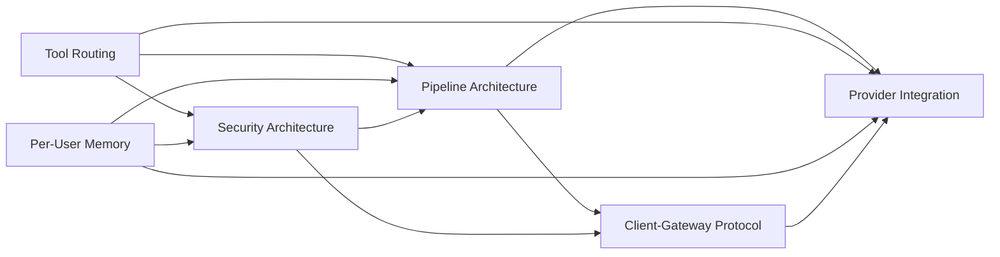
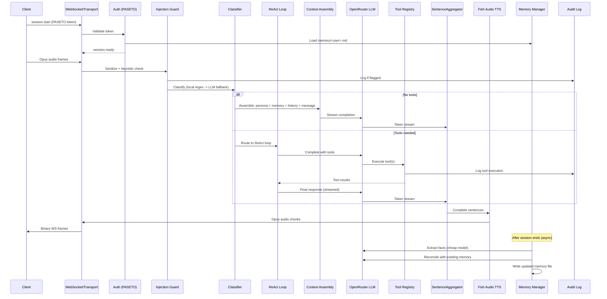

# Cross-Component Dependencies & Interactions

## Dependency Map

## Key Interactions

| From | To | Dependency | Details |
|------|----|-----------|---------|
| pipeline-architecture | client-gateway-protocol | Transport processor bridges wire protocol and frame pipeline | WebSocket binary frames -> AudioEncodedFrame; JSON messages -> control frames. TransportProcessor holds WS reference. |
| pipeline-architecture | provider-integration | Pipeline processors call providers via Protocol interfaces | STT processor uses `STTProvider.transcribe_stream()`. LLM processor uses `LLMProvider.stream_complete()`. TTS processor uses `TTSProvider.stream_synthesize()`. All async streaming contracts. |
| pipeline-architecture | per-user-memory | Memory loaded into context assembly stage | Tier 1 + Tier 2 loaded at session start (~500-1500 tokens). Must fit within 80% context budget. |
| tool-routing | security-architecture | Impact tiers gate tool execution | Four tiers (read/write/confirm/admin). Role claim from PASETO gates admin tier. Confirmation flow uses WebSocket `tool.confirm_request`/`tool.confirm` messages. |
| tool-routing | provider-integration | Agent loop calls LLM via provider interface | ReAct loop uses `LLMProvider.complete_with_tools()`. Classifier uses cheap model via same OpenRouter path. |
| tool-routing | pipeline-architecture | ClassifierProcessor and AgentLoopProcessor are FrameProcessors | Classifier emits DirectLLMRequestFrame or AgentLoopRequestFrame. Agent loop streams final response as TextFrames. Tool results are UninterruptibleFrames. |
| per-user-memory | security-architecture | Cross-user isolation at memory loading | Path validation (regex allowlist + symlink resolve). Extraction prompt privacy guards. Per-user file isolation. |
| per-user-memory | provider-integration | Memory extraction uses cheap LLM | Three-phase pipeline (extract/reconcile/apply) calls DeepSeek V3 via OpenRouter after session ends. |
| security-architecture | client-gateway-protocol | Auth happens at WebSocket connection time | First WS message is `session.start` with PASETO token. 5-second auth timeout or disconnect with code 4001. |
| security-architecture | pipeline-architecture | Audit logging is cross-cutting | structlog with contextvars binds user_id/device_id/session_id once per session. Every stage may log via `audit.info()`. JSONL append-only files. |
| security-architecture | tool-routing | Impact tiers + role gating + prompt injection defense | Heuristic pre-filter flags suspicious input before classifier. Tiers enforced at tool execution. ToolContext restricts tool access to secrets, HTTP, audit. |
| security-architecture | provider-integration | API key access via age-encrypted config | Secrets decrypted to memory at startup. ToolContext.secrets provides read-only access. SIGHUP reloads without restart. |
| client-gateway-protocol | provider-integration | Audio codec alignment | Gateway receives Opus from client, forwards to Deepgram (supports Opus input). Fish Audio outputs Opus natively. Cartesia fallback requires Opus transcoding. |

## Data Flow: Complete Request Lifecycle

## Shared Resources Across Components

| Resource | Shared By | Notes |
|----------|-----------|-------|
| asyncio event loop | All components | Single event loop, all sessions as coroutines |
| ThreadPoolExecutor(4) | Audio processors | Opus encode/decode offloaded to threads |
| aiohttp.ClientSession | All provider integrations, tool HTTP calls | Connection pooling, shared across sessions |
| structlog audit logger | All components | contextvars bind user/session per-request |
| Config dict (from YAML) | All components | Read-only after startup, SIGHUP reload for secrets |
| Deepgram WS connection | All STT processors | Persistent connection, shared or per-session (TBD) |
| Fish Audio WS connection | All TTS processors | Persistent connection, shared or per-session (TBD) |
