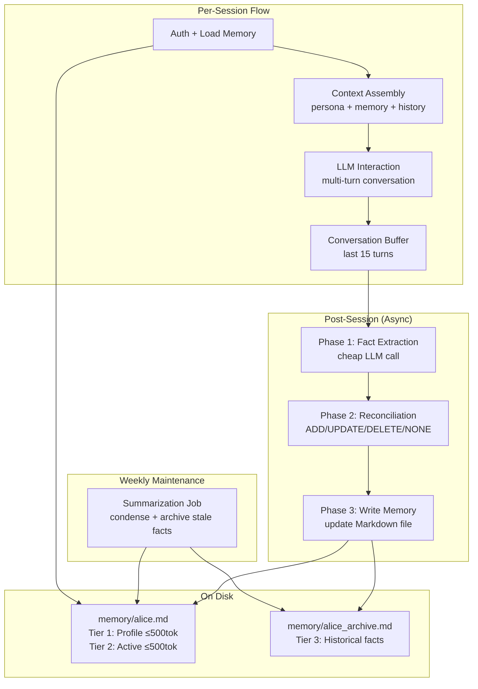
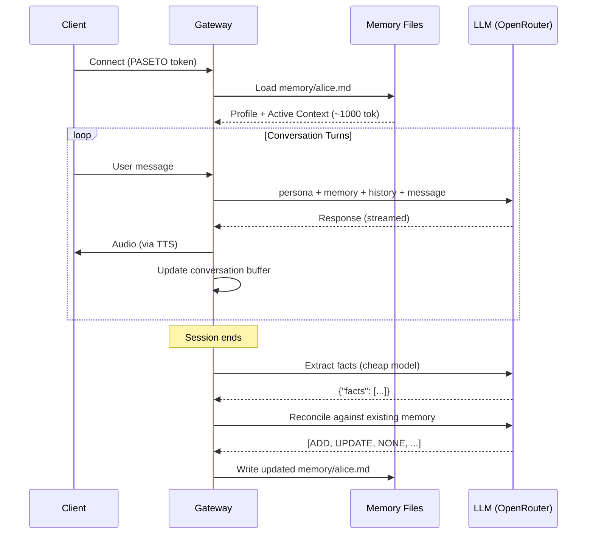

# Per-User Memory System

## Decision Area
Persistent per-user memory that lets the assistant learn from interactions over time. Memory files live on disk, loaded at auth, updated post-interaction.

## Key Questions
1. **File format**: Structured markdown? JSON? What fields (facts, preferences, conversation summaries)?
2. **Update strategy**: After every turn? End of session? LLM-decided?
3. **Context window management**: persona.md + memory/<user>.md + conversation history must fit in context
4. **Summarization**: How to keep memory files from growing unbounded
5. **Privacy**: Memory is per-user, but LLM sees it — can prompt injection leak cross-user data?
6. **Quality**: How to ensure the LLM writes useful memories, not noise
7. **Persona interaction**: Memory augments but doesn't override the persona

---

## 1. Memory File Format

### Why Markdown Over JSON

Markdown is **15-16% more token-efficient** than JSON for the same data (11,612 vs 13,869 tokens in head-to-head testing — OpenAI Community Forum). The savings come from eliminating braces, quotes, and colons. For memory files that are loaded into every LLM call, this adds up: saving 200-300 tokens per request across 100+ daily interactions.

Beyond token efficiency:
- **Human-inspectable**: Family admin can read/edit memory files directly
- **LLM-native**: LLMs generate and parse Markdown more naturally than JSON for freeform facts
- **Git-friendly**: Clean diffs when memory files change
- **Aligned with persona.md**: Same format as the persona file already in the system

JSON makes sense for structured data (schedules, device states), but memory is inherently semi-structured — facts, preferences, and contextual notes that resist rigid schemas.

### Recommended Format: Sectioned Markdown

```markdown
# Memory: Alice

## Profile
- Age: 34
- Role: Parent (primary admin)
- Occupation: Data scientist at Acme Corp

## Preferences
- Prefers detailed weather forecasts, not just "sunny"
- Morning routine: news briefing → calendar → weather
- Likes jazz and lo-fi when asking for music
- Allergic to shellfish — flag in any recipe suggestions

## Family Context
- Partner: Bob (also a user)
- Kids: Charlie (8), Dana (5)
- Charlie has soccer practice Tuesdays and Thursdays at 4pm
- Dana's birthday: June 15

## Recent Context
- Working on Q2 planning at work (as of 2026-04-01)
- Planning a camping trip for Memorial Day weekend

## Conversation Patterns
- Prefers concise answers, gets frustrated with verbose responses
- Often asks follow-up questions — keep context ready
```

### Approach Comparison: File Format

| Factor | A. Sectioned Markdown | B. JSON with Schema | C. YAML Frontmatter + Markdown |
|--------|:-:|:-:|:-:|
| Token efficiency | Best (15-16% less than JSON) | Worst | Good (YAML overhead small) |
| Human readability | Excellent | Poor | Good |
| LLM generation reliability | High (natural output) | High (structured, but verbose) | Medium (YAML indent errors) |
| Programmatic parsing | Medium (section headings as keys) | Excellent | Good (frontmatter parseable) |
| Extensibility | Excellent (add sections freely) | Medium (schema changes needed) | Good |
| Edit by non-technical user | Easy | Hard | Medium |

**Recommendation: Sectioned Markdown (A)** — most token-efficient, human-inspectable, LLM-native. Parse by section headings when programmatic access is needed. YAML frontmatter (C) adds complexity without proportional benefit for 5 users.

---

## 2. Update Strategy

### The Three-Phase Memory Pipeline (Mem0-Inspired)

Mem0's architecture provides the most battle-tested approach for LLM memory management, achieving 66.9% accuracy on the LOCOMO benchmark vs. OpenAI's 52.9% (26% relative improvement). Adapted for a home assistant:

**Phase 1: Fact Extraction** (after each session, not each turn)

```
Extract memorable facts from this conversation. Focus on:
- Family member names, ages, relationships
- Food preferences and dietary restrictions
- Daily routines and schedules
- Hobbies and interests
- Important dates (birthdays, appointments)
- Smart home preferences (lighting, temperature, music)
- Conversation style preferences

Only extract facts from the USER's messages.
Return JSON: {"facts": ["fact1", "fact2"]}
If no memorable facts, return {"facts": []}
```

**Phase 2: Memory Reconciliation** (compare new facts against existing memory)

For each extracted fact, decide one of four operations:
- **ADD**: Genuinely new information
- **UPDATE**: More specific/current version of an existing fact
- **DELETE**: Contradicts an existing fact (user changed preference)
- **NONE**: Already known

**Phase 3: File Update** (apply operations to the Markdown file)

### Update Timing: Hybrid Approach

| Strategy | A. Every Turn | B. End of Session | C. Hybrid (Recommended) |
|----------|:-:|:-:|:-:|
| Latency impact | High (+1-3s per turn) | None during session | Low (explicit saves are async) |
| Cost per interaction | ~$0.003-0.01 | ~$0.005-0.015 (batch) | ~$0.003-0.008 |
| Memory completeness | Best (catches everything) | Good (may miss mid-session details) | Very good |
| Risk of noise | High (trivial facts saved) | Low (batch filter) | Low |
| Implementation complexity | Low | Low | Medium |

**Recommended: Hybrid (C)**

1. **End-of-session extraction**: After each session ends, run the three-phase pipeline. This catches the bulk of memorable facts without adding latency during conversation.
2. **Explicit save trigger**: If the user says "remember this" or similar, immediately extract and save the current context. This handles the case where a session might not end cleanly (network drop, Pi reboot).
3. **No per-turn extraction**: The latency cost (1-3s extra per turn) is unacceptable for a voice assistant where perceived responsiveness matters enormously. End-of-session is a natural batch point.

### Implementation Sketch

```python
class MemoryManager:
    """Manages per-user memory extraction and persistence."""
    
    def __init__(self, memory_dir: Path, llm_client: LLMProvider):
        self.memory_dir = memory_dir
        self.llm = llm_client
    
    async def extract_facts(self, conversation: list[dict]) -> list[str]:
        """Phase 1: Extract memorable facts from conversation."""
        response = await self.llm.complete(
            model="deepseek-v3",  # Cheap model, good at extraction
            messages=[
                {"role": "system", "content": FACT_EXTRACTION_PROMPT},
                {"role": "user", "content": format_conversation(conversation)},
            ],
            response_format={"type": "json_object"},
        )
        return json.loads(response.content).get("facts", [])
    
    async def reconcile(
        self, new_facts: list[str], existing_memory: str
    ) -> list[MemoryOp]:
        """Phase 2: Compare new facts against existing memory."""
        response = await self.llm.complete(
            model="deepseek-v3",
            messages=[
                {"role": "system", "content": MEMORY_RECONCILIATION_PROMPT},
                {"role": "user", "content": json.dumps({
                    "existing_memory": existing_memory,
                    "new_facts": new_facts,
                })},
            ],
            response_format={"type": "json_object"},
        )
        return parse_memory_ops(response.content)
    
    async def update_memory(self, user_id: str, conversation: list[dict]):
        """Full pipeline: extract → reconcile → write."""
        memory_path = self.memory_dir / f"{user_id}.md"
        existing = memory_path.read_text() if memory_path.exists() else ""
        
        facts = await self.extract_facts(conversation)
        if not facts:
            return  # Nothing to remember
        
        ops = await self.reconcile(facts, existing)
        updated = apply_memory_ops(existing, ops)
        
        memory_path.write_text(updated)
        audit.info("memory.updated", user_id=user_id,
                   ops_count=len(ops), facts_extracted=len(facts))
```

### Cost Analysis

Using DeepSeek V3 via OpenRouter ($0.14/$0.28 per 1M tokens) for memory extraction:

| Component | Tokens | Cost per Session |
|-----------|--------|-----------------|
| Fact extraction prompt + conversation | ~2,000 in + ~200 out | ~$0.0003 |
| Reconciliation prompt + memory + facts | ~1,500 in + ~300 out | ~$0.0003 |
| **Total per session** | | **~$0.0006** |
| **Daily (100 sessions)** | | **~$0.06** |
| **Monthly** | | **~$1.80** |

Negligible cost. The real budget consideration is latency — these two LLM calls take 1-3s total, which is why they run after the session ends, not during.

---

## 3. Context Window Budget

### The Context Rot Problem

Research from Chroma (2025-2026) shows that LLM performance degrades non-linearly as context grows:
- Models may hold at 95% accuracy up to a threshold, then plummet unpredictably
- At 32K tokens, 11/12 tested models dropped below 50% of short-context performance
- Irrelevant context compounds degradation — even single distractors reduce accuracy
- **Rule of thumb: keep total utilization under 80% of context window**

### Budget Allocation

For voice interactions (short turns, rapid exchanges), an 8K-32K context window is typical. Here's the recommended allocation:

| Component | Tokens | Priority | Notes |
|-----------|--------|----------|-------|
| System prompt (persona.md) | 500-1,000 | Fixed | Loaded once, rarely changes |
| Security framing (delimiters, instructions) | 200-300 | Fixed | XML wrapping, canary token |
| Per-user memory | 500-1,500 | Semi-fixed | Loaded at session start, cap enforced |
| Tool definitions (when classified as needed) | 300-800 | Conditional | Only included for tool-routed requests |
| Conversation history (recent turns) | 2,000-6,000 | Dynamic | Last 10-15 exchanges verbatim |
| Response headroom | 1,000-2,000 | Reserved | LLM's generation budget |
| **Total (8K model)** | **~5,500-6,500** | | **~80% of 8K** |
| **Total (32K model)** | **~5,500-12,000** | | **~17-38% of 32K** |

### Context Assembly Order

The order matters for LLM attention patterns (primacy > recency > middle):

```
1. System prompt: persona.md              ← Highest attention (first position)
2. Security framing: delimiters, rules    ← Always visible
3. Per-user memory: memory/<user>.md      ← Semi-permanent context
4. [Tool definitions if needed]           ← Conditional
5. Conversation history (oldest first)    ← Middle (least attention, but necessary)
6. Current user message (XML-wrapped)     ← Highest attention (last position)
```

### Conversation History Management

```python
class ConversationBuffer:
    """Manages conversation history within token budget."""
    
    def __init__(self, max_tokens: int = 4000):
        self.max_tokens = max_tokens
        self.turns: list[dict] = []
    
    def add_turn(self, role: str, content: str):
        self.turns.append({"role": role, "content": content})
        self._trim()
    
    def _trim(self):
        """Drop oldest turns until under budget, keeping at least 2 turns."""
        while len(self.turns) > 2 and self._count_tokens() > self.max_tokens:
            self.turns.pop(0)
    
    def _count_tokens(self) -> int:
        """Approximate token count (~4 chars per token for English)."""
        return sum(len(t["content"]) // 4 for t in self.turns)
```

For voice interactions, conversation history is naturally shorter (spoken turns are ~20-50 words vs. ~100-500 in text chat), so the 4,000-token history budget fits ~15-30 exchanges comfortably.

---

## 4. Summarization Strategy

### Growth Rate Estimate

For 5 users, ~100 interactions/day:

| Metric | Value |
|--------|-------|
| New facts per interaction | 0-3 (avg ~1.5) |
| Net new facts per day (after dedup) | ~30-50 across all users |
| Per-user growth | ~6-10 new facts/day |
| Monthly per user (raw) | ~180-300 facts (~18K-45K tokens) |
| **Unbounded growth after 1 year** | **~2,000-3,600 facts per user** |

Without summarization, memory files would grow to 200K-360K tokens per user in a year — far exceeding any context window. Summarization is not optional.

### Recommended: Tiered Memory with Hard Caps

**Tier 1: Core Profile (always in context, ≤500 tokens)**

Stable facts that rarely change: name, age, relationships, allergies, strong preferences.

```markdown
## Profile
- Age: 34, data scientist at Acme Corp
- Partner: Bob. Kids: Charlie (8), Dana (5)
- Allergic to shellfish
- Prefers concise responses
```

**Tier 2: Active Context (in context, ≤500 tokens, rolling)**

Recent and currently relevant information: ongoing projects, upcoming events, recent conversations.

```markdown
## Active Context
- Planning Memorial Day camping trip (researching gear)
- Charlie's school play is April 15 — needs costume
- Started a new garden project last week
- Asked about sourdough recipes 3 times this week
```

**Tier 3: Archive (on disk, searchable, unlimited)**

Everything that ages out of Tier 2. Stored in a separate file (`memory/<user>_archive.md`) and only retrieved via semantic search when relevant.

### Summarization Pipeline

Runs weekly (or when Tier 1 + Tier 2 exceeds 1,200 tokens):

```
1. Load Tier 1 + Tier 2
2. Ask LLM: "Condense this memory file. Keep:
   - All stable facts (profile, family, allergies) in Tier 1
   - Active/recent context in Tier 2
   Move stale items (not referenced in 2+ weeks) to archive.
   Hard cap: Tier 1 ≤ 500 tokens, Tier 2 ≤ 500 tokens."
3. Append evicted items to archive file
4. Write updated memory file
```

### Approach Comparison: Summarization

| Factor | A. Rolling Summary | B. Fixed Slots | C. Tiered Memory (Recommended) |
|--------|:-:|:-:|:-:|
| Bounded growth | Yes (hard cap) | Yes (hard cap) | Yes (Tier 1+2 capped, Tier 3 on disk) |
| Information loss | High (old facts overwritten) | Medium (slots evict oldest) | Low (archive preserves everything) |
| Retrieval of old facts | Impossible | Impossible | Possible (archive search) |
| Implementation complexity | Low | Low | Medium |
| Token budget predictability | High | High | High (Tier 1+2 have hard caps) |
| LLM summarization cost | Medium (frequent) | Low (simple eviction) | Low (weekly batch) |

**Why Tiered over Rolling Summary?** A rolling summary loses information permanently — if Alice mentioned 3 months ago that she's vegetarian, a rolling summary might discard it. Tiered memory archives it, making it retrievable via search. For a family assistant that should "know" users deeply over years, archival retrieval matters.

---

## 5. Privacy Isolation

Cross-user memory privacy is covered extensively in the security-architecture exploration (Section 7). The key memory-specific concerns:

### Memory-Specific Privacy Risks

| Risk | Vector | Mitigation |
|------|--------|------------|
| Cross-user data in extraction | LLM extracts "Bob mentioned..." from Alice's conversation | Extraction prompt: "Only extract facts about the CURRENT user" |
| Memory file path traversal | Bug in code loads wrong user's file | Path validation + allowlist (see security-architecture) |
| Shared device context bleed | Family member uses same device, session not properly reset | Session isolation: new session = new memory load, no carryover |
| LLM hallucinating cross-user facts | LLM "remembers" Bob's preferences during Alice's session | Memory is loaded fresh from file per session; LLM has no inter-session state |
| Archive search leaks | Semantic search accidentally returns another user's archive | Archive files are per-user; search is scoped to `memory/<user_id>_archive.md` only |

### Extraction Prompt Privacy Guard

```
IMPORTANT: Only extract facts about {user_name} (the current user).
Do NOT extract or store:
- Facts about other family members' private preferences
- Information that another user shared in confidence
- Health information about other users
You MAY store relational facts: "{user_name}'s son Charlie has soccer on Tuesdays"
```

This balances utility (Alice should know Charlie's schedule) with privacy (Alice shouldn't learn about Bob's private health queries).

---

## 6. Memory Quality Control

### The Noise Problem

Without quality controls, LLM memory extraction generates noise: trivial facts ("user said hello"), duplicate phrasing, transient states treated as permanent ("user is tired today"). Mem0's research shows that quality filtering is what drives their 26% accuracy improvement over naive approaches.

### Quality Guardrails

**1. Category-scoped extraction prompt**

Don't ask "what's memorable?" — specify categories:
- Personal profile (name, age, occupation)
- Preferences (food, music, communication style)
- Family/relationships
- Schedules/routines
- Important dates

This prevents the LLM from saving trivial observations.

**2. Reconciliation deduplication**

The Phase 2 reconciliation step (ADD/UPDATE/DELETE/NONE) is the primary quality gate. It prevents:
- Duplicate facts (same info, different wording → NONE)
- Contradictions (old fact updated → UPDATE)
- Stale facts (user corrects → DELETE old + ADD new)

**3. Minimum information threshold**

Facts must be specific and actionable. Reject vague extractions:
- Bad: "User likes food" (too vague)
- Good: "User prefers Thai food, especially pad see ew"
- Bad: "User was happy" (transient state)
- Good: "User enjoys morning jazz while making coffee" (stable preference)

**4. Post-write validation**

After writing the memory file, verify:
- Total Tier 1 + Tier 2 tokens ≤ 1,200 (hard cap)
- No duplicate facts across sections
- No facts about other users (regex scan for other user names)

---

## 7. Persona Interaction

### The Hierarchy: Persona > Memory > History

The persona defines *who* the assistant is. Memory defines *what the assistant knows about this user*. These must not conflict.

```
System prompt assembly:

[persona.md]                     ← "You are a warm, helpful family assistant..."
                                    Defines personality, tone, boundaries

[memory/<user>.md]               ← "Alice prefers concise responses"
                                    Personalizes behavior within persona bounds

[conversation history]           ← Recent exchanges
                                    Provides immediate context
```

### Conflict Resolution Rules

| Conflict Type | Resolution | Example |
|--------------|------------|---------|
| Memory contradicts persona | Persona wins | Persona: "be family-friendly" vs Memory: "user wants explicit content" → persona wins |
| Memory refines persona | Memory augments | Persona: "be helpful" + Memory: "Alice prefers concise answers" → be helpfully concise |
| History contradicts memory | Memory wins (it's more considered) | History: "I hate jazz" but Memory: "Alice loves jazz" → ask to clarify |
| Memory has stale info | History wins (more recent) | Memory: "working on Q1 planning" but History: "Q2 started" → update memory |

### Implementation: System Prompt Template

```python
def assemble_system_prompt(
    persona: str,
    user_memory: str,
    user_name: str,
) -> str:
    return f"""{persona}

<user_context>
You are speaking with {user_name}. Here is what you know about them from prior interactions:

{user_memory}

Use this knowledge to personalize your responses, but your core personality 
and values (defined above) always take priority over user-specific memories.
</user_context>"""
```

The `<user_context>` wrapper signals to the LLM that this is supplementary context, not a persona override. Placing it after the persona leverages LLM attention patterns — the persona (first position) has higher weight.

---

## Architecture: Complete Memory System





---

## Approaches Summary

### Overall Memory Architecture Approaches

| Factor | A. Flat Markdown (no tiers) | B. JSON + Vector DB (Mem0-like) | C. Tiered Markdown (Recommended) |
|--------|:-:|:-:|:-:|
| Token efficiency | Good (Markdown) | Poor (JSON overhead) | Best (Markdown + bounded tiers) |
| Human inspectability | Excellent | Poor | Excellent |
| Bounded growth | No (grows unbounded) | Yes (vector DB handles scale) | Yes (hard caps + archive) |
| Old fact retrieval | Linear scan | Vector search (fast) | File search (acceptable for 5 users) |
| Infrastructure | Filesystem only | Needs vector DB (ChromaDB, etc.) | Filesystem only |
| RPi5 resource fit | Excellent | Poor (vector DB uses RAM) | Excellent |
| Implementation complexity | Low | High | Medium |
| LLM integration | Native (Markdown in prompt) | Requires serialization | Native (Markdown in prompt) |
| Persona compatibility | Excellent (same format) | Poor (format mismatch) | Excellent |

### Key Architecture Decisions

1. **Format**: Sectioned Markdown — 15% more token-efficient than JSON, human-inspectable, LLM-native
2. **Update strategy**: Hybrid — end-of-session extraction (async, no latency impact) + explicit "remember this" trigger
3. **Update pipeline**: Three-phase Mem0-inspired — extract facts → reconcile against existing → apply operations
4. **Context budget**: persona (500-1000 tok) + memory (500-1500 tok) + history (2000-6000 tok) ≤ 80% of context window
5. **Summarization**: Tiered memory — Tier 1 (core profile, ≤500 tok) + Tier 2 (active context, ≤500 tok) + Tier 3 (archive on disk)
6. **Quality**: Category-scoped extraction prompt + reconciliation deduplication + minimum information threshold
7. **Privacy**: Per-user file isolation + extraction prompt guards + path validation (see security-architecture)
8. **Persona interaction**: Persona > Memory > History hierarchy; memory placed in `<user_context>` wrapper after persona

### Open Questions for Scoring

- Should Tier 3 archive search use simple keyword matching or a lightweight embedding model?
- Is weekly summarization frequent enough, or should it trigger on token count threshold?
- Should memory extraction use the same model as the main conversation or always a cheap model?
- How to handle "shared family facts" (e.g., vacation plans) that are relevant to multiple users without duplicating across memory files?
- Should the explicit "remember this" trigger be a detected intent or a specific wake phrase?

---

## Score
Pending
