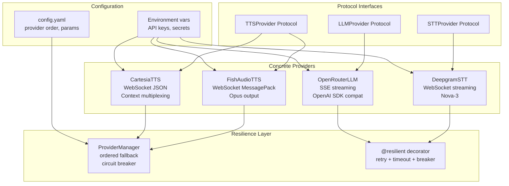
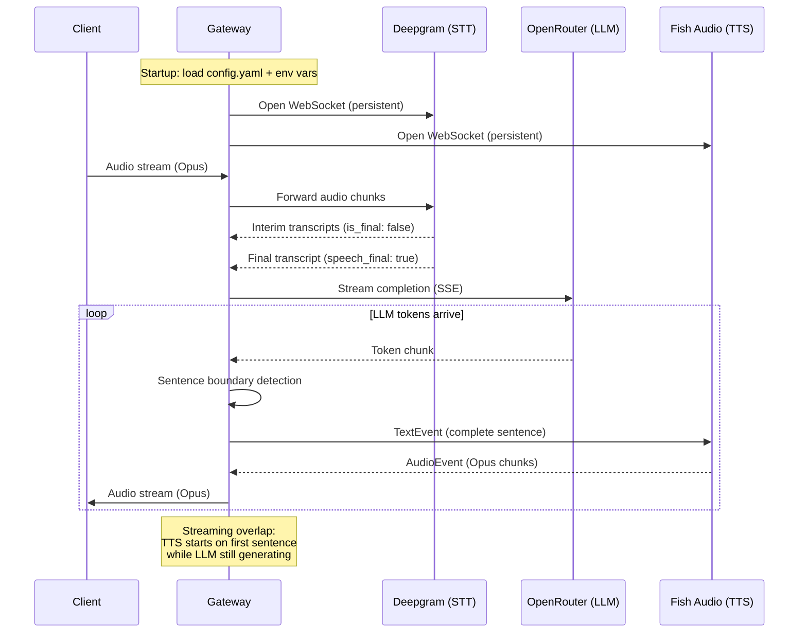

# Provider Integration Layer

## Decision Area
Pluggable interfaces for STT, LLM, and TTS providers. Must support swapping providers without code changes and handle provider failures gracefully.

## Key Questions
1. **Interface design**: Abstract base classes? Protocol classes? How to define the contract
2. **Fish Audio TTS**: Streaming API, voice selection, emotion tags, latency
3. **TTS alternatives**: Cartesia (lowest latency), ElevenLabs (best quality) — compare at family-scale pricing
4. **Deepgram STT**: WebSocket streaming, VAD, partial transcripts
5. **OpenRouter LLM**: Streaming SSE, function calling, model selection
6. **Provider failover**: Automatic fallback when a provider is down
7. **Configuration**: Config file / env vars for provider selection and credentials

---

## 1. Interface Design: Protocol vs ABC

### Why Protocol Over ABC

Python `Protocol` (PEP 544, structural subtyping) is the modern idiomatic choice for pluggable provider systems in Python 3.11+. The key advantages over ABCs for this use case:

- **No import coupling**: A provider implementation doesn't need to import and subclass from the gateway's codebase. If it has the right methods, it Just Works.
- **Decoupled ownership**: Protocols belong where they are *used* (gateway core), ABCs belong to their *subclasses* — Protocol is cleaner for plugin registries.
- **Zero runtime overhead**: Purely a type-checker artifact unless you opt into `@runtime_checkable`.
- **Async-native**: `async def` methods in Protocol signatures are fully enforced by mypy/pyright — a regular `def` won't satisfy an `async def` Protocol method.

**Use ABC when**: you want to share concrete implementation via inheritance (e.g., a `BaseProvider` with shared retry/config logic). The two patterns compose well — define the interface as Protocol, offer an optional ABC base for convenience.

### `@runtime_checkable` Caveat

`@runtime_checkable` checks method/attribute **names only** — not signatures, return types, or parameter types. A class with `def transcribe(self, wrong_arg)` returning `int` would pass `isinstance(obj, STTProvider)`. **Do not rely on it for correctness** — use static type checkers instead.

### Recommended Interface Design

```python
from typing import Protocol, AsyncIterator, Any

class STTProvider(Protocol):
    """Speech-to-text provider contract."""
    def configure(self, **kwargs: Any) -> None: ...
    async def transcribe_stream(
        self, audio_stream: AsyncIterator[bytes]
    ) -> AsyncIterator[str]: ...
    # Yields partial transcripts (interim), then final transcript

class LLMProvider(Protocol):
    """LLM provider contract."""
    def configure(self, **kwargs: Any) -> None: ...
    async def complete(
        self, messages: list[dict], **kwargs: Any
    ) -> str: ...
    async def stream_complete(
        self, messages: list[dict], **kwargs: Any
    ) -> AsyncIterator[str]: ...
    async def complete_with_tools(
        self, messages: list[dict], tools: list[dict], **kwargs: Any
    ) -> dict: ...

class TTSProvider(Protocol):
    """Text-to-speech provider contract."""
    def configure(self, **kwargs: Any) -> None: ...
    async def synthesize(self, text: str) -> bytes: ...
    async def stream_synthesize(
        self, text: str
    ) -> AsyncIterator[bytes]: ...
    # For LLM→TTS streaming overlap:
    async def stream_from_text_stream(
        self, text_stream: AsyncIterator[str]
    ) -> AsyncIterator[bytes]: ...
```

For streaming, `AsyncIterator[T]` in Protocol is satisfied by `async def` with `yield` (async generators are subtypes of `AsyncIterator`).

### Optional Base Class for Shared Logic

```python
from abc import ABC

class BaseProvider(ABC):
    """Optional mixin — provides config management. Not required."""
    def __init__(self) -> None:
        self._config: dict[str, Any] = {}
    
    def configure(self, **kwargs: Any) -> None:
        self._config.update(kwargs)
```

### Approach Comparison: Interface Design

| Factor | A. Protocol (Recommended) | B. ABC | C. Dict/Function Module |
|--------|:-:|:-:|:-:|
| Import coupling | None | Requires import + inheritance | None |
| Static type checking | Full (mypy/pyright) | Full | Minimal |
| Async method enforcement | Yes (signature-level) | Yes (at instantiation) | No |
| Runtime overhead | Zero | Metaclass overhead at class creation | Zero |
| IDE support (pyright) | Excellent | Good | Poor |
| Extensibility | Add methods to Protocol | Add abstract methods | Add function conventions |
| Shared implementation logic | Via optional ABC mixin | Built-in | Not supported |

**Recommendation: Protocol (A)** with an optional ABC mixin for shared config/retry logic. Best of both worlds — structural typing for the contract, inheritance for convenience.

---

## 2. Fish Audio TTS Integration

### API Architecture

Fish Audio offers two streaming paths:

**WebSocket (`wss://api.fish.audio/v1/tts/live`)** — Bidirectional MessagePack framing. Ideal for LLM→TTS streaming overlap:
1. `StartEvent` — TTS config (format, voice, latency mode, prosody)
2. `TextEvent` — Stream text chunks as LLM generates them
3. `FlushEvent` — Force synthesis of buffered text (sentence boundary)
4. `CloseEvent` — End session

Server responds with `AudioEvent` (binary chunks) and `FinishEvent`.

**HTTP Streaming (`POST /v1/tts`)** — Full text in, chunked audio out. Simpler, but no incremental text input — only suitable when complete text is available upfront.

### Latency Modes

| Mode | Quality | Latency | Use Case |
|------|---------|---------|----------|
| `low` | Acceptable | Lowest | Real-time voice agent (recommended) |
| `balanced` | Good | Medium | Default |
| `normal` | Best | Highest | Pre-generated audio |

### Voice Selection

Two mechanisms:
- **Persistent voice model** (recommended): Pre-upload 15-30s of reference audio via `POST /model`, reference by `reference_id` UUID. Better quality and lower latency.
- **Zero-shot inline cloning**: Pass `references: [{"audio": bytes, "text": transcript}]` per request. Higher latency, useful for experimentation.

### Audio Output Formats

| Format | Sample Rate | Notes |
|--------|-------------|-------|
| `opus` | 48 kHz mono | Best for WebSocket streaming (low bandwidth) |
| `mp3` | 32-44.1 kHz | Default, 64-192 kbps |
| `pcm` | 8-44.1 kHz | Raw signed 16-bit LE |
| `wav` | 8-44.1 kHz | PCM with header |

Opus at `opus_bitrate: -1000` (auto) is ideal for our gateway — matches the client-gateway Opus codec choice.

### Emotion/Prosody Control

- **Inline text tags**: `(excited)`, `(nervous)`, `(confident)` — embedded in text string
- **Prosody object**: `speed` (0.5-2.0x), `volume` (±20 dB offset)
- No SSML support. No pitch control.

### Key Parameters

- `chunk_length`: 100-300 chars (default 300) — controls synthesis chunk granularity
- `condition_on_previous_chunks`: bool — maintains voice consistency across chunks
- `temperature`: 0-1 (default 0.7), `top_p`: 0-1 (default 0.7)
- Models: `s1` (standard), `s2-pro` (multi-speaker, higher quality)

### Python SDK

`pip install fish-audio-sdk` — provides `FishAudio` (sync) and `AsyncFishAudio` (async). WebSocket streaming is a first-class feature.

### Rate Limits

Tiered by cumulative spend (no RPM caps documented):
| Tier | Spend | Concurrent Requests |
|------|-------|---------------------|
| Starter | <$100 | 5 |
| Elevated | ≥$100 | 15 |

5 concurrent requests is sufficient for our 5-user family scale.

---

## 3. TTS Provider Comparison

### Head-to-Head: Fish Audio vs Cartesia vs ElevenLabs

| Factor | Fish Audio | Cartesia | ElevenLabs |
|--------|:-:|:-:|:-:|
| **TTFB** | ~200-500ms (est., `low` mode) | ~40ms (Sonic Turbo) | ~75ms (Flash v2.5) |
| **Quality** | Good (natural, emotion tags) | Good (SSM architecture) | Best (4.14 MOS, most natural) |
| **Streaming protocol** | WebSocket (MessagePack) | WebSocket (JSON, context mux) | WebSocket |
| **Opus output** | Yes (48 kHz) | No (PCM/WAV/MP3 only) | Yes |
| **Context multiplexing** | No (1 session per WS) | Yes (dozens on 1 WS) | No |
| **Python SDK** | `fish-audio-sdk` (async) | `cartesia` v3.0.2 (async, httpx) | `elevenlabs` (async) |
| **Emotion control** | Inline tags + prosody | 60+ emotion options + speed/volume | Style controls |
| **Word timestamps** | No | Yes (word + phoneme level) | Yes |
| **Self-hostable fallback** | Yes (Fish Speech, Apache 2.0) | No | No |

### Pricing at Family Scale (~100 requests/day, ~30s avg audio each)

| Provider | Plan | Monthly Cost | Audio Budget |
|----------|------|-------------|--------------|
| Fish Audio | PAYG ($15/1M UTF-8 bytes) | **~$2-3** | Effectively unlimited |
| Cartesia | Pro ($4/mo annual) | **$4** | ~111 min/mo (may be tight) |
| Cartesia | Startup ($39/mo) | **$39** | ~1,389 min/mo (ample) |
| ElevenLabs | Creator ($22/mo) | **$22** | 100k chars/mo (~67 min) |
| ElevenLabs | Pro ($99/mo) | **$99** | 500k chars/mo |

### Cartesia Deep Dive

Cartesia's WebSocket API has a unique **context multiplexing** feature — multiple TTS generations share a single WebSocket connection via `context_id`. This eliminates ~200ms of TCP+TLS handshake per request. Features:

- `continue: true` flag for LLM→TTS streaming (maintains prosody across chunks)
- Explicit cancel per context (`cancel: true`)
- Word-level and phoneme-level timestamps without extra latency
- Sonic Turbo: ~40ms TTFB; Sonic 3: ~80ms TTFB, 42 languages

**Critical limitation**: No Opus output format. Only PCM, WAV, MP3. This means the gateway would need to transcode to Opus for client delivery — adding CPU load on RPi5 and ~5-10ms latency.

**Credit budget concern**: Pro plan gives 100K credits = ~111 minutes of audio/month. At 100 requests/day × 10s avg response = ~500 min/month — **insufficient on Pro plan**. Would need Startup ($39/mo) or PAYG.

### ElevenLabs Assessment

Highest quality (4.14 MOS) but worst price-performance. The Creator plan at $22/mo only provides ~67 minutes of audio — likely insufficient. Pro at $99/mo is overkill for a family project. **Not recommended as primary** but could be a premium fallback option.

### TTS Provider Recommendation

**Primary: Fish Audio** — Best price-performance ($2-3/mo), native Opus output (matches client codec), WebSocket streaming, emotion tags, self-hostable fallback (Fish Speech). Adequate quality for a family assistant.

**Fallback: Cartesia Sonic Turbo** — Lowest latency (40ms TTFB) but requires Opus transcoding and higher plan ($39/mo for sufficient credits). Consider if Fish Audio latency proves unacceptable.

**Not recommended: ElevenLabs** — Prohibitive cost at family scale despite best quality.

---

## 4. Deepgram STT Integration

### WebSocket Protocol

**Connection**: `wss://api.deepgram.com/v1/listen?model=nova-3&encoding=linear16&sample_rate=16000&channels=1&interim_results=true&endpointing=300&vad_events=true`

Configuration is via query parameters (no JSON config message needed). Audio is sent as raw binary WebSocket frames — no framing envelope.

### Turn-Taking: `is_final` + `speech_final`

Two orthogonal flags on every `Results` message:

| Flag | Meaning |
|------|---------|
| `is_final: false` | Interim/partial — transcript may change |
| `is_final: true` | Audio segment fully processed, won't be revised |
| `speech_final: false` | Speaker still talking |
| `speech_final: true` | Endpointing fired — speaker stopped |

**Correct turn-taking pattern**:
1. Accumulate all `is_final: true` transcript chunks (concatenate)
2. On `speech_final: true`, the accumulated string is the complete utterance — submit to LLM
3. Display `is_final: false` (interim) results for responsive UI feedback

### VAD and Endpointing

- `vad_events=true`: Emits `SpeechStarted` and `UtteranceEnd` events
- `endpointing=<ms>`: Silence threshold for `speech_final` (default 10ms, recommend 300ms for natural conversation)
- `utterance_end_ms=1000`: Safety net — fires `UtteranceEnd` after N ms of silence

Tuning tradeoff: shorter endpointing = faster response but more false positives on mid-thought pauses; longer = more natural but higher latency. 300ms is a good starting point for voice assistant use.

### Audio Input

Supports extensive formats. Recommended for our gateway: `encoding=opus` (since clients send Opus) or `encoding=linear16&sample_rate=16000` (if decoding to PCM first). Container formats (WAV, Ogg, WebM) auto-detect.

### Connection Lifecycle

- **Idle timeout**: 10 seconds of no audio AND no KeepAlive → closes with `NET-0001`
- **KeepAlive**: Send `{"type": "KeepAlive"}` text frame every 3-5s during silence (e.g., while TTS is playing back)
- **Graceful close**: Send `{"type": "CloseStream"}` — server flushes remaining transcripts then closes
- **Finalize**: Send `{"type": "Finalize"}` to force emission of current partial transcript

### Python SDK

`deepgram-python-sdk` — production quality, actively maintained. Both sync (`DeepgramClient`) and async (`AsyncDeepgramClient`) modes. Listen v1 (general) and v2 (conversational AI with advanced turn detection).

### Latency

- Transcription processing: 150-300ms
- Total end-to-end: 200-500ms
- Nova-3 rated "sub-300ms streaming latency"

### Cost

$0.0077/min PAYG. At ~100 requests/day × 15s avg audio = ~25 min/day → **~$6/month**.

---

## 5. OpenRouter LLM Integration

### Streaming SSE

Enable with `"stream": true`. OpenAI-compatible format:
- `data: {"choices":[{"delta":{"content":"token"},"finish_reason":null}]}`
- Heartbeat comments `": OPENROUTER PROCESSING"` keep connection alive (discard)
- Usage data in final chunk before `data: [DONE]`
- **Mid-stream errors**: HTTP stays 200 (headers sent); error arrives as SSE event with `finish_reason: "error"` — must parse stream content, not just HTTP status

### Function/Tool Calling

Standard OpenAI tool schema format. Key details:
- `tools` param must be included in **every request** in a multi-turn tool loop
- Response: `finish_reason: "tool_calls"` with `tool_calls` array
- `tool_choice: "auto"` (default), `"none"`, or force-specific-tool
- Supported models: Claude series, GPT-4/o-series, Gemini series, Qwen, etc.
- Filter: `openrouter.ai/models?supported_parameters=tools`

### Per-Request Model Selection

Full flexibility — specify `model` per request:
```python
{"model": "anthropic/claude-sonnet-4-5", ...}
```

**Model fallback array** — automatic cascading:
```python
{"models": ["anthropic/claude-sonnet-4-5", "openai/gpt-4o"], ...}
```
Tries in order on rate limits, context length errors, moderation blocks, downtime.

### Built-In Provider Failover

Default: load-balances across providers, excludes those with outages in last 30s. Configurable via `provider` object:
- `order`: Explicit provider priority list
- `sort`: `"latency"`, `"throughput"`, `"price"`
- `allow_fallbacks`: Enable/disable cascading (default true)
- `data_collection`: `"deny"` for privacy-conscious routing
- Routing suffixes: `:nitro` (throughput), `:floor` (cheapest), `:exacto` (quality/tool-calling)

### Python Integration

Drop-in with OpenAI SDK:
```python
from openai import AsyncOpenAI

client = AsyncOpenAI(
    base_url="https://openrouter.ai/api/v1",
    api_key=OPENROUTER_KEY,
)

async for chunk in await client.chat.completions.create(
    model="anthropic/claude-sonnet-4-5",
    messages=messages,
    stream=True,
    extra_body={"provider": {"sort": "latency"}},
):
    yield chunk.choices[0].delta.content
```

OpenRouter-specific parameters (`models`, `provider`, `plugins`) go in `extra_body`.

### Response Healing

Plugin that repairs malformed JSON (missing brackets, commas, markdown-wrapped JSON). Enable with `plugins: [{"id": "response-healing"}]`. **Non-streaming only** — useful for classifier/tool-routing JSON responses but not for main conversation streaming.

### Rate Limits

Pay-as-you-go: no platform-level rate limits. Free tier: 50 req/day, 20 req/min. Our budget ($1-3/mo for Haiku 4.5) implies PAYG with credits — effectively unlimited rate.

### Cost

| Model | Input/Output per 1M tok | Est. Monthly (100 req/day) |
|-------|--------------------------|---------------------------|
| Haiku 4.5 | $1/$5 | ~$1-3 |
| Gemini Flash Lite | $0.25/$1.50 | <$1 |
| DeepSeek V3 | $0.14/$0.28 | <$0.50 |
| Claude Sonnet 4.5 | $3/$15 | ~$5-15 |

---

## 6. Provider Failover Strategy

### Approach Comparison

| Factor | A. Config-Ordered Fallback (Recommended) | B. Health-Check Based | C. No Automatic Failover |
|--------|:-:|:-:|:-:|
| Complexity | Low-medium | High (health probes, state machine) | Minimal |
| Latency on failure | +request timeout (5-10s) | Near-zero (pre-routed) | Manual intervention |
| RPi5 resource fit | Good (no background probes) | Poor (continuous pinging) | Excellent |
| Family-scale fit | Excellent | Overengineered | Acceptable but fragile |
| False positive risk | Low (fail-then-switch) | Medium (health != functional) | N/A |

### Recommended: Config-Ordered Fallback with Circuit Breaker

For 5 family users, health-check probes are overengineered. Config-ordered fallback with circuit breakers provides the right balance:

```yaml
# config.yaml
tts:
  providers:
    - name: fish-audio
      api_key_env: FISH_AUDIO_KEY
      timeout: 10
      circuit_breaker:
        failure_threshold: 3      # open after 3 consecutive failures
        recovery_timeout: 60      # try again after 60s
    - name: cartesia
      api_key_env: CARTESIA_KEY
      timeout: 10
      circuit_breaker:
        failure_threshold: 3
        recovery_timeout: 60
```

### pyresilience for Resilience Wrapping

The `pyresilience` library (v0.3.2, Python 3.9+, zero dependencies) provides a unified `@resilient()` decorator:

```python
from pyresilience import resilient

class FishAudioTTS:
    @resilient(
        retry_attempts=2,
        retry_backoff="exponential",
        circuit_breaker_threshold=3,
        circuit_breaker_recovery=60,
        timeout=10.0,
    )
    async def stream_synthesize(self, text: str) -> AsyncIterator[bytes]:
        ...
```

Supports retry, circuit breaker, timeout, bulkhead (concurrency limiting), and fallback — all in one decorator, both sync and async. OpenTelemetry integration built in.

### Provider Manager Implementation Sketch

```python
class ProviderManager[T]:
    """Manages ordered provider fallback for any provider type."""
    
    def __init__(self, providers: list[T]):
        self.providers = providers  # ordered by priority
        self._circuit_open: dict[int, float] = {}  # provider index → reopen time
    
    async def call(self, method: str, *args, **kwargs):
        """Try each provider in order, skip circuit-open ones."""
        last_error = None
        for i, provider in enumerate(self.providers):
            if self._is_circuit_open(i):
                continue
            try:
                return await getattr(provider, method)(*args, **kwargs)
            except Exception as e:
                self._record_failure(i)
                last_error = e
                continue
        raise ProviderUnavailableError(f"All providers failed") from last_error
```

### LLM Failover: OpenRouter Handles It

For LLM, OpenRouter already provides built-in provider failover via the `models` array. No need to implement our own — just configure the fallback list:

```python
extra_body={"models": ["anthropic/claude-sonnet-4-5", "openai/gpt-4o", "google/gemini-2.5-flash"]}
```

### STT Failover: Deferred

With only Deepgram as our STT provider, there's no failover target. If Deepgram is down, the gateway should surface a clear "speech recognition unavailable" message to clients. Adding a second STT provider (e.g., Google Cloud Speech, Assembly AI) is future work.

---

## 7. Configuration Strategy

### Approach Comparison

| Factor | A. YAML Config File | B. Environment Variables | C. Hybrid (Recommended) |
|--------|:-:|:-:|:-:|
| Structure expressiveness | Excellent (nested, lists) | Poor (flat key-value) | Excellent |
| Secret management | Poor (secrets in files) | Good (systemd, .env) | Good (secrets in env) |
| Deployment ergonomics | Good (single file) | Good (systemd integration) | Best |
| 12-factor compliance | No | Yes | Partial (secrets yes, config no) |
| Human editability | Excellent (family admin) | Poor | Good |
| Hot-reload potential | Yes (watch file) | No (restart required) | Partial |

### Recommended: Hybrid (C)

**YAML for structure** — provider ordering, feature flags, tuning parameters:
```yaml
# /etc/voice-gateway/config.yaml
gateway:
  host: 0.0.0.0
  port: 8765

stt:
  provider: deepgram
  model: nova-3
  endpointing_ms: 300
  encoding: opus

llm:
  provider: openrouter
  models:
    primary: anthropic/claude-sonnet-4-5
    classifier: deepseek/deepseek-chat-v3
    memory_extraction: deepseek/deepseek-chat-v3
  routing:
    sort: latency
    allow_fallbacks: true

tts:
  providers:
    - name: fish-audio
      model: s1
      latency_mode: low
      voice_id: "<uuid>"
      output_format: opus
    - name: cartesia  # fallback
      model: sonic-turbo

persona:
  file: /etc/voice-gateway/persona.md

memory:
  dir: /var/lib/voice-gateway/memory/
  tier1_max_tokens: 500
  tier2_max_tokens: 500
  summarization_schedule: weekly
```

**Environment variables for secrets** (managed by systemd credentials or `.env`):
```bash
DEEPGRAM_API_KEY=...
OPENROUTER_API_KEY=...
FISH_AUDIO_API_KEY=...
CARTESIA_API_KEY=...
```

**Configuration loading**:
```python
import yaml
import os

def load_config(path: str = "/etc/voice-gateway/config.yaml") -> dict:
    with open(path) as f:
        config = yaml.safe_load(f)
    # Inject secrets from env
    config["stt"]["api_key"] = os.environ["DEEPGRAM_API_KEY"]
    config["llm"]["api_key"] = os.environ["OPENROUTER_API_KEY"]
    for p in config["tts"]["providers"]:
        env_key = f"{p['name'].upper().replace('-', '_')}_API_KEY"
        p["api_key"] = os.environ[env_key]
    return config
```

### Provider Swapping

To switch TTS from Fish Audio to Cartesia, the admin edits `config.yaml`:
```yaml
tts:
  providers:
    - name: cartesia    # now primary
      model: sonic-turbo
    - name: fish-audio  # now fallback
```

Then restarts the gateway. No code changes required.

---

## Architecture: Complete Provider Integration





---

## Approaches Summary

### Overall Provider Integration Approaches

| Factor | A. Protocol + Ordered Fallback + Hybrid Config (Recommended) | B. ABC + Health Checks + YAML Only | C. Minimal (No Fallback, Env Only) |
|--------|:-:|:-:|:-:|
| Extensibility | Excellent (drop-in providers) | Good (subclass required) | Poor |
| Resilience | Good (circuit breaker + retry) | Best (proactive health checks) | None |
| RPi5 resource fit | Excellent (no background probes) | Poor (continuous pinging) | Excellent |
| Configuration ergonomics | Best (structure + secrets separated) | Good | Poor (flat env vars) |
| Implementation complexity | Medium | High | Low |
| Family-scale fit | Excellent | Overengineered | Fragile |
| Static type safety | Excellent (Protocol + pyright) | Good | None |

### Key Architecture Decisions

1. **Interface design**: Protocol classes for provider contracts — structural typing, zero runtime overhead, async-native
2. **Optional ABC mixin**: `BaseProvider` for shared config/retry logic — composable with Protocol
3. **TTS primary**: Fish Audio — $2-3/mo, native Opus, WebSocket streaming, emotion tags, self-hostable fallback
4. **TTS fallback**: Cartesia Sonic Turbo — 40ms TTFB, but needs Opus transcoding, higher cost ($39/mo for sufficient credits)
5. **STT**: Deepgram Nova-3 — WebSocket streaming, `speech_final` for turn-taking, 300ms endpointing, ~$6/mo
6. **LLM**: OpenRouter — OpenAI SDK compatible, built-in provider failover via `models` array, per-request model selection
7. **Failover**: Config-ordered fallback with circuit breakers (TTS); OpenRouter-native (LLM); deferred (STT)
8. **Resilience**: `pyresilience` `@resilient()` decorator for retry + circuit breaker + timeout per provider method
9. **Configuration**: Hybrid — YAML for structure/ordering, env vars for API key secrets
10. **Provider swapping**: Edit `config.yaml`, restart gateway — no code changes

### Open Questions for Scoring

- Should the gateway maintain persistent WebSocket connections to STT/TTS providers, or connect per-session? Persistent saves ~200ms but adds connection management complexity.
- Fish Audio TTFB is not officially published — need a PoC to measure actual latency in `low` mode.
- Cartesia's lack of Opus output: how much CPU/latency does FFmpeg transcoding add on RPi5? Worth a PoC.
- Should the classifier model (DeepSeek V3) use the same OpenRouter path as the main LLM, or a separate provider instance for isolation?
- For LLM tool calling, is OpenRouter's model-agnostic tool format reliable enough, or should we target specific models (e.g., Claude only) for tool-calling requests?
- Is `pyresilience` stable enough for production, or should we implement a simpler custom circuit breaker?

---

## Cost Summary (All Providers, ~100 requests/day)

| Component | Provider | Monthly Est. |
|-----------|----------|-------------|
| STT | Deepgram Nova-3 | ~$6 |
| LLM (main) | OpenRouter (Haiku 4.5) | ~$1-3 |
| LLM (classifier) | OpenRouter (DeepSeek V3) | <$0.50 |
| LLM (memory extraction) | OpenRouter (DeepSeek V3) | ~$1.80 |
| TTS (primary) | Fish Audio | ~$2-3 |
| **Total** | | **~$11-14/month** |

With Cartesia as primary TTS instead: **~$48-52/month** (Startup plan required).

---

## Score
Pending
