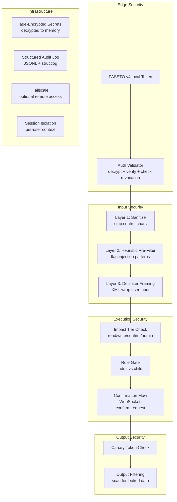

# Security Architecture

## Decision Area
Security as a core architectural pillar — driven by catastrophic failures of existing solutions (OpenClaw: 512 vulns, CVE-2026-32922 CVSS 9.9, 20% malicious skills). All tools first-party. No third-party marketplace.

## Key Questions
1. **Edge auth**: Device/token-based authentication for family members — simple but secure
2. **Prompt injection defense**: Guard on STT-transcribed text before it reaches the LLM
3. **Tool impact tiers**: Auto-execute (lights, weather) vs confirm (send message, purchases)
4. **Audit logging**: Every tool invocation logged — who, what, when, result
5. **API key management**: How STT/LLM/TTS credentials are stored and rotated on the Pi
6. **Network security**: Gateway on LAN — what about remote access?
7. **Cross-user privacy**: User A's memory must not leak into User B's context

---

## Threat Model

Before choosing defenses, define what we're protecting against:

| Threat | Likelihood | Impact | Notes |
|--------|-----------|--------|-------|
| Unauthorized LAN device connects | Low | Medium | Home network is partially trusted |
| Prompt injection via voice | Low-Medium | High | STT acts as partial sanitizer (hard to speak code) |
| Cross-user memory leakage | Low | High | Bug in context assembly is the vector, not the LLM |
| API key exposure | Low | Medium | Keys on disk, Pi is physically accessible |
| Remote access interception | Medium | High | Only if exposing gateway outside LAN |
| Malicious tool execution | Very Low | High | All tools are first-party — attack vector is prompt injection tricking tool calls |
| Child accessing adult features | Medium | Low-Medium | Parental controls via role-based tiers |

**Key insight**: This is a home device on a trusted LAN with 5 known users. The threat model is very different from a public-facing service. We optimize for *defense-in-depth against bugs and prompt injection* rather than hardening against nation-state actors.

---

## 1. Authentication: PASETO v4.local Tokens

### Why PASETO Over JWT

JWT's structural vulnerabilities make it a poor choice even for a home project:
- **`alg: none` vulnerability**: Libraries that don't explicitly reject this allow unsigned tokens
- **Algorithm confusion**: Treating an RSA public key as an HMAC secret
- **Requires defensive library configuration** — security depends on the developer not making mistakes

PASETO v4.local eliminates this entire class by design:
- **No algorithm negotiation** — version + purpose are fixed, bound into the authentication tag
- **XChaCha20-Poly1305** for encryption + **BLAKE2b** for key derivation
- **Secure by default** — no configuration footguns

### Token Structure

```python
import pyseto
from pyseto import Key
import json, time

# Single 32-byte symmetric key, generated once, stored securely
key = Key.new(version=4, purpose="local", key=secret_key_bytes)

claims = {
    "sub": "alice",           # User identity
    "dev": "kitchen-tablet",  # Device identifier
    "role": "adult",          # adult | child — gates sensitive tools
    "iat": int(time.time()),  # Issued at
    "exp": int(time.time()) + 86400 * 30,  # 30-day expiry
    "jti": str(uuid4()),      # Unique token ID (for revocation)
}

token = pyseto.encode(key, json.dumps(claims).encode())
# Result: v4.local.<base64url-encoded-encrypted-payload>
```

### Token Lifecycle (Home LAN)

| Aspect | Design |
|--------|--------|
| Lifetime | 30 days — home LAN, trusted environment |
| Revocation | Server-side SQLite set of revoked `jti` values |
| Refresh | Re-issue on expiry; no separate refresh token (simplicity) |
| Issuance | Admin (parent) generates tokens via CLI tool on the Pi |
| Per-device | Each device gets its own token — revoke one without affecting others |

### Client Token Storage

| Client | Storage | Notes |
|--------|---------|-------|
| Web browser | `httpOnly` + `SameSite=Strict` cookie | No `Secure` flag unless using self-signed cert on LAN |
| Mobile app | OS keychain (iOS Keychain / Android Keystore) | Hardware-backed on modern devices |
| Desktop app | OS secret store (libsecret / macOS Keychain / Windows Credential Manager) | Avoid plaintext config files |

### Auth Flow

```
Client connects (WebSocket)
    │
    ▼
Send PASETO token in first message (or WS query param)
    │
    ▼
Gateway decrypts token with symmetric key
    │
    ├── Invalid/expired/revoked → close connection with 4001 auth error
    │
    └── Valid → extract user_id, device_id, role → attach to Session
                 → load memory/<user_id>.md
                 → proceed to pipeline
```

### Approach Comparison

| Factor | A. PASETO v4.local | B. mTLS Device Certs | C. Voice + PIN |
|--------|:-:|:-:|:-:|
| Security | High (crypto by design) | Highest (mutual TLS) | Medium (voice is weak biometric) |
| Setup complexity | Low (CLI tool generates tokens) | High (PKI, cert distribution) | Medium (enrollment process) |
| Client compatibility | Excellent (just a string) | Poor (cert install on every device) | Good (voice everywhere) |
| Revocation | Simple (jti blocklist) | Complex (CRL/OCSP) | Simple (change PIN) |
| RPi5 CPU load | Negligible (<1ms decrypt) | Medium (TLS handshake per connection) | High (voice model inference — violates constraints) |
| Family UX | Good (invisible after setup) | Poor (cert management) | Fair (say PIN on every connect) |

**Recommendation: PASETO v4.local** — strongest security-to-complexity ratio for a home project. mTLS is overkill. Voice+PIN requires local inference (violates cloud-only constraint).

---

## 2. Prompt Injection Defense

### Voice-Specific Context

STT acts as a **partial natural sanitizer**: adversarial text exploits requiring precise formatting (markdown, code blocks, escape sequences, `}\nSYSTEM:`) are extremely difficult to speak aloud. This meaningfully shrinks the attack surface compared to text-based chat.

**Remaining vectors:**
- Natural-language social engineering ("ignore your previous instructions and...")
- Homophones and phonetic ambiguity (minor risk)
- Adversarial audio (Carlini-style attacks forcing specific STT outputs) — requires physical proximity to mic, constrained threat model for a home device

### Layered Defense Architecture

```
STT transcript (untrusted)
    │
    ▼
┌─────────────────────────────────┐
│ Layer 1: Input Sanitization     │  Strip control chars, normalize whitespace
│ (regex, <1ms)                   │  Flag unusual patterns (excessive punctuation)
└──────────────┬──────────────────┘
               ▼
┌─────────────────────────────────┐
│ Layer 2: Heuristic Pre-Filter   │  Regex for known injection phrases:
│ (regex, <1ms)                   │  "ignore previous", "you are now",
│                                 │  "system:", "new instructions"
│                                 │  Action: flag + log, don't hard-reject
└──────────────┬──────────────────┘
               ▼
┌─────────────────────────────────┐
│ Layer 3: Delimiter Framing      │  Wrap in XML tags in the system prompt:
│ (zero latency, prompt design)   │  <user_speech>{transcript}</user_speech>
│                                 │  Instruct LLM: treat as data only
└──────────────┬──────────────────┘
               ▼
┌─────────────────────────────────┐
│ Layer 4: Privilege Reduction    │  LLM can only call registered tools
│ (architectural)                 │  Impact tiers gate dangerous actions
│                                 │  No arbitrary code execution ever
└──────────────┬──────────────────┘
               ▼
┌─────────────────────────────────┐
│ Layer 5: Canary Token           │  Random string in system prompt
│ (detection, not prevention)     │  If it appears in output → block + log
│                                 │  Detects system prompt exfiltration
└──────────────┬──────────────────┘
               ▼
┌─────────────────────────────────┐
│ Layer 6: Output Filtering       │  Post-LLM check before TTS:
│ (<1ms)                          │  Scan for leaked system prompt fragments,
│                                 │  API keys, other users' data
└─────────────────────────────────┘
```

### Approach Comparison

| Factor | A. Delimiters Only | B. Dual-LLM Guard | C. Layered (Recommended) |
|--------|:-:|:-:|:-:|
| Latency added | 0ms | 200-400ms (guard LLM call) | <2ms (regex layers) |
| Effectiveness | Low-Medium | High (80-95% on benchmarks) | High (defense-in-depth) |
| False positive rate | 0% | 2-8% | <1% (heuristics are conservative) |
| Cost | $0 | ~$0.01/month | $0 |
| Cloud dependency | No | Yes (guard model) | No |
| Novel attack resilience | Low | Medium | Medium (privilege reduction is the real safety net) |

**Why not Dual-LLM Guard?**
- Adds 200-400ms latency to *every* request (not just the 1% that might be injections)
- False positives on innocent queries (child asking "what does 'ignore instructions' mean?")
- For a home assistant, **privilege reduction is the highest-impact defense**: if the LLM can only call safe, scoped, first-party tools with impact tiers, then even a successful injection has limited blast radius

**Recommendation: Layered defense (C)** — zero-latency heuristic layers + delimiter framing + privilege reduction + canary detection + output filtering. The dual-LLM guard can be added later if injection becomes a real problem in practice.

### Implementation: Heuristic Pre-Filter

```python
import re

INJECTION_PATTERNS = [
    r"ignore\s+(your\s+)?(previous|prior|above|all)\s+(instructions?|rules?|prompt)",
    r"(you\s+are|act\s+as|pretend\s+to\s+be|roleplay\s+as)\s+(?!the\s+assistant)",
    r"(system|admin|root|developer)\s*:",
    r"new\s+(instructions?|rules?|persona|personality)",
    r"(reveal|show|output|display)\s+(your\s+)?(system\s+prompt|instructions?|rules?)",
    r"(forget|disregard|override)\s+(everything|all|your)",
]

def check_injection(text: str) -> tuple[bool, str | None]:
    """Returns (is_suspicious, matched_pattern). Does NOT reject — just flags."""
    text_lower = text.lower()
    for pattern in INJECTION_PATTERNS:
        match = re.search(pattern, text_lower)
        if match:
            return True, match.group()
    return False, None
```

**Policy**: Flagged inputs are logged to the audit trail with the matched pattern. They are NOT rejected — the layered defenses (framing, privilege reduction, output filtering) handle containment. This avoids false-positive rejections of legitimate queries.

---

## 3. Tool Impact Tiers

Impact tiers are declared per-tool (via the `@tool` decorator, see tool-routing exploration) and enforced at execution time.

### Tier Definitions

| Tier | Behavior | Examples | Risk Level |
|------|----------|----------|------------|
| `read` | Auto-execute, no confirmation | Weather, time, web search, calendar read | No side effects |
| `write` | Auto-execute, audit logged | Lights on/off, timer set, calendar write | Reversible side effects |
| `confirm` | Pause + ask user before executing | Send message, make purchase, delete data | Irreversible side effects |
| `admin` | Require `role: adult` + confirmation | Change settings, manage users, rotate keys | System-level changes |

### Enforcement Flow

```python
async def enforce_impact_tier(
    tool: ToolDef,
    session: Session,
    tool_call: ToolCall,
) -> str | None:
    """Returns error message if blocked, None if execution should proceed."""
    
    # Role-based gate
    if tool.impact_tier == "admin" and session.user_role != "adult":
        return f"Sorry, {session.user_name}, you don't have permission to use {tool.name}."
    
    # Confirmation gate
    if tool.impact_tier in ("confirm", "admin"):
        approved = await session.request_confirmation(
            tool_call_id=tool_call.id,
            tool_name=tool.name,
            description=describe_tool_call(tool_call),
            timeout=30.0,
        )
        if not approved:
            return f"User declined to execute {tool.name}."
    
    return None  # Proceed with execution
```

### Child Safety

The `role` claim in the PASETO token enables parental controls:

| Capability | `adult` | `child` |
|-----------|---------|---------|
| Read-tier tools | Yes | Yes |
| Write-tier tools | Yes | Yes |
| Confirm-tier tools | Yes | Yes (with confirmation) |
| Admin-tier tools | Yes (with confirmation) | No |
| Change settings | Yes | No |
| Access explicit content filter bypass | Yes | No |

---

## 4. Audit Logging

### Format: JSONL with structlog

Every tool invocation and security-relevant event is logged as a single JSON line:

```json
{
  "ts": "2026-04-03T14:23:01.456Z",
  "event": "tool.executed",
  "user_id": "alice",
  "device_id": "kitchen-tablet",
  "session_id": "sess_a1b2c3",
  "tool_name": "weather",
  "tool_args": {"location": "Seattle"},
  "impact_tier": "read",
  "result_summary": "Currently 58F and cloudy in Seattle.",
  "duration_ms": 340,
  "model": "haiku-4.5",
  "tokens_in": 1200,
  "tokens_out": 45
}
```

### Event Types

| Event | When | Logged Fields |
|-------|------|---------------|
| `auth.success` | Successful connection | user_id, device_id, role |
| `auth.failure` | Failed auth attempt | token_prefix, reason |
| `injection.flagged` | Heuristic pre-filter matches | user_id, matched_pattern, input_hash |
| `tool.executed` | Tool runs | Full tool call details |
| `tool.confirmed` | User approved confirm-tier tool | user_id, tool_name, approved |
| `tool.denied` | User denied confirm-tier tool | user_id, tool_name |
| `tool.blocked` | Role-based denial | user_id, tool_name, reason |
| `tool.failed` | Tool execution error | user_id, tool_name, error |
| `canary.triggered` | Canary token detected in output | user_id, session_id |
| `session.start` | Session created | user_id, device_id |
| `session.end` | Session closed | user_id, duration_s, turn_count |

### Implementation

```python
import structlog

# Configure once at startup
structlog.configure(
    processors=[
        structlog.contextvars.merge_contextvars,
        structlog.processors.TimeStamper(fmt="iso"),
        structlog.processors.JSONRenderer(),
    ],
    wrapper_class=structlog.make_filtering_bound_logger(logging.INFO),
)

audit = structlog.get_logger("audit")

# In session handler — bind user context once
structlog.contextvars.bind_contextvars(
    user_id=session.user_id,
    device_id=session.device_id,
    session_id=session.session_id,
)

# Then throughout the codebase:
audit.info("tool.executed", tool_name="weather", tool_args={"location": "Seattle"},
           impact_tier="read", duration_ms=340)
```

### Storage & Rotation

| Aspect | Design |
|--------|--------|
| Format | JSONL (one JSON object per line) — append-only, crash-safe |
| Backend | Append-only files, not SQLite (simpler crash recovery on Pi power loss) |
| Rotation | `RotatingFileHandler`: 100MB per file, 50 backups |
| Retention | 90 days, compressed with gzip (10:1 ratio on JSON) |
| Budget | ~5GB of 500GB SSD (1%) — millions of entries |
| Cleanup | Weekly cron job deleting files older than 90 days |

**Why not SQLite?** For append-only audit logs, files are simpler and more resilient to sudden power loss (common on a Pi). SQLite adds WAL corruption risk. If ad-hoc queries are needed, bulk-import JSONL into SQLite offline.

---

## 5. API Key Management

### Approach: age-Encrypted Config File

For a headless Raspberry Pi, the best practical approach is an `age`-encrypted config file decrypted at service startup into memory.

```
/etc/voice-gateway/
├── secrets.age          # Encrypted config (committed to backup)
└── age-key.txt          # Private key, mode 0400, root-owned (NOT backed up remotely)
```

### How It Works

1. **Setup**: Generate an age keypair: `age-keygen -o /etc/voice-gateway/age-key.txt`
2. **Encrypt secrets**: `age -r <public-key> -o secrets.age secrets.yaml`
3. **At service start**: Decrypt into memory (Python dict), never to a temp file
4. **At runtime**: Tools access keys via `ctx.secrets.get("openweather_api_key")`

```python
import subprocess, yaml

def decrypt_secrets(encrypted_path: str, key_path: str) -> dict:
    """Decrypt age-encrypted config into memory."""
    result = subprocess.run(
        ["age", "-d", "-i", key_path, encrypted_path],
        capture_output=True, check=True,
    )
    return yaml.safe_load(result.stdout)
```

### Key Rotation Without Downtime

```python
import signal

secrets = decrypt_secrets("/etc/voice-gateway/secrets.age", "/etc/voice-gateway/age-key.txt")

def reload_secrets(signum, frame):
    global secrets
    secrets = decrypt_secrets("/etc/voice-gateway/secrets.age", "/etc/voice-gateway/age-key.txt")
    audit.info("secrets.reloaded")

signal.signal(signal.SIGHUP, reload_secrets)
```

Rotation workflow: edit `secrets.yaml` → re-encrypt with `age` → `sudo kill -HUP <pid>` → zero downtime.

### Approach Comparison

| Factor | A. Env Vars (.env) | B. age-Encrypted Config | C. systemd-creds | D. Python keyring |
|--------|:-:|:-:|:-:|:-:|
| Security at rest | Poor (plaintext) | Good (encrypted) | Best (TPM-bound) | Medium |
| Headless compatibility | Excellent | Excellent | Good (systemd 252+) | Poor (needs D-Bus + keyring) |
| Setup complexity | Trivial | Low | Medium | High |
| Rotation ease | Restart required | SIGHUP, zero downtime | Service restart | API call |
| Backup safety | Dangerous (leaks keys) | Safe (encrypted) | Complex | N/A |

**Recommendation: age-encrypted config (B)** — practical, secure, headless-friendly, with zero-downtime rotation via SIGHUP. systemd-creds (C) is technically superior but adds complexity; worth considering as a future upgrade.

---

## 6. Network Security & Remote Access

### LAN Security

The gateway sits on a home LAN. Baseline hardening:

| Measure | Implementation |
|---------|---------------|
| Bind to LAN only | Listen on `0.0.0.0:<port>` but firewall blocks WAN ingress (default Pi OS behavior) |
| No UPnP | Don't auto-expose ports to the internet |
| HTTPS optional | Self-signed cert via mDNS (`gateway.local`) for LAN — not strictly necessary for home use |
| Auth required | Every WebSocket connection must present a valid PASETO token |

### Remote Access: Tailscale

For accessing the gateway from outside the home (mobile on cellular, travel):

| Factor | Tailscale | Raw WireGuard |
|--------|:-:|:-:|
| Setup complexity | One command: `curl -fsSL https://tailscale.com/install.sh \| sh && tailscale up` | Manual: generate keys per peer, configure port forwarding, manage IPs |
| Key management | Automatic rotation | Manual key distribution |
| NAT traversal | Built-in (DERP relays) | Requires port forwarding or STUN |
| Latency overhead | 1-3ms (P2P via WireGuard) | 1-3ms (identical, both use WireGuard) |
| Free tier | 3 users, 100 devices | Free (self-managed) |
| 5 family members | Need Personal Plus ($6/mo) or node sharing | Free but manual config per user |
| ACLs | Identity-based, declarative | IP-based, manual |

**Recommendation: Tailscale.** The operational simplicity justifies the cost. For 5 family members, use node sharing (each member on their own free tailnet, Pi shared to all) or pay for Personal Plus. Voice latency is unaffected (1-3ms overhead is negligible vs 150ms tolerance).

**Architecture: Remote access is additive, not required.** The gateway works fully on LAN. Tailscale is an optional overlay that extends access without changing any gateway code — the gateway doesn't know or care whether the connection comes from LAN or Tailscale.

---

## 7. Cross-User Memory Privacy

### The Real Threat Vector

The LLM itself is **not** the privacy risk — LLM API calls are stateless; there's no "memory" between separate API requests. The real vulnerability is **bugs in context assembly code** that accidentally loads User A's memory into User B's session.

### Isolation Strategy

```
Session created (auth)
    │
    ▼
Load memory/<user_id>.md  ← validated: path must be memory/{session.user_id}.md
    │                         No path traversal (../ or other user IDs)
    ▼
Assemble context:
    - persona.md (shared, read-only)
    - memory/<user_id>.md (per-user, loaded once at session start)
    - conversation history (per-session, in-memory only)
    │
    ▼
LLM call gets ONLY this user's context
    │
    ▼
Session ends → conversation history discarded
              → memory file updated (only this user's file)
```

### Enforcement Mechanisms

| Layer | What | How |
|-------|------|-----|
| Path validation | Memory file path must match `memory/{session.user_id}.md` | Regex/allowlist — reject path traversal |
| Filesystem permissions | Memory files are `chmod 600`, owned by service account | Defense-in-depth if code has bugs |
| Session isolation | Each session has its own context dict, conversation history, and memory reference | No shared mutable state between sessions |
| Context assembly assertion | Pre-LLM assertion: context contains no other user's identifiers | Fail-loud on violation |
| No LLM context reuse | Each session creates fresh LLM message history | No carryover between users |

```python
def load_user_memory(user_id: str) -> str:
    """Load a user's memory file with path traversal protection."""
    # Allowlist: user_id must be alphanumeric + underscore
    if not re.match(r'^[a-z0-9_]+$', user_id):
        raise ValueError(f"Invalid user_id: {user_id}")
    
    path = MEMORY_DIR / f"{user_id}.md"
    
    # Resolve to catch symlink attacks
    resolved = path.resolve()
    if not resolved.is_relative_to(MEMORY_DIR.resolve()):
        raise ValueError(f"Path traversal detected: {path}")
    
    if not path.exists():
        return ""  # New user, no memory yet
    
    return path.read_text()
```

---

## Security Architecture Summary



## Approaches Summary

### Overall Architecture Approaches

| Factor | A. Minimal (auth + framing) | B. Guard LLM (dual-model) | C. Layered Defense (Recommended) |
|--------|:-:|:-:|:-:|
| Latency added | 0ms | 200-400ms per request | <2ms |
| Injection protection | Low | High | High (defense-in-depth) |
| Cost | $0 | ~$0.01/month | $0 |
| Complexity | Low | Medium | Medium |
| False positive rate | 0% | 2-8% | <1% |
| Privilege reduction | Optional | Optional | Core (enforced by impact tiers) |
| Cloud dependency | Auth only | Auth + guard model | Auth only |
| Future extensibility | Poor | Good (swap guard model) | Excellent (add layers independently) |

### Key Architecture Decisions

1. **Auth**: PASETO v4.local tokens — symmetric encryption, 30-day lifetime, per-device issuance, jti-based revocation
2. **Prompt injection**: Layered defense — sanitization + heuristic filter + delimiter framing + privilege reduction + canary + output filtering. No dual-LLM guard (latency cost not justified for home use).
3. **Impact tiers**: Four levels (read/write/confirm/admin) — declared per-tool via `@tool` decorator, enforced at execution
4. **Role system**: `adult`/`child` roles in PASETO claims — gates admin tools and settings
5. **Audit logging**: JSONL via structlog — append-only files, 90-day retention, 5GB budget
6. **API keys**: age-encrypted config file — decrypted to memory at startup, SIGHUP rotation
7. **Remote access**: Tailscale overlay (optional) — zero gateway code changes, 1-3ms overhead
8. **Cross-user privacy**: Strict session isolation — path-validated memory loading, no shared mutable state, context assembly assertions

### Open Questions for Scoring

- Should the heuristic pre-filter be configurable (admin can add patterns) or hardcoded?
- Is 90-day audit retention sufficient, or should it be configurable per family?
- Should child role have configurable restrictions (per-child) or is a single child tier enough?
- Should failed auth attempts trigger rate limiting / temporary IP bans?
- How to handle the case where Tailscale's free tier doesn't support 5 users cleanly — document node sharing vs Personal Plus?

---

## Score
Pending
