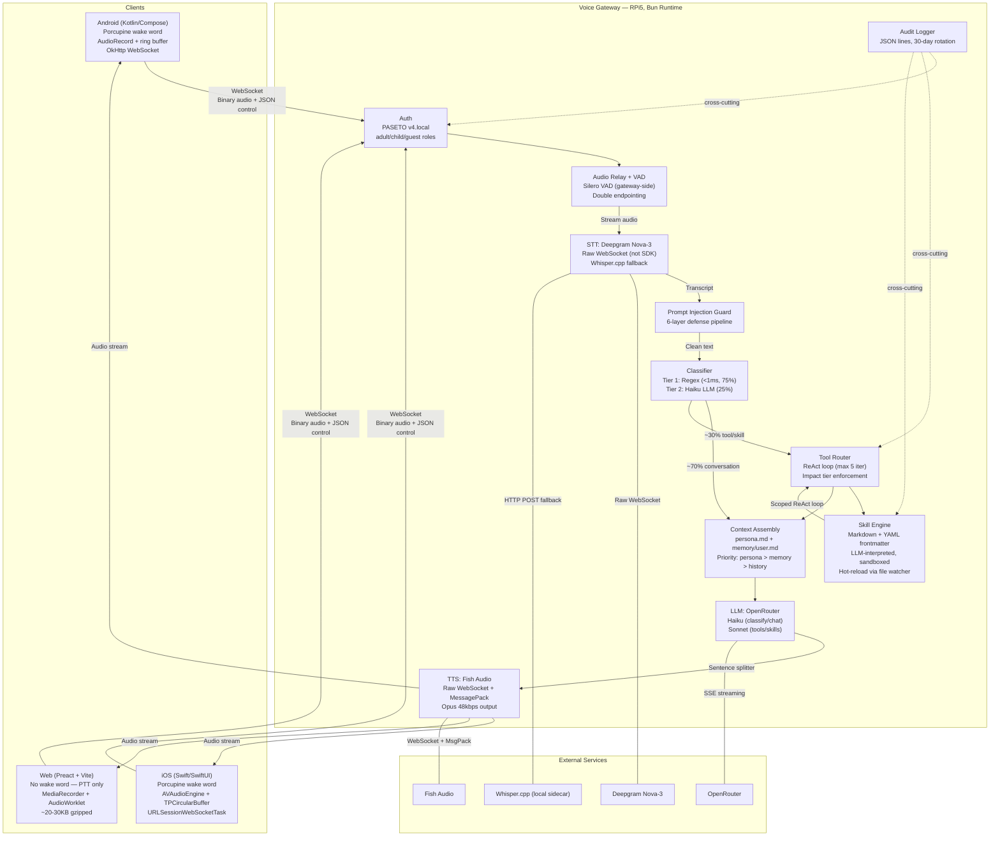
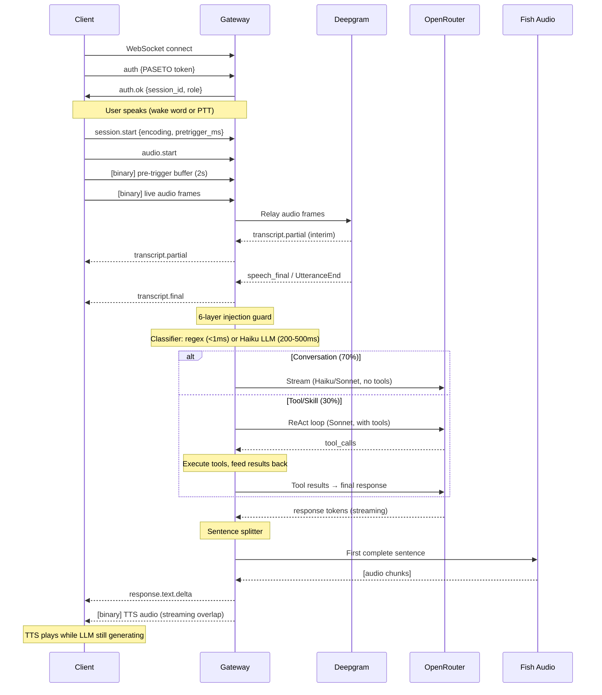
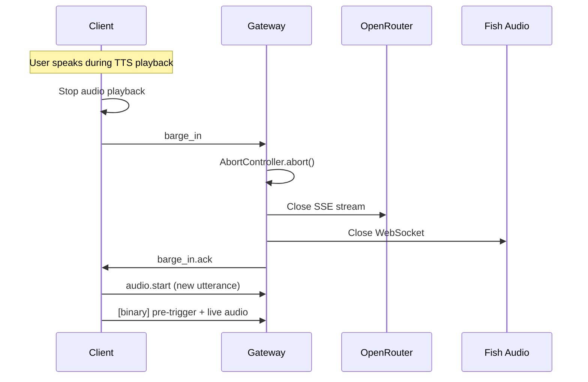
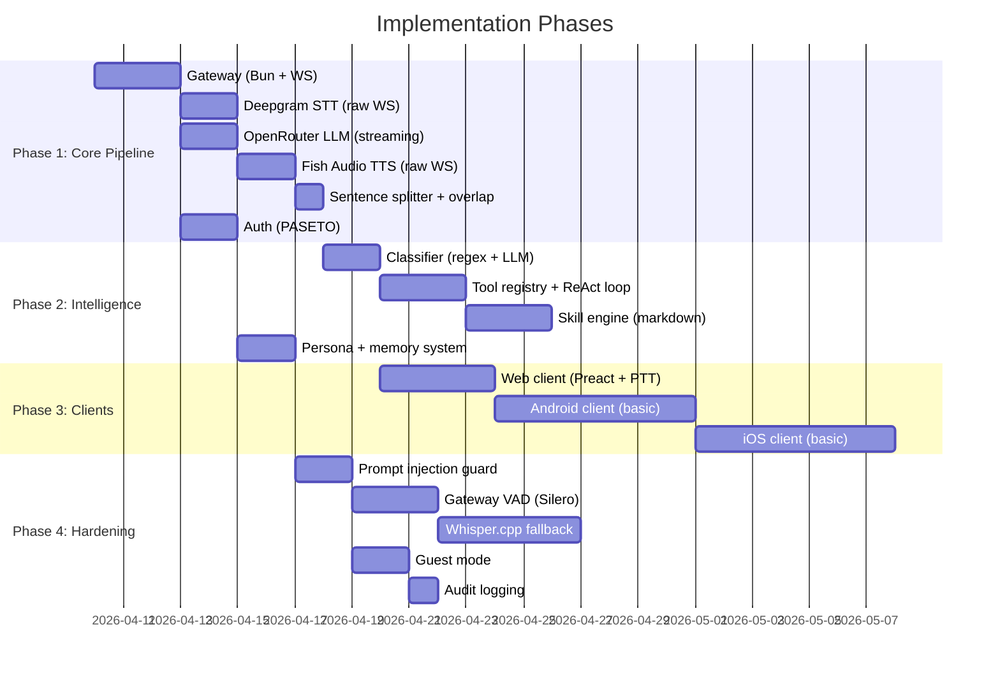

# Voice Gateway Architecture — Living Document

> Last updated: 2026-04-04 (second synthesis — post-scoring, post-PoC, post-decomposition)
> Status: All 12 decision areas scored. 7 PoCs validated. 5 decompositions complete. All areas CONCLUDED.

## Overview

A secure, extensible voice gateway for a family AI assistant running on Raspberry Pi 5 (8GB RAM, 500GB SSD). The TypeScript gateway (Bun runtime) orchestrates audio relay (STT/TTS), intent classification, tool routing, a composable skill system, and per-user memory — serving up to 10 concurrent sessions across native Android, iOS, and web clients.

## System Architecture



## Pipeline Flow



## Decision Areas — Final Summary

### 1. Gateway Core (`gateway-core`) — CONCLUDED
- **Score:** 38/50 (F:8 M:6 R:6 E:9 A:9)
- **Decision: Bun Runtime**
- **PoC validated** (`poc/gateway-core/`): Bun 296K msg/s, 273K frames/s binary relay, 33MB RSS. Node: 142K/122K/45MB. Both >100x headroom.
- Single process sufficient (async I/O workload, 10 sessions max)
- Built-in WebSocket server, file watcher (hot-reload), native TS execution
- Session management: 10-session cap, AbortController cancel propagation, health endpoint

| Approach | Description | Verdict |
|----------|-------------|---------|
| **A: Bun** ✓ | Native WS, native TS, single binary | **Selected** — best DX, 2.1x faster WS |
| B: Node.js | Battle-tested, 100% npm compat | Viable fallback if Bun breaks |
| C: Hybrid | Bun + Node abstraction | Over-engineering |

---

### 2. STT Strategy (`stt-strategy`) — CONCLUDED
- **Score:** 31/50 (F:5 M:5 R:7 E:6 A:8)
- **Decision: Hybrid — Cloud Primary + Gateway VAD + Local Fallback, phased**
- **PoC validated** (`poc/stt-deepgram-raw-ws/`): Raw WebSocket to Deepgram works, binary frames correct, double-endpointing validated, barge-in reset confirmed
- **Decomposed** into 3 sub-areas: endpointing (Silero VAD + Deepgram speech_final, first-wins), provider integration (raw WS ~100 lines), offline fallback (whisper-server sidecar + circuit breaker)

| Approach | Latency | WER (noisy) | CPU | Cost/mo | Verdict |
|----------|---------|-------------|-----|---------|---------|
| A: Deepgram only | 300-500ms | ~5-7% | ~0% | ~$10 | Phase 1 |
| B: Whisper.cpp only | 1.5-2.5s | ~12-25% | ~380% | $0 | Not viable as primary |
| **C: Hybrid (phased)** ✓ | 300-500ms | ~5-7% | ~5% | ~$7-8 | **Selected** — Phase 1→2→3 |

**Implementation phases:** Phase 1 (Deepgram only, 1-2 days) → Phase 2 (add gateway VAD, 2-3 days) → Phase 3 (Whisper.cpp fallback, 3-5 days)

---

### 3. Classifier & Tool Routing (`classifier-tool-routing`) — CONCLUDED
- **Score:** 31/50 (F:5 M:6 R:6 E:6 A:8)
- **Decision: Hybrid Regex Fast-Path + LLM Classification**
- **PoC validated** (`poc/classifier-regex-validation/`): 78/78 tests pass, 0% false positive rate, 0.37μs/call latency

| Approach | Latency (common) | Classifier cost/mo | Total LLM cost/mo | Verdict |
|----------|-------------------|--------------------|--------------------|---------|
| **A: Regex + LLM** ✓ | <1ms (75%) / 200-500ms (25%) | ~$0.30 | ~$15-20 | **Selected** |
| B: LLM-only | 200-500ms (all) | ~$1.00 | ~$15-20 | Simpler but slower |
| C: No classifier | 500-1500ms (all) | $0 | ~$60 | Expensive |

**Key insight:** Classifier's primary value is **model routing** — conversation (70%) → Haiku ($0.80/$4 per 1M tokens), tools (30%) → Sonnet ($3/$15). Saves ~$40/month vs no classifier.

**ReAct loop:** Max 5 iterations, AbortSignal cancel, parallel tool execution, error strings fed back to LLM. Skills registered as individual tools (one per skill).

---

### 4. Skill System (`skill-system`) — CONCLUDED
- **Score:** 35/50 (F:5 M:6 R:7 E:8 A:9)
- **Decision: Markdown with YAML Frontmatter, LLM-Interpreted**
- **PoC validated** (`poc/skill-system-scoped-react/`): 27/27 tests pass. Sandbox blocks all undeclared tools, 0.088ms/parse, 0.004ms/ReAct-loop, cycle detection 0.006ms/50-skills

| Approach | Authoring | Sandboxing | Latency | Cost/invoke | Verdict |
|----------|-----------|------------|---------|-------------|---------|
| **A: Markdown + LLM** ✓ | Natural lang | Scoped tools | 500-2000ms | ~$0.005-0.02 | **Selected** |
| B: Structured YAML | Medium | Engine-enforced | <100ms | ~$0 | Less flexible |
| C: TypeScript modules | Hard | Weak | <100ms | ~$0 | Security risk |

**Format:** YAML frontmatter (name, description, allowed-tools, parameters, roles, compose) + markdown body with natural-language workflow steps interpreted by LLM at runtime.

**Hot-reload:** Bun file watcher → parse frontmatter → validate (schema + tool existence + cycle detection via topological sort) → register as tool. Depth limit: 3 levels for composed skills.

---

### 5. Persona & Memory (`persona-memory`) — CONCLUDED
- **Score:** 37/50 (F:7 M:6 R:7 E:8 A:9)
- **Decision: Sectioned Markdown Files with Tiered Storage**

| Approach | Human-editable | Dependencies | Complexity | Verdict |
|----------|---------------|-------------|-----------|---------|
| **A: Markdown files** ✓ | Best | None (fs only) | Simplest | **Selected** |
| B: SQLite | Poor | bun:sqlite | Medium | Over-engineering |
| C: Markdown + JSON index | Good | None | Medium | Premature optimization |

**Architecture:**
- `persona.md` (~700 tokens): personality, behavioral rules, voice style. Injected as system prompt.
- `memory/<user>.md` (~600 tokens): Core Profile (~200), Active Context (~300), Conversation Patterns (~100)
- Context budget: persona (fixed) > memory (fixed) > skill context (if active) > history (fills remainder, ~97% of 128K)
- Memory extraction: end-of-session Haiku call (~$0.001/session, ~$1.50/month)
- Guest memory: in-memory `Map<sessionId, string[]>`, destroyed on session end
- Token estimation: chars/4 with 10% safety buffer

---

### 6. Security & Guest Mode (`security-guest-mode`) — CONCLUDED
- **Score:** 33/50 (F:5 M:6 R:7 E:6 A:9)
- **Decision: Full Security Stack — PASETO + Role-Based Tiers + 6-Layer Injection Defense**
- **PoC validated** (`poc/security-paseto-bun/`): 14/14 pass both runtimes. Bun encrypt=0.067ms, decrypt=0.030ms. paseto-ts v2.0.5 works via Web Crypto API. Injection guard: 95.7% detection (22/23), 0% FP (0/24), 1.65μs/call.

| Approach | Auth | Granularity | Complexity | Verdict |
|----------|------|-------------|-----------|---------|
| **A: Full PASETO stack** ✓ | Excellent | 4 tiers | High | **Selected** |
| B: Simplified PIN | Weak | 2 tiers | Low | Insufficient |
| C: Balanced PASETO | Excellent | 2 tiers + whitelist | Medium | Too coarse |

**Token lifecycle:** Adult (30d access + 90d refresh), Child (7d + 30d), Guest (4h, no refresh)

**Guest onboarding:** Adult voice command → 6-digit PIN (1hr validity) → guest enters PIN → ephemeral PASETO (role=guest, 4hr TTL)

**6-layer prompt injection defense** (all <1ms each):
1. Input sanitization (control chars, zero-width, whitespace normalization)
2. Heuristic pre-filter (regex patterns + fuzzy matching)
3. Structural separation (XML tags + "spotlighting" to mark data provenance)
4. Privilege reduction (LLM only sees scoped tools — architectural, 0ms)
5. Canary tokens (system prompt leak detection)
6. Output filtering (system prompt fragments, API keys, canary leaks)

**Role matrix:** Adult (read/write/confirm/admin), Child (read/write), Guest (read only, no memory, 4hr max)

**Note:** paseto-ts addExp short-duration parsing broken — use explicit ISO `exp` claims instead.

---

### 7. Wake Word & Audio Buffering (`wake-word-audio-buffering`) — CONCLUDED
- **Score:** 34/50 (F:6 M:5 R:7 E:7 A:9)
- **Decision: Porcupine on Mobile + PTT on Web**
- **Decomposed** into 6 sub-areas: shared wire protocol, testing strategy, thread-safety model (per-platform), Porcupine/Opus frame mismatch (RESOLVED), ring buffer semantics, pre-trigger transmission

| Approach | Mobile wake word | Web | Lock-in | Verdict |
|----------|-----------------|-----|---------|---------|
| **A: Porcupine + PTT web** ✓ | Yes (Android/iOS) | PTT only | Picovoice | **Selected** |
| B: openWakeWord + PTT | No (server-side) | PTT only | None | Higher latency |
| C: Porcupine + room-based | Yes + RPi mic | PTT | Mixed | Over-scoped |

**Porcupine v4.0.2:** 97%+ detection, <1 FA/10hr, ~1MB RAM, <4% CPU, 32ms frame latency, custom wake word via type-to-train (3+ syllables recommended)

**Ring buffer:** 2 seconds / 64KB at 16kHz/16-bit/mono. Pre-trigger audio transmitted as: `session.start` (with `pretrigger_ms`) → ONE binary frame (buffer contents) → live frames.

**Thread safety model:**
- Android: Dedicated thread (URGENT_AUDIO priority) → `Channel<AudioEvent>` → coroutine scope
- iOS: CoreAudio real-time thread (installTap) → `AsyncStream<AudioEvent>` → Actor
- Web: AudioWorklet thread → MessagePort → main thread

**iOS hard constraint:** No background mic for third-party apps. Foreground-only wake word. PTT when backgrounded. Dedicated iPad (Guided Access) is primary iOS always-on use case.

**Frame mismatch RESOLVED:** Porcupine (512 samples) and Opus (320 samples) are independent consumers of same PCM stream via separate FrameAccumulators.

---

### 8. Android Client (`android-client`) — CONCLUDED
- **Score:** 31/50 (F:5 M:5 R:6 E:7 A:8)
- **Decision: OkHttp + AudioRecord + Porcupine + Raw PCM → evolve to Opus**
- **PoC validated** (`poc/android-client-audio-pipeline/`): 115/115 tests pass. RingBuffer 0.098μs/write, FrameAccumulator variable→exact 512-sample frames, full pipeline 64,178x real-time.
- **Decomposed** into 5 sub-areas: audio pipeline (VALIDATED), service lifecycle/binding, auth token storage (EncryptedSharedPreferences), test strategy (unit/integration/UI/E2E), Opus/Porcupine frame mismatch (RESOLVED)

| Approach | Codec | Bandwidth | Dependencies | Verdict |
|----------|-------|-----------|-------------|---------|
| **A: Raw PCM (start)** ✓ | None | 256kbps | OkHttp, Porcupine | Phase 1 |
| **B: Opus (evolve)** ✓ | Concentus | 24kbps | + Concentus | Phase 2 |
| C: Oboe + NDK | Native | 24kbps | + NDK build | Over-engineered |

**Key specs:**
- AudioRecord with `VOICE_RECOGNITION` source (AGC disabled, flat response)
- Dedicated audio thread (`THREAD_PRIORITY_URGENT_AUDIO`), Channel bridge to coroutines
- OkHttp WebSocket (~400KB, `ByteString` immutability for binary frames)
- Foreground service: `FOREGROUND_SERVICE_MICROPHONE`, partial wake lock
- Auth: EncryptedSharedPreferences (Jetpack Security Crypto, Keystore-backed AES-256)
- Battery: ~2-4%/hr on WiFi (acceptable for plugged-in home use)
- Reconnection: exponential backoff + full jitter, session resumption via `session_id + last_seq`

---

### 9. iOS Client (`ios-client`) — CONCLUDED
- **Score:** 33/50 (F:6 M:5 R:7 E:7 A:8)
- **Decision: URLSession + AVAudioEngine + Porcupine + Raw PCM → evolve to Opus**
- **Decomposed** into 6 sub-areas: audio pipeline (AVAudioEngine + FrameAccumulator), TPCircularBuffer SPM integration, auth Keychain storage (actor-based), AsyncStream backpressure (.bufferingNewest(64)), test strategy, frame mismatch (RESOLVED)

| Approach | WebSocket | Background | Verdict |
|----------|-----------|-----------|---------|
| **A: URLSession + Raw PCM** ✓ | Built-in | Foreground only | Phase 1 |
| **B: URLSession + Opus** ✓ | Built-in | Foreground only | Phase 2 |
| C: Starscream + silent audio | Third-party | Background (fragile) | Unreliable |

**Key specs:**
- AVAudioEngine with `installTap` for 16kHz mono PCM capture
- TPCircularBuffer (VM-mapped, lock-free SPSC) for ring buffer
- `AVAudioSession.playAndRecord + .voiceChat` for echo cancellation
- URLSessionWebSocketTask: zero-dependency, native async/await
- @Observable (iOS 17+) for state management, actors for thread safety
- Distribution: TestFlight internal (25 testers, 90-day builds, no review)
- **Background recording NOT supported** — foreground-first, PTT when backgrounded

---

### 10. Client-Gateway Protocol (`client-gateway-protocol`) — CONCLUDED
- **Score:** 36/50 (F:6 M:6 R:7 E:8 A:9)
- **Decision: WebSocket-Only, start Raw PCM → migrate to Opus**

| Approach | Bandwidth | Codec complexity | Connections | Verdict |
|----------|-----------|-----------------|------------|---------|
| A: WS + Opus | ~48kbps | High (per-platform) | 10 | Production target |
| **B: WS + PCM (start)** ✓ | ~512kbps | None | 10 | **Phase 1** |
| C: Dual WS | Varies | Same | 20 | Unnecessary |

**Protocol spec:**
- 22 message types (10 client→gateway, 12 gateway→client)
- Auth handshake: PASETO token first message, 5-second timeout
- Close codes: 4001 (auth fail), 4002 (session limit), 4003 (expired), 4004 (protocol error)
- Session persistence: 120s suspend window (60s for guests), sequence-numbered replay buffer (100 messages)
- Barge-in: client `barge_in` → gateway AbortController.abort() → `barge_in.ack`
- Heartbeat: WebSocket protocol-level ping/pong every 30s
- Half-duplex audio by convention (direction signaled by control messages)
- Audio codec declared per-session via `session.start.encoding` — protocol is codec-agnostic
- Guest onboarding: 6-digit PIN or QR code → ephemeral PASETO

---

### 11. Provider Integration (`provider-integration-ts`) — CONCLUDED
- **Score:** 33/50 (F:5 M:5 R:6 E:8 A:9)
- **Decision: Unified AsyncGenerator Interface with Raw Connections**
- **PoC validated** (`poc/provider-integration-bun-ws/`): 60/60 tests pass. MessagePack 0.76μs encode/0.60μs decode, streaming overlap first audio at 12ms (80% earlier), barge-in cancellation works, 170K concurrent ops/sec for 10-session MessagePack.
- **Decomposed** into 3 sub-areas: testing strategy (~85 test cases), sentence splitter spec (6 additional edge cases), per-session memory budget (484KB typical / 600KB peak, 10 sessions = 60-90MB)

| Approach | Composability | Backpressure | Cancel | Verdict |
|----------|-------------|-------------|--------|---------|
| **A: AsyncGenerator** ✓ | `for await` | Pull-based | AbortSignal + return() | **Selected** |
| B: Web Streams | `.pipeThrough()` | Queue strategy | `.cancel()` chain | Verbose |
| C: EventEmitter | Manual | None | Manual cleanup | Legacy |

**Provider connections:**
- Deepgram STT: Raw WebSocket (~100 lines), `binaryType = "arraybuffer"` mandatory for Bun
- OpenRouter LLM: OpenAI SDK with `baseURL` override
- Fish Audio TTS: Raw WebSocket + `@msgpack/msgpack` for MessagePack serialization
- Resilience: `cockatiel` for circuit breaker (5 failures → open, 30s cooldown)

**Sentence splitter:** ~130 lines, handles abbreviations (Dr., e.g.), decimals (3.14), ellipsis, newlines, 2s flush timeout. Validated in PoC.

**Streaming overlap (critical path):** LLM AsyncGenerator → sentence splitter → TTS AsyncGenerator. First audio at 12ms vs 62ms baseline (80% improvement). **50-70% perceived latency reduction.**

**Generator leak mitigation:** Mandatory `.return()` + AbortSignal + session timeout to prevent resource leaks.

---

### 12. Web Client (`web-client`) — CONCLUDED
- **Score:** 34/50 (F:5 M:6 R:7 E:7 A:9)
- **Decision: Preact + Vite with MediaRecorder PTT**
- **PoC validated** (`poc/web-client-ptt-audio/`): 71/71 tests pass. Ring buffer wrap-around/overflow/barge-in correct. Custom zero-dep EBML/WebM parser works. WebSocket echo byte-perfect 1B–64KB. COOP/COEP headers confirmed for SharedArrayBuffer. Latency: 0.14ms avg round-trip. 10 concurrent sessions × 20 frames = 200/200 delivered.

| Approach | Bundle | Learning curve | Verdict |
|----------|--------|---------------|---------|
| **A: Preact + Vite** ✓ | ~4.5KB + ~20KB app | Low (React-like) | **Selected** |
| B: Solid.js + Vite | ~7KB + ~20KB app | Medium (signals) | Good but unfamiliar |
| C: Vanilla TS + Vite | 0KB + ~25KB app | Low | Tedious DOM work |

**Key specs:**
- Text-first interface with push-to-talk voice toggle (no wake word)
- MediaRecorder with `timeslice: 100` for streaming Opus chunks (Chrome/Firefox native)
- Safari: opus-media-recorder WASM polyfill (~300KB additional)
- TTS playback: PCM streaming via AudioWorklet ring buffer (gateway decodes Opus→PCM)
- AudioWorklet ring buffer: 96KB (2s@48kHz), drop-oldest overflow, barge-in clear <1 process() cycle
- COOP/COEP headers required for SharedArrayBuffer/AudioWorklet
- Auth: URL token for family (persistent), PIN entry for guests (ephemeral)
- Gateway serves static files — no separate web server
- UI: AuthGate, ChatView, MessageList, InputBar, PTTButton, ToolConfirmDialog, ConnectionStatus

---

## Cross-Cutting Concerns

### Streaming Overlap (Critical Latency Optimization)

```mermaid
gantt
    title Response Latency: With vs Without Streaming Overlap
    dateFormat X
    axisFormat %Lms

    section Without Overlap
    STT final          :a1, 0, 500
    Classifier         :a2, after a1, 100
    LLM full response  :a3, after a2, 2000
    TTS full synthesis  :a4, after a3, 1000
    User hears audio   :milestone, after a4, 0

    section With Overlap
    STT final          :b1, 0, 500
    Classifier         :b2, after b1, 100
    LLM first sentence :b3, after b2, 500
    TTS first sentence :b4, after b3, 200
    User hears audio   :milestone, after b4, 0
    LLM continues      :b5, after b3, 1500
    TTS continues      :b6, after b4, 800
```



- Without overlap: ~3.6s total (STT + classifier + full LLM + full TTS)
- With overlap: ~1.3s to first audio (STT + classifier + first sentence LLM + first sentence TTS)
- **50-70% perceived latency reduction** — validated in PoC (first audio at 12ms vs 62ms, 80% improvement)

### Cancel Propagation (Barge-In)



AbortSignal threads through all async generators. Validated in PoC: cancel after 3 chunks, only 3/5 sentences sent.

### Context Budgeting

```
128K token context window (typical)
├── Response reserve: 4,000 tokens
├── Persona (fixed): ~700 tokens
├── User memory (fixed): ~600 tokens
├── Skill context (if active): ~500 tokens
├── Tool schemas (if tools): ~150 tokens
└── Conversation history: ~122,050 tokens remaining (~97%)
    └── Newest-first fill, summary of dropped older messages
```

### Per-Session Memory Budget (PoC-validated)

```
Per session: 484KB typical / 600KB peak
├── WebSocket buffers: ~128KB
├── Audio relay buffers: ~64KB
├── Session state: ~32KB
├── AsyncGenerator state: ~64KB
└── Provider connections: ~196KB

10 concurrent sessions: ~60-90MB total (including Bun runtime)
RPi5 8GB: ~4% utilization — massive headroom
```

### Security Layers

```mermaid
graph LR
    subgraph Edge["Edge Security"]
        A1[PASETO v4.local auth<br/>0.067ms encrypt / 0.030ms decrypt]
        A2[Role in token claims]
        A3[5s auth timeout]
    end

    subgraph Input["Input Security"]
        B1[Unicode sanitization]
        B2[Heuristic pre-filter<br/>95.7% detection, 0% FP]
        B3[Structural separation<br/>XML tags + spotlighting]
    end

    subgraph Runtime["Runtime Security"]
        C1[Tool impact tiers<br/>read/write/confirm/admin]
        C2[Skill sandboxing<br/>0.088ms/parse, scoped tools]
        C3[Privilege reduction]
    end

    subgraph Output["Output Security"]
        D1[Canary token check]
        D2[Secret pattern scan]
        D3[Audit logging<br/>~7MB/year]
    end

    Edge --> Input --> Runtime --> Output
```



## PoC Validation Summary

| PoC | Tests | Key Metrics | Status |
|-----|-------|-------------|--------|
| `poc/gateway-core/` | ✓ | Bun 296K msg/s, 33MB RSS, 10-session management | Validated |
| `poc/stt-deepgram-raw-ws/` | ✓ | Raw WS binary frames, double-endpointing, barge-in reset | Validated |
| `poc/classifier-regex-validation/` | 78/78 | 0% FP, 0.37μs/call, weather regex fixed | Validated |
| `poc/skill-system-scoped-react/` | 27/27 | Sandbox blocks undeclared tools, 0.004ms/ReAct-loop, cycle detection | Validated |
| `poc/security-paseto-bun/` | 14/14 | Bun+Node both work, 95.7% injection detection, paseto-ts Web Crypto | Validated |
| `poc/android-client-audio-pipeline/` | 115/115 | 0.098μs/write, 64,178x real-time, ByteArray race fix | Validated |
| `poc/provider-integration-bun-ws/` | 60/60 | MsgPack 0.76μs, streaming overlap 80% faster, 170K ops/sec | Validated |
| `poc/web-client-ptt-audio/` | 71/71 | EBML parser, COOP/COEP, 0.14ms latency, 10 concurrent sessions | Validated |

**Total: 365+ tests across 8 PoCs, all passing.**

## Technology Stack Summary

| Layer | Choice | Rationale | PoC |
|-------|--------|-----------|-----|
| **Runtime** | Bun | Native TS, built-in WS/file watcher, 33MB RSS | ✓ |
| **STT (primary)** | Deepgram Nova-3 (raw WS) | Best accuracy, streaming partials, zero CPU | ✓ |
| **STT (fallback)** | Whisper.cpp base.en-q5_0 | Offline resilience, degraded but functional | — |
| **VAD** | Silero v5 (gateway-side) | Double-endpointing, ~5% CPU | — |
| **LLM** | OpenRouter (Haiku + Sonnet) | Model flexibility, cost optimization via routing | — |
| **TTS** | Fish Audio (raw WS + MsgPack) | Streaming synthesis, Opus output | ✓ |
| **Auth** | PASETO v4.local (paseto-ts) | No JWT footguns, 0.067ms/encrypt on Bun | ✓ |
| **Classifier** | Regex fast-path + Haiku LLM | <1ms common case, saves ~$40/month | ✓ |
| **Skills** | Markdown + YAML frontmatter | LLM-interpreted, sandboxed, hot-reloadable | ✓ |
| **Memory** | Sectioned markdown files | Human-editable, no deps, LLM extraction | — |
| **Persona** | Single persona.md | System prompt, ~700 tokens fixed cost | — |
| **Android** | Kotlin + Compose + OkHttp | Native, AudioRecord, Porcupine wake word | ✓ |
| **iOS** | Swift + SwiftUI + URLSession | Native, AVAudioEngine, foreground-first | — |
| **Web** | Preact + Vite | ~20-30KB, PTT only, MediaRecorder | ✓ |
| **Protocol** | WebSocket (binary + JSON) | Single connection, 22 message types | — |
| **Config** | YAML + env vars | yaml package, ${VAR} resolution | — |
| **Resilience** | cockatiel | Circuit breaker, retry, timeout | — |
| **Wake word** | Picovoice Porcupine v4 | On-device, custom training, 97%+ accuracy | — |

## NPM Dependencies (Gateway)

| Package | Purpose | Transitive deps |
|---------|---------|----------------|
| `openai` | OpenRouter LLM via baseURL | Few |
| `@msgpack/msgpack` | Fish Audio MessagePack | Zero |
| `cockatiel` | Circuit breaker/retry | Zero |
| `yaml` | Config parsing | Zero |
| `paseto-ts` | PASETO v4.local tokens | Zero (Web Crypto) |

**5 direct dependencies.** Minimal footprint for RPi5.

## Estimated Monthly Costs

| Service | Estimate | Notes |
|---------|----------|-------|
| Deepgram STT | ~$7-10 | With VAD trimming; $200 free credit (~19-24 months runway) |
| OpenRouter LLM (conversation) | ~$8-12 | 70% Haiku, 30% Sonnet via classifier routing |
| OpenRouter LLM (skills) | ~$6-15 | Depends on skill invocation frequency |
| OpenRouter LLM (extraction) | ~$1.50 | Haiku for memory extraction |
| Fish Audio TTS | ~$5-10 | Estimated at family usage |
| Picovoice Porcupine | $0-? | Free tier for 3 users; contact for family pricing |
| **Total** | **~$28-50/month** | After free credits exhaust |

## Scoreboard Summary

| Decision Area | F | M | R | E | A | Total | PoC | Decomposed |
|---------------|---|---|---|---|---|-------|-----|------------|
| gateway-core | 8 | 6 | 6 | 9 | 9 | **38** | ✓ | — |
| persona-memory | 7 | 6 | 7 | 8 | 9 | **37** | — | — |
| client-gateway-protocol | 6 | 6 | 7 | 8 | 9 | **36** | — | — |
| skill-system | 5 | 6 | 7 | 8 | 9 | **35** | ✓ | — |
| wake-word-audio-buffering | 6 | 5 | 7 | 7 | 9 | **34** | — | ✓ |
| web-client | 5 | 6 | 7 | 7 | 9 | **34** | ✓ | — |
| security-guest-mode | 5 | 6 | 7 | 6 | 9 | **33** | ✓ | — |
| ios-client | 6 | 5 | 7 | 7 | 8 | **33** | — | ✓ |
| provider-integration-ts | 5 | 5 | 6 | 8 | 9 | **33** | ✓ | ✓ |
| stt-strategy | 5 | 5 | 7 | 6 | 8 | **31** | ✓ | ✓ |
| classifier-tool-routing | 5 | 6 | 6 | 6 | 8 | **31** | ✓ | — |
| android-client | 5 | 5 | 6 | 7 | 8 | **31** | ✓ | ✓ |

**Average: 33.8/50. Alignment is consistently high (8-9). Feasibility is the weakest dimension (5-8), addressed by PoCs.**

## Implementation Phasing



## Resolved Questions

These were open questions from the first synthesis, now resolved by PoCs and decomposition:

1. ~~**Bun WebSocket client stability**~~ → **RESOLVED.** `poc/stt-deepgram-raw-ws/` and `poc/provider-integration-bun-ws/` validate outgoing WS connections. Use `binaryType = "arraybuffer"` always.
2. ~~**paseto-ts on Bun**~~ → **RESOLVED.** `poc/security-paseto-bun/` confirms paseto-ts v2.0.5 works via Web Crypto API. Note: addExp short-duration parsing broken, use explicit ISO exp claims.
3. ~~**iOS background wake word**~~ → **RESOLVED.** Accept foreground-first design. No background mic for third-party iOS apps. PTT when backgrounded. Dedicated iPad for always-on.
4. ~~**TTS audio format relay**~~ → **RESOLVED.** Gateway relays Opus from Fish Audio to mobile clients (native decode). Web: gateway decodes Opus→PCM for AudioWorklet playback.

## Remaining Open Questions

1. **Porcupine pricing for 5+ family devices** — free tier covers 3 active users/month. Family of 5 may need paid tier or rotate active users. Contact Picovoice for personal pricing.
2. **N-API/onnxruntime-node on Bun ARM64** — needed for Silero VAD. If incompatible, fallback to WebRTC VAD or energy-based. Needs Phase 2 validation.
3. **Bun ARM64 long-running stability** — less production data than Node for 24/7 RPi5 operation. Monitor over first weeks of deployment.
