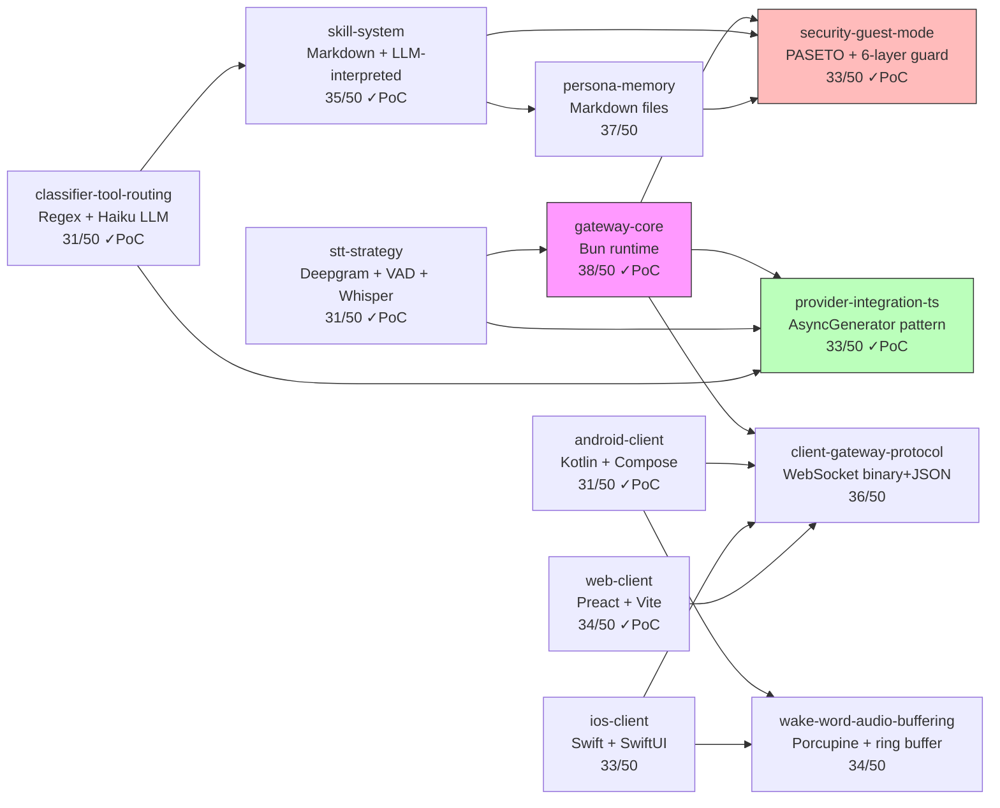
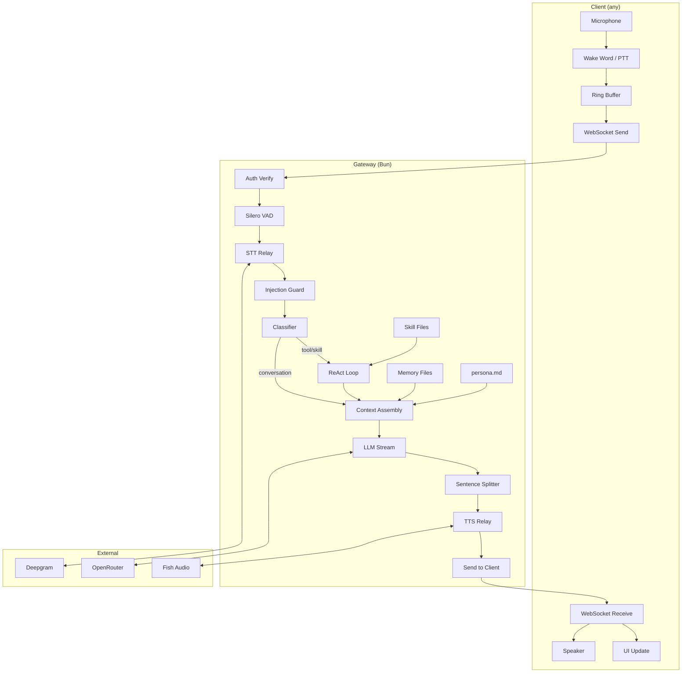

# Cross-Component Dependencies & Interactions

> Last updated: 2026-04-04 (second synthesis — post-scoring, post-PoC, post-decomposition)

## Dependency Map



## Critical Interactions

### 1. Gateway Core ↔ Provider Integration (PoC-validated)
- **Runtime determines streaming pattern:** Bun → AsyncGenerator with raw WebSocket for STT/TTS, fetch streaming for LLM
- **All providers use AsyncGenerator interface:** pull-based, composable, cancellable via AbortSignal
- **`binaryType = "arraybuffer"` mandatory** for all Bun outgoing WebSocket connections (blob crashes Bun) — validated in PoC
- **Application-level keepalive needed** (Bun lacks `ws.ping()`): Deepgram KeepAlive JSON, Fish Audio heartbeat
- **Generator leak mitigation:** mandatory `.return()` + AbortSignal + session timeout

### 2. Provider Integration ↔ Streaming Overlap (PoC-validated)
- **Critical latency path:** LLM AsyncGenerator → sentence splitter → TTS AsyncGenerator
- First complete sentence triggers TTS immediately while LLM continues generating
- **80% improvement validated:** first audio at 12ms vs 62ms baseline (5-sentence pipeline: 40ms vs 376ms, 89% improvement)
- AbortSignal threads through all generators for barge-in cancel propagation
- Sentence splitter: ~130 lines, handles abbreviations, decimals, ellipsis, 2s flush timeout

### 3. Provider Integration ↔ STT Strategy (PoC-validated)
- **Deepgram:** Raw WebSocket (~100 lines), NOT the `@deepgram/sdk` (Bun binary frame issues) — validated
- **Fish Audio:** Raw WebSocket + `@msgpack/msgpack` for MessagePack serialization — validated (0.76μs/encode)
- **OpenRouter:** OpenAI SDK with `baseURL` override (HTTP/fetch, no WS issues)
- **Circuit breaker (cockatiel)** wraps each provider for automatic failover

### 4. Classifier ↔ Skill System ↔ Tool Router (PoC-validated)
- **Skills registered as individual tools** in the tool registry (one per skill, not a meta-tool)
- Classifier identifies intent → routes to either direct LLM (conversation) or ReAct loop (tools/skills)
- Skill execution creates a **scoped ReAct loop** — only the skill's declared tools are available — sandbox validated (27/27 tests)
- Composed skills add additional tools to the scoped set; cycle detection via topological sort (0.006ms/50-skills)
- **LLM decides** when to invoke which tool/skill based on descriptions in the tool schema

### 5. Classifier ↔ LLM Cost Optimization (PoC-validated)
- **Model routing is the classifier's primary value:**
  - Conversation (70%) → Haiku ($0.80/$4 per 1M tokens)
  - Tool/skill intents (30%) → Sonnet ($3/$15 per 1M tokens)
- Without classifier: every request hits Sonnet with full tool context → ~$60/month
- With classifier: ~$15-20/month — saves ~$40/month
- **Regex fast-path:** 0.37μs/call, 0% false positive rate (78/78 tests) — handles 75% of requests instantly

### 6. Security ↔ Everything (PoC-validated)
- **Auth touches:** gateway core (middleware), protocol (handshake), clients (token storage)
- **PASETO performance:** encrypt=0.067ms, decrypt=0.030ms on Bun (Web Crypto API) — validated
- **Tool tiers touch:** classifier (routing), tool router (enforcement), skill system (sandboxing), memory (guest restrictions)
- **Prompt injection guard sits between STT output and classifier** — 95.7% detection, 0% FP, 1.65μs/call
- **Guest restrictions enforced at 5 layers:** token role, tool tier matrix, skill roles, memory store type, session TTL
- **Note:** paseto-ts `addExp` broken for short durations — use explicit ISO `exp` claims

### 7. Client Protocol ↔ All Clients
- **Protocol design constrains all three client implementations:**
  - Same message types (22 types: 10 client→GW, 12 GW→client)
  - Same auth handshake (PASETO token first, 5s timeout)
  - Same reconnection protocol (session_id + last_seq, 120s suspend window)
  - Same barge-in flow (client sends `barge_in`, GW cancels pipeline, sends `barge_in.ack`)
- **Audio codec declared per-session** via `session.start.encoding` — protocol is codec-agnostic
- **Half-duplex audio** by convention: direction signaled by control messages

### 8. Wake Word ↔ Client Protocol (decomposition-validated)
- Pre-trigger audio buffer (2s, 64KB PCM) must be transmitted to gateway
- Protocol: `session.start` with `pretrigger_ms` → ONE binary frame (ring buffer contents) → live frames
- Gateway concatenates pre-trigger + live into single audio byte stream for STT
- **STT service sees continuous audio** — boundary metadata stays at gateway layer
- Ring buffer capacity: exactly 64,000 bytes (2.0 seconds at 16kHz/16-bit/mono)
- Web client (PTT) omits `pretrigger_ms` and skips the pre-trigger binary frame entirely
- Barge-in: ring buffer continuously overwrites — no flush needed

### 8b. Wake Word ↔ Audio Threading (decomposition-validated)
- **Android**: AudioCaptureThread (dedicated, URGENT_AUDIO priority) → `Channel<AudioEvent>` → coroutine scope
  - FrameAccumulator uses copy-on-emit (ByteArray.copyOf) to prevent race condition — validated fix
- **iOS**: CoreAudio real-time thread (installTap callback) → `AsyncStream<AudioEvent>` (.bufferingNewest(64)) → Actor
- **Web**: AudioWorklet thread → MessagePort postMessage → main thread (PTT only, no wake word)
  - AudioWorklet ring buffer: 96KB (2s@48kHz), drop-oldest overflow, barge-in clear <1 process() cycle
- Porcupine and ring buffer writes happen on the audio thread (same thread, no synchronization needed)
- Cross-thread boundary is always a message-passing mechanism (Channel/AsyncStream/MessagePort), never shared mutable state with locks
- **Frame mismatch RESOLVED:** Porcupine (512 samples) and Opus (320 samples) are independent consumers via separate FrameAccumulators

### 9. STT Strategy ↔ Gateway Core (decomposition-validated)
- **Cloud STT (normal):** Gateway stays lightweight passthrough — relay audio to Deepgram, receive transcripts
- **Gateway VAD (Phase 2):** Adds Silero VAD processing (~5% CPU) — still lightweight
  - **Open risk:** onnxruntime-node N-API compatibility with Bun ARM64 unvalidated
- **Local STT (Phase 3 fallback):** Gateway becomes compute node — whisper.cpp pegs all 4 cores during inference
- Circuit breaker pattern switches between cloud and local paths

### 10. Persona & Memory ↔ Context Assembly
- `persona.md` (~700 tokens) is always injected as system prompt — highest priority
- `memory/<user>.md` (~600 tokens) is always loaded at session start — second priority
- Skill context (~500 tokens) injected only during skill execution
- Conversation history fills remaining budget (newest-first, ~97% of 128K context available)
- **Guest sessions:** in-memory ephemeral memory, no file reads/writes
- Token estimation: chars/4 with 10% safety buffer (fast, sufficient for budgeting)

### 11. Provider Integration ↔ Security
- API keys in env vars, referenced from YAML config via `${VAR}` syntax, resolved at startup
- Encrypted config file (`secrets.enc`) → decrypted to memory at startup, never plaintext on disk
- Provider connections are outbound only — no inbound API surface exposed
- Audit logging captures provider latency/errors for operational visibility

### 12. Web Client ↔ Gateway Serving (PoC-validated)
- Gateway's HTTP endpoint serves static web client assets (Vite build output)
- **No separate web server** — single process, single port for both WebSocket and static files
- **COOP/COEP headers required** on all endpoints for SharedArrayBuffer/AudioWorklet — validated
- Web client authenticates via same PASETO protocol as mobile clients
- Guest access via PIN entry or URL token — served from same origin
- Custom zero-dep EBML/WebM parser for audio container handling — validated (71/71 tests)

## Data Flow Summary



## Per-Session Resource Budget (PoC-validated)

```
Per session: 484KB typical / 600KB peak
├── WebSocket buffers: ~128KB
├── Audio relay buffers: ~64KB
├── Session state: ~32KB
├── AsyncGenerator state: ~64KB
└── Provider connections: ~196KB

10 concurrent sessions: ~60-90MB total (including Bun runtime ~33MB RSS)
RPi5 8GB: ~4% utilization — massive headroom
```

## Dependency Risk Matrix

| Dependency | Failure Impact | Fallback | Recovery | PoC Status |
|-----------|---------------|----------|----------|------------|
| Deepgram | No STT | Whisper.cpp local (degraded) | Circuit breaker: 30s | Raw WS validated |
| OpenRouter | No LLM responses | None (hard dependency) | Retry with backoff | — |
| Fish Audio | No TTS | Text-only responses | Circuit breaker: 30s | WS+MsgPack validated |
| Picovoice (client) | No wake word | PTT fallback | N/A (on-device) | — |
| Home internet | No cloud services | Whisper + text-only | Wait for recovery | — |
| Bun runtime | Gateway down | Migrate to Node.js | Hours (one-time) | Gateway PoC validated |
