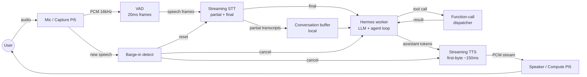

# Sentient Open Source Release Implementation Plan

> **For agentic workers:** REQUIRED SUB-SKILL: Use superpowers:subagent-driven-development (recommended) or superpowers:executing-plans to implement this plan task-by-task. Steps use checkbox (`- [ ]`) syntax for tracking.

**Goal:** Publish sentient as a public MIT-licensed GitHub repository, migrating from private GitLab with a fresh single-commit history.

**Architecture:** Two repositories in play during execution. The GitLab develop worktree at `/Users/kevinye/Development/sentient/.claude/worktrees/harmonic-wondering-waffle/` is the source of truth where plan-progress commits land for traceability. The empty GitHub target at `/Users/kevinye/Development/github-repo/sentient/` receives the final sanitized snapshot as one commit titled "Initial public release". Authoring of public-only files (LICENSE, README rewrite, CONTRIBUTING, .github/, etc.) happens directly in the GitHub working tree to keep them out of GitLab history.

**Tech Stack:** Git, rsync, gitleaks (or detect-secrets), bash, Markdown, GitHub Actions YAML, Mermaid for diagrams.

**Spec:** `docs/superpowers/specs/2026-05-24-sentient-open-source-release.md`

**Inputs the engineer needs before starting:**
- GitHub owner / org name (e.g. `kevin-ye`) — referred to throughout as `${GH_OWNER}`. Confirm with the user before Task 21.
- A clone of the GitLab `develop` branch, available as the worktree at `/Users/kevinye/Development/sentient/.claude/worktrees/harmonic-wondering-waffle/`.
- An empty initialized GitHub-target repo at `/Users/kevinye/Development/github-repo/sentient/` (verified: only `.git/` present).

---

## Phase 1 — Pre-flight on GitLab

### Task 1: Merge `feature/esp32-cube-v2-rescope` into `develop`

**Files:**
- Modify: GitLab `develop` branch tip (and the worktree at `/Users/kevinye/Development/sentient/.claude/worktrees/harmonic-wondering-waffle/`)

- [ ] **Step 1: Verify the pre-merge state**

```bash
cd /Users/kevinye/Development/sentient/.claude/worktrees/harmonic-wondering-waffle
git status
git log --oneline -1
git rev-list --count develop..feature/esp32-cube-v2-rescope
git rev-list --count feature/esp32-cube-v2-rescope..develop
```

Expected: clean worktree on `develop` at `93bc2ddd`, 77 commits ahead, 0 commits behind.

- [ ] **Step 2: Fast-forward merge**

```bash
git merge --ff-only feature/esp32-cube-v2-rescope
```

Expected: "Fast-forward" message, tip moves to `e43108bd`. If not a clean ff, stop and ask the user — there's an unexpected divergence not surfaced by the brainstorm audit.

- [ ] **Step 3: Verify post-merge state**

```bash
git log --oneline -5
git rev-list --count develop..feature/esp32-cube-v2-rescope
```

Expected: tip is `e43108bd fix(protocol/test): add required clientType to session.configure fixtures`, and `develop..feature/esp32-cube-v2-rescope` returns 0.

- [ ] **Step 4: Note — no commit needed**

Fast-forward merges don't create a new commit. Skip to Task 2.

---

### Task 2: Decide on `esp32/devtool/uv.lock`

**Files:**
- Possibly modify: `/Users/kevinye/Development/sentient/.claude/worktrees/phase6-cube-sdk/esp32/devtool/uv.lock` (commit it)
- OR modify: `/Users/kevinye/Development/sentient/.claude/worktrees/harmonic-wondering-waffle/.gitignore` (gitignore it)

- [ ] **Step 1: Inspect the file**

```bash
cd /Users/kevinye/Development/sentient/.claude/worktrees/phase6-cube-sdk
ls -la esp32/devtool/uv.lock
head -20 esp32/devtool/uv.lock
```

Expected: a Python `uv`-managed lockfile.

- [ ] **Step 2: Check whether other lockfiles in the repo are tracked**

```bash
cd /Users/kevinye/Development/sentient/.claude/worktrees/harmonic-wondering-waffle
git ls-files | grep -E '\.lock$|bun\.lock|package-lock|poetry\.lock|uv\.lock' | head
```

Expected: `bun.lock` is tracked (per `ls -la` earlier). Lockfiles are tracked here; commit `uv.lock` for parity.

- [ ] **Step 3: Stage and commit the lockfile**

The lockfile lives in the `phase6-cube-sdk` worktree but the branch `feature/esp32-devtool-foundation` (already merged into develop via Task 1) needs to receive the commit only if the file content matters for produciton. Since we're shipping to GitHub from `develop`, the simplest path: copy it into the develop worktree and commit there.

```bash
cd /Users/kevinye/Development/sentient/.claude/worktrees/harmonic-wondering-waffle
cp /Users/kevinye/Development/sentient/.claude/worktrees/phase6-cube-sdk/esp32/devtool/uv.lock esp32/devtool/uv.lock
git add esp32/devtool/uv.lock
git status
```

Expected: file staged.

- [ ] **Step 4: Commit**

```bash
git commit -m "chore(esp32/devtool): commit uv.lock for reproducibility"
```

- [ ] **Step 5: Verify**

```bash
git log --oneline -1
git ls-files esp32/devtool/uv.lock
```

Expected: new commit; file is tracked.

---

### Task 3: Install and run `gitleaks` on the working tree

**Files:** none modified

- [ ] **Step 1: Install gitleaks (if not present)**

```bash
which gitleaks || brew install gitleaks
gitleaks version
```

Expected: a version string.

- [ ] **Step 2: Run a tree-scan (working directory, not history)**

```bash
cd /Users/kevinye/Development/sentient/.claude/worktrees/harmonic-wondering-waffle
gitleaks detect --no-git --redact --report-format json --report-path /tmp/gitleaks-tree.json
echo "exit code: $?"
```

Expected: exit code 0 (no leaks) or 1 (leaks found — must review).

- [ ] **Step 3: Run a history scan on `develop`**

```bash
gitleaks detect --redact --report-format json --report-path /tmp/gitleaks-history.json
echo "exit code: $?"
```

Expected: exit code 0 (clean history) or 1 (historical leaks — flag for user; do NOT proceed to publish without resolution).

- [ ] **Step 4: Review reports if non-empty**

```bash
[ -s /tmp/gitleaks-tree.json ] && jq '.[] | {rule:.RuleID, file:.File, line:.StartLine}' /tmp/gitleaks-tree.json || echo "tree clean"
[ -s /tmp/gitleaks-history.json ] && jq '.[] | {rule:.RuleID, file:.File, line:.StartLine}' /tmp/gitleaks-history.json || echo "history clean"
```

If anything surfaces, stop and surface to user. Each finding either:
- True positive → must rotate the secret and (if history) decide whether to rewrite history or accept the leak as known-rotated
- False positive → add to `.gitleaksignore` with justification

- [ ] **Step 5: Commit `.gitleaksignore` if any false positives needed exclusion**

```bash
git status .gitleaksignore 2>/dev/null
git add .gitleaksignore 2>/dev/null
git commit -m "chore: gitleaks false-positive allowlist" 2>/dev/null || echo "no .gitleaksignore needed"
```

---

## Phase 2 — Author public-release files in the GitHub working tree

All files in Phase 2 are authored directly into `/Users/kevinye/Development/github-repo/sentient/` (the empty github target). They never get committed to GitLab — they're public-only.

### Task 4: Verify GitHub target is empty and ready

**Files:** none modified

- [ ] **Step 1: Inspect the target**

```bash
cd /Users/kevinye/Development/github-repo/sentient
ls -la
git status
```

Expected: only `.git/` present, no commits, no branches.

- [ ] **Step 2: Configure user (if not inherited)**

```bash
git config user.name
git config user.email
```

Expected: both return values. If not, set them — these are the author of the eventual "Initial public release" commit.

- [ ] **Step 3: Create the `develop` branch**

```bash
git checkout -b develop
git branch
```

Expected: on `develop`, no other branches.

---

### Task 5: Write `LICENSE`

**Files:**
- Create: `/Users/kevinye/Development/github-repo/sentient/LICENSE`

- [ ] **Step 1: Write the file**

```
MIT License

Copyright (c) 2026 Kevin Ye

Permission is hereby granted, free of charge, to any person obtaining a copy
of this software and associated documentation files (the "Software"), to deal
in the Software without restriction, including without limitation the rights
to use, copy, modify, merge, publish, distribute, sublicense, and/or sell
copies of the Software, and to permit persons to whom the Software is
furnished to do so, subject to the following conditions:

The above copyright notice and this permission notice shall be included in all
copies or substantial portions of the Software.

THE SOFTWARE IS PROVIDED "AS IS", WITHOUT WARRANTY OF ANY KIND, EXPRESS OR
IMPLIED, INCLUDING BUT NOT LIMITED TO THE WARRANTIES OF MERCHANTABILITY,
FITNESS FOR A PARTICULAR PURPOSE AND NONINFRINGEMENT. IN NO EVENT SHALL THE
AUTHORS OR COPYRIGHT HOLDERS BE LIABLE FOR ANY CLAIM, DAMAGES OR OTHER
LIABILITY, WHETHER IN AN ACTION OF CONTRACT, TORT OR OTHERWISE, ARISING FROM,
OUT OF OR IN CONNECTION WITH THE SOFTWARE OR THE USE OR OTHER DEALINGS IN THE
SOFTWARE.
```

- [ ] **Step 2: Verify**

```bash
test -f /Users/kevinye/Development/github-repo/sentient/LICENSE && head -3 /Users/kevinye/Development/github-repo/sentient/LICENSE
```

Expected: first line is `MIT License`.

---

### Task 6: Write `THIRD_PARTY_NOTICES.md` (root)

**Files:**
- Create: `/Users/kevinye/Development/github-repo/sentient/THIRD_PARTY_NOTICES.md`

- [ ] **Step 1: Write the file**

```markdown
# Third Party Notices

This file lists the licenses and attributions for third-party software that
ships as part of Sentient or is consumed at runtime. The firmware tree has
its own notices file at `esp32/cube/firmware/THIRD_PARTY_NOTICES.md`.

## npm / Bun runtime dependencies

### Apache-2.0

- [dockerode](https://github.com/apocas/dockerode) — Apache-2.0
- [openai](https://github.com/openai/openai-node) — Apache-2.0
- [@jitsi/rnnoise-wasm](https://github.com/jitsi/rnnoise-wasm) (wrapper) — Apache-2.0

For each Apache-2.0 dependency, the upstream `NOTICE` file (where present)
is preserved in the installed `node_modules/<pkg>/NOTICE` and reproduced in
container distributions.

### BSD-2-Clause / BSD-3-Clause

- [RNNoise](https://github.com/xiph/rnnoise) C source (bundled inside
  `@jitsi/rnnoise-wasm` as compiled wasm) — BSD-3-Clause, © Xiph.Org Foundation
- [libopus](https://www.opus-codec.org/) (bundled inside `opus-decoder` and
  `ogg-opus-decoder` wasm) — BSD-3-Clause, © Xiph.Org Foundation

### MPL-2.0

- [DOMPurify](https://github.com/cure53/DOMPurify) (consumed via
  `isomorphic-dompurify`, unmodified) — MPL-2.0 / Apache-2.0 dual-licensed

  Sentient does not fork or modify DOMPurify source. Consumed as a published
  npm dependency. Only triggers MPL file-level copyleft if the source were
  modified, which it is not.

### MIT / ISC / permissive (selected)

The following ship under permissive licenses (MIT, ISC, or equivalent) and
require no special notice beyond preservation of their `LICENSE` file:
`@logtape/logtape`, `@logtape/file`, `@msgpack/msgpack`, `@preact/signals`,
`cockatiel`, `emoji-regex`, `marked`, `ogg-opus-decoder`, `opus-decoder`,
`paseto-ts`, `preact`, `qrcode`, `streaming-markdown`, `yaml`, `zod`.

## Python / STT Service runtime dependencies

### Apache-2.0

- [transformers](https://github.com/huggingface/transformers) — Apache-2.0
- [sherpa-onnx](https://github.com/k2-fsa/sherpa-onnx) — Apache-2.0
- [huggingface_hub](https://github.com/huggingface/huggingface_hub) — Apache-2.0

### BSD-3-Clause

- [websockets](https://github.com/python-websockets/websockets) — BSD-3-Clause
- [soundfile](https://github.com/bastibe/python-soundfile) — BSD-3-Clause
- [psutil](https://github.com/giampaolo/psutil) — BSD-3-Clause
- [opuslib](https://github.com/orion-labs/opuslib) — BSD-3-Clause
- [numpy](https://github.com/numpy/numpy) — primarily BSD-3-Clause with
  bundled components under 0BSD / MIT / Zlib / CC0

### MIT

- [silero-vad](https://github.com/snakers4/silero-vad) — MIT (package and
  bundled VAD model weights, v5.1+)
- [onnxruntime](https://github.com/microsoft/onnxruntime) — MIT
- [pyyaml](https://github.com/yaml/pyyaml) — MIT

### System / native

- `libopus0` (Debian package, system-installed at Docker build time) —
  BSD-3-Clause, © Xiph.Org Foundation

## Machine learning model weights

Model weights download at Docker build time via
`capabilityServices/STTService/scripts/download_models.py`. They are not
vendored in this repository. Each model carries its own license, separate
from the wrapping code.

### Smart-Turn v3.2 ONNX weights — BSD-2-Clause

Source: [pipecat-ai/smart-turn-v3](https://huggingface.co/pipecat-ai/smart-turn-v3)
© Pipecat AI. BSD-2-Clause — see upstream `LICENSE`.

### Silero VAD model — MIT

Source: bundled with the `silero-vad` Python package. © Silero Team.

### SenseVoice-Small ONNX weights — FunASR Model Open Source License v1.1

Source: [FunAudioLLM/SenseVoiceSmall](https://huggingface.co/FunAudioLLM/SenseVoiceSmall),
distributed via [csukuangfj's sherpa-onnx ONNX mirror](https://github.com/k2-fsa/sherpa-onnx).
© Alibaba (FunAudioLLM Team).

**Important:** SenseVoice-Small weights are licensed under the custom
**FunASR Model Open Source License v1.1**, not under MIT or another
OSI-approved license. The terms permit commercial use, but require
attribution to the upstream model + retention of the model name. They
also include a non-standard termination clause if the user "denigrates or
insults" the upstream software. Downstream redistributors of the model
file (including those who ship built Docker images) inherit these
obligations. See the upstream model card for the full license text.

This repository ships only the download script, not the model weights
themselves, so the obligation only attaches to built images that bundle
the downloaded weights.
```

- [ ] **Step 2: Verify**

```bash
grep -q "FunASR Model Open Source License v1.1" /Users/kevinye/Development/github-repo/sentient/THIRD_PARTY_NOTICES.md && \
grep -q "MPL-2.0" /Users/kevinye/Development/github-repo/sentient/THIRD_PARTY_NOTICES.md && \
grep -q "BSD-3-Clause" /Users/kevinye/Development/github-repo/sentient/THIRD_PARTY_NOTICES.md && \
echo "OK"
```

Expected: `OK`.

---

### Task 7: Write `esp32/cube/firmware/THIRD_PARTY_NOTICES.md`

**Files:**
- Create: `/Users/kevinye/Development/github-repo/sentient/esp32/cube/firmware/THIRD_PARTY_NOTICES.md`

This file does not exist yet because the github target is still empty — the directory tree gets created when this file is written.

- [ ] **Step 1: Create the directory tree**

```bash
mkdir -p /Users/kevinye/Development/github-repo/sentient/esp32/cube/firmware
```

- [ ] **Step 2: Write the file**

```markdown
# Third Party Notices — Cube Firmware

The firmware tree under `esp32/cube/firmware/` bundles and depends on the
following third-party software. This is in addition to the root
`THIRD_PARTY_NOTICES.md` covering host-side dependencies.

## Vendored upstream

### xiaozhi-esp32 (flat-tree vendored at SHA `b72945a`) — MIT

Upstream: https://github.com/78/xiaozhi-esp32

The firmware tree under `esp32/cube/firmware/main/` is a vendored snapshot
of xiaozhi-esp32 at commit `b72945a`. Original copyright belongs to the
upstream maintainers. Modifications by the Sentient project are also MIT.

## Managed components (pulled by ESP-IDF component manager at build time)

### Espressif official components — Apache-2.0

ESP-IDF itself, plus all `espressif/*` managed components (`lvgl_port`,
`esp_audio_codec`, `esp_audio_effects`, `esp-sr`, `button`, `knob`,
`led_strip`, all `esp_lcd_*` drivers, and the rest of the
60+ component dependency tree pulled by `idf_component.yml`).
© Espressif Systems.

### LVGL 9.x — MIT

[lvgl/lvgl](https://github.com/lvgl/lvgl). © LVGL Kft. and contributors.

### 78/xiaozhi-fonts ~1.6.0 — MIT (wrapper)

Manifest declares MIT. The bundled font files are derivatives of the
upstream font projects below — those upstream licenses apply to the
compiled `.c` glyph data shipped with the component.

#### Google Noto fonts — SIL Open Font License 1.1

[Noto Sans / Noto Sans CJK](https://fonts.google.com/noto). © Google. SIL OFL 1.1.

#### Alibaba PuHui fonts — SIL Open Font License 1.1

[Alibaba PuHuiTi](https://www.alibabafonts.com/). © Alibaba. SIL OFL 1.1.

Both font licenses permit embedding and redistribution as part of this
firmware. The OFL forbids selling the fonts standalone, which this project
does not do.

### 78/esp-ml307, 78/esp-wifi-connect, 78/esp_lcd_nv3023, 78/uart-eth-modem — Apache-2.0

Managed components by the same maintainer as xiaozhi-esp32. Apache-2.0.

### lecram/gifdec — Public Domain

Source: included at `esp32/cube/firmware/main/display/lvgl_display/gif/gifdec.c`
with the upstream `LICENSE.txt` preserved in the same directory.

## Other / unverified

A clean build resolves the full transitive set of managed components into
`esp32/cube/firmware/managed_components/`. Before each public release run:

```
cd esp32/cube/firmware
idf.py reconfigure   # forces component resolution
python -m idf_component_manager licenses
```

Any component reporting a license other than MIT, Apache-2.0, BSD,
SIL-OFL, or public-domain must be reviewed and added to this notices
file before release.
```

- [ ] **Step 3: Verify**

```bash
test -f /Users/kevinye/Development/github-repo/sentient/esp32/cube/firmware/THIRD_PARTY_NOTICES.md && \
grep -q "b72945a" /Users/kevinye/Development/github-repo/sentient/esp32/cube/firmware/THIRD_PARTY_NOTICES.md && \
echo "OK"
```

Expected: `OK`.

---

### Task 8: Add SPDX-License-Identifier headers to first-party firmware files

**Files:**
- Modify: every `.c`, `.cc`, `.h`, `.hpp` file under
  `/Users/kevinye/Development/sentient/.claude/worktrees/harmonic-wondering-waffle/esp32/cube/firmware/components/agent_console/` and
  `.../components/net_logger/`

These files live in GitLab — they get the headers there, then ship to GitHub via the export in Phase 4. Edit in place.

- [ ] **Step 1: Enumerate target files**

```bash
cd /Users/kevinye/Development/sentient/.claude/worktrees/harmonic-wondering-waffle
find esp32/cube/firmware/components/agent_console esp32/cube/firmware/components/net_logger \
  \( -name '*.c' -o -name '*.cc' -o -name '*.h' -o -name '*.hpp' \) 2>/dev/null
```

If `find` returns empty, the directory layout is different than the audit reported. Stop and inspect: `find esp32/cube/firmware -type d -name 'agent_console' -o -name 'net_logger'`.

- [ ] **Step 2: Write a one-shot header-prepend script**

Create `/tmp/add-spdx.sh`:

```bash
#!/usr/bin/env bash
set -euo pipefail
HDR='// SPDX-License-Identifier: MIT'
for f in "$@"; do
  if head -1 "$f" | grep -q SPDX-License-Identifier; then
    echo "skip (already has SPDX): $f"
    continue
  fi
  tmp=$(mktemp)
  { echo "$HDR"; cat "$f"; } > "$tmp"
  mv "$tmp" "$f"
  echo "added: $f"
done
```

```bash
chmod +x /tmp/add-spdx.sh
```

- [ ] **Step 3: Run the script on enumerated files**

```bash
cd /Users/kevinye/Development/sentient/.claude/worktrees/harmonic-wondering-waffle
find esp32/cube/firmware/components/agent_console esp32/cube/firmware/components/net_logger \
  \( -name '*.c' -o -name '*.cc' -o -name '*.h' -o -name '*.hpp' \) -exec /tmp/add-spdx.sh {} +
```

Expected output: one `added: <path>` line per file (or `skip` if any pre-existed).

- [ ] **Step 4: Verify**

```bash
find esp32/cube/firmware/components/agent_console esp32/cube/firmware/components/net_logger \
  \( -name '*.c' -o -name '*.cc' -o -name '*.h' -o -name '*.hpp' \) | \
  while read f; do
    head -1 "$f" | grep -q "SPDX-License-Identifier: MIT" || echo "MISSING: $f"
  done
```

Expected: empty output (every file passes).

- [ ] **Step 5: Commit**

```bash
git add esp32/cube/firmware/components/agent_console esp32/cube/firmware/components/net_logger
git status
git commit -m "chore(esp32/firmware): add SPDX-License-Identifier headers on first-party files"
git log --oneline -1
```

---

### Task 9: Write `README.md`

**Files:**
- Create: `/Users/kevinye/Development/github-repo/sentient/README.md`

This replaces the existing repo README. Authored fresh in the github target. The existing GitLab README does not transfer (it gets overwritten by the rsync in Phase 4 because the rsync excludes nothing in the kept tree — but the rsync goes INTO the github working tree where the new README already exists, so file precedence handling matters; see Task 22).

- [ ] **Step 1: Write the file**

````markdown
# Sentient

A real-time streaming voice assistant for the home. Built around streaming
STT, streaming TTS, mid-response barge-in, and a per-user agent loop
backed by [Hermes](#hermes). Runs on a pair of Raspberry Pi 5 boards in
production (or a single dev box for local development), with a web client
today and an ESP32-S3 hardware "cube" + mobile clients in progress.

```
Client (web / cube / future mobile)
    │  WebSocket  (binary audio + JSON control)
    ▼
Sentient Gateway   ───►  STTService  (Silero VAD + Smart-Turn v3 + SenseVoice-Small)
(Bun / TypeScript)
    │
    ├─►  Fish Audio TTS  (streaming)
    │
    └─►  hermes-adapter-client  (WebSocket)
                                    │
                                    ▼
                          Hermes container (one worker per user)
```

**Status:** gateway runs in production at one household. ESP32 cube
firmware is in active development (Phase 5.5). Android and iOS clients
are planned but not yet started — see `ROADMAP.md`.

## What it does

- **Streaming voice** end-to-end: voice activity detection, partial STT,
  streaming LLM tokens, streaming TTS, all overlapped.
- **Barge-in** mid-response: when the user starts speaking while the
  assistant is talking, the assistant cancels playback and the in-flight
  cycle within a sub-second budget.
- **Per-user agent loop:** each family member has their own Hermes worker
  that owns the LLM call, agent loop, tool dispatch, and conversation memory.
- **Browser-side echo cancellation:** TTS audio routes through a local
  `RTCPeerConnection` loopback so the browser's built-in AEC subtracts the
  assistant's voice from mic input — no false barge-in from self-audio.
- **Open and runnable:** docker compose, two env vars, the stack boots
  on a Mac in a few minutes.

## Hardware

- **Production install:** dual Raspberry Pi 5 (capture Pi for mic + STT;
  compute Pi for Hermes + TTS). Splitting capture from compute keeps mic
  latency deterministic when the LLM container is busy.
- **Local development:** any Linux or macOS box with Docker.

## Quick start (local dev)

```bash
# 1. Provision service-to-service auth tokens
SENTIENT_AUTH_LOCAL=1 ./sentient-auth/run.sh init

# 2. Configure provider keys
cp deploy/docker/.env.example deploy/docker/.env
# Edit deploy/docker/.env and fill in:
#   OPENROUTER_API_KEY=...   (https://openrouter.ai/keys)
#   FISH_AUDIO_API_KEY=...   (https://fish.audio/developers)

# 3. Build + start the stack
docker compose -f deploy/docker/docker-compose.yml build
docker compose -f deploy/docker/docker-compose.yml up -d

# 4. Open https://localhost:8888/
#    (accept the self-signed cert once per browser)
```

See `ARCHITECTURE.md` for the full architectural deep-dive, and
`docs/diagrams/` for the rendered pipeline diagram.

## Architecture overview

A *cognitive cycle* is one Hermes round-trip: the gateway sends a
`user.message`, Hermes streams one or more `assistant.message` frames
(intermediate narration → tool calls → final answer), then terminates the
cycle with `cycle.done`. The gateway dispatches cycles through
`AttentionGate` — the only path that can fire a cycle — and translates
inbound Hermes events back into the SDK wire protocol so the web client
never needs to know Hermes exists.

External stimuli that arrive during an active cycle (a second user
message, a sensor event) accumulate in `ShortTermContext`. The gate fires
the next cycle at the natural end of the current one, with everything
since `lastCycleEndSeq`. ReAct continuations run back-to-back, bounded by
`maxIterations`.

Session-level cancellation is split into two controllers:
- `bargeInController` — mic-onset → abort cycle + TTS, keep tool tasks alive
- `interruptController` — UI Stop button → abort cycle + TTS, plus task-cancel
  to Hermes for any interruptible tools

The full deep-dive lives in `ARCHITECTURE.md`.

## Latency

Measured end-to-end latency numbers will land here after the measurement
protocol runs. Until then, the rough working budget is:

| Metric | Target |
|---|---|
| End-to-end (mic close → first TTS audio) | sub-second |
| Barge-in (mic onset → TTS stops) | sub-200 ms |
| TTS first-byte | sub-150 ms |

## Demo

A 30–60 second screen capture of a conversation including a barge-in
will land here once recorded.

## How this was built

This repository is human-authored with Claude Code as a pair-programming
partner. Commits where the agent materially shaped the code carry a
`Co-Authored-By: Claude` trailer.

Architecture decisions, public API shapes, and test scaffolding are
human-written. The agent accelerates research, generates boilerplate,
executes typed-mechanical refactors, and drafts test cases. Every commit
is reviewed before merge.

Audit trail:

```bash
git log --grep "Co-Authored-By: Claude"
```

## License

[MIT](./LICENSE). Third-party attributions in
[`THIRD_PARTY_NOTICES.md`](./THIRD_PARTY_NOTICES.md) and (for the firmware
tree) [`esp32/cube/firmware/THIRD_PARTY_NOTICES.md`](./esp32/cube/firmware/THIRD_PARTY_NOTICES.md).

Note: the SenseVoice-Small ONNX model weights, downloaded at Docker build
time by the STT service, ship under the upstream **FunASR Model Open
Source License v1.1** (Alibaba), separate from this project's MIT license.
Details in `THIRD_PARTY_NOTICES.md`.

## Contributing

See [`CONTRIBUTING.md`](./CONTRIBUTING.md).

## Hermes

Hermes is the agent runtime that owns the LLM call, agent loop, tool
dispatch, and per-user profile memory. It's a separate runtime from this
gateway. The gateway dials Hermes over WebSocket via
`hermes-adapter-client/`.
````

- [ ] **Step 2: Verify**

```bash
test -f /Users/kevinye/Development/github-repo/sentient/README.md && \
grep -q "Quick start" /Users/kevinye/Development/github-repo/sentient/README.md && \
grep -q "MIT" /Users/kevinye/Development/github-repo/sentient/README.md && \
grep -q "Co-Authored-By: Claude" /Users/kevinye/Development/github-repo/sentient/README.md && \
echo "OK"
```

Expected: `OK`.

- [ ] **Step 3: Forbidden-framing scan**

```bash
grep -iE "portfolio|resume|show off|hiring|interview|recruiter|layoff|career|job hunt" \
  /Users/kevinye/Development/github-repo/sentient/README.md && \
  echo "FAIL — forbidden framing present" || echo "OK — no forbidden framing"
```

Expected: `OK — no forbidden framing`.

---

### Task 10: Write `ARCHITECTURE.md`

**Files:**
- Create: `/Users/kevinye/Development/github-repo/sentient/ARCHITECTURE.md`

- [ ] **Step 1: Source the deep-dive material**

The current README on GitLab develop already contains an architectural
deep-dive (the "Architecture" section). Most of `ARCHITECTURE.md` is that
content reorganized.

```bash
sed -n '/^## Architecture/,/^## Stack/p' \
  /Users/kevinye/Development/sentient/.claude/worktrees/harmonic-wondering-waffle/README.md \
  | head -100
```

Expected: the architecture section content, ending at the next H2 boundary.

- [ ] **Step 2: Write the file**

```markdown
# Architecture

## System overview

Sentient is composed of three runtimes:

1. **Gateway** (this repository, Bun + TypeScript) — terminates client
   WebSocket connections, runs STT and TTS, hosts a small MCP server for
   gateway-side tools (`identify_user`, audio control, channel control),
   and dials Hermes for the agent loop.
2. **STT Service** (this repository, Python) — Silero VAD +
   Smart-Turn v3 turn detector + SenseVoice-Small ASR, all wrapped in a
   small WebSocket server. Local, on-device, no cloud STT call.
3. **Hermes** — a separate runtime (not in this repo) that owns the LLM
   call, agent loop, tool dispatch, and per-user profile memory. One
   `hermes -p <user>` worker per user, managed by supervisord inside a
   single `sentient-hermes` container.

Clients are toggle-to-talk in the browser today, an ESP32-S3 cube in
development, and mobile (Android, iOS) planned.

## Cognitive cycle

A *cognitive cycle* is one Hermes round-trip identified by `cycleId`. The
gateway sends a `user.message`. Hermes streams one or more
`assistant.message` frames (intermediate narration → tool calls → final
answer), then terminates with `cycle.done`. Cycles are atomic: at most
one active per session.

`AttentionGate` (`gateway/src/cerebrum/attention-gate.ts`) is the only
path that can dispatch a cycle. External stimuli that arrive during an
active cycle accumulate in `ShortTermContext`. The gate fires the next
cycle at the natural end of the current one with everything since
`lastCycleEndSeq`. ReAct continuations run back-to-back, bounded by
`maxIterations`.

## Salience accumulation

The attention gate owns two salience accumulators: `conversationSalience`
(bumped by user/trigger entries) and `ambientSalience` (bumped by sensor
events and other ambient stimuli). Each wake signal looks up a
source-neutral salience key (`conversation.user.text`,
`conversation.trigger`, `sensor.*`) and increments the appropriate
accumulator. At dispatch time the two are merged and compared against a
threshold.

User interrupt clears the conversation accumulator only. Ambient salience
remains so the next cycle can still dispatch on ambient backlog.

## Cancellation

Session-level cancellation is split into two controllers:

- **`bargeInController`** — mic-onset triggers this. Aborts the in-flight
  cycle and TTS but keeps tool tasks alive. The user is interrupting the
  *response*, not necessarily the *work*.
- **`interruptController`** — UI Stop button triggers this. Aborts the
  cycle and TTS, and additionally requests task cancellation from Hermes
  for any interruptible tools.

Cutoff kinds on committed assistant entries: `interrupt | barge-in`.

## Browser-side AEC

TTS audio plays through a local `RTCPeerConnection` loopback so the
browser's built-in echo cancellation treats it as remote audio and
subtracts it from mic input. Without this, the assistant's own voice
would trigger barge-in.

## Authentication

- **Browser users** sign in with a PIN issued at provisioning time. The
  gateway exchanges the PIN for a PASETO v4.local session token. The web
  client stores the token in `localStorage` and sends it as `Bearer` on
  every subsequent request.
- **Service-to-service** (gateway ↔ STTService and other capability
  services) uses shared bearer tokens managed by `sentient-auth`.

## Configuration

- `gateway/config.yaml` — operator-tunable defaults (timeouts, VAD knobs,
  TTS provider settings, logging levels). Schema is owned by
  `shared/config/`.
- Per-user behavior (chat model, voice ID, persona, MCP catalog) lives in
  per-user profile YAML under `profiles/`. The repository ships
  `profiles/example/` as a template; real households keep profiles under
  `~/.sentient/profiles/`.
- Secrets (provider API keys, admin tokens) come from environment
  variables or the wizard-managed `~/.sentient/secrets/keys.yaml`. Never
  committed.

## Decorator-pattern pipelines

The TTS pipeline (and any future post-LLM-token pipeline) uses a
decorator-unit pattern: every stage is an `AsyncGenerator` in,
`AsyncGenerator` out. Stages compose by chaining. Each unit owns its
internal buffering. Service connection lifecycle lives in the flow
manager, not in the units.

See `.claude/rules/decorator-pattern.md` for the full rule set.

## Storage layout (host paths)

```
~/.sentient/
├── gateway/
│   ├── config/         live config.yaml (overrides repo defaults)
│   ├── data/           users.json, profiles/, archives/
│   └── logs/           rotating daily log files (UTC)
├── stt-service/
│   ├── config/         STT service config.yaml
│   ├── logs/           per-day rotating logs
│   └── recordings/     optional debug PCM dumps
├── secrets/
│   └── keys.yaml       wizard-managed provider keys + admin tokens
├── auth/
│   └── tokens/         shared-token bearer files (chmod 700)
├── certs/              self-signed TLS material
├── run/sentient/       unix sockets for inter-container comms
└── profiles/           per-user profile YAML (real names live here, not in repo)
```

Containers mount the relevant subtrees read-write or read-only as needed.

## Where Sentient diverges from hosted real-time voice APIs

- **Dual-Pi5 split** — production runs capture and compute on separate
  boards so the mic-side stays deterministic when the LLM container is
  busy. Hosted APIs run as a single cloud process.
- **Local conversation buffer** — the gateway persists conversation
  history locally and syncs lazily. Trade-off: privacy and offline
  support vs. harder multi-device sync.
- **On-device VAD** — reduces uplink bandwidth and latency at the cost of
  client CPU.
- **Local function-call dispatch** — tool calls dispatch on the LLM Pi5
  rather than in cloud. Trade-off: privacy and offline-capable tools vs.
  limited tool surface.
```

- [ ] **Step 3: Verify**

```bash
test -f /Users/kevinye/Development/github-repo/sentient/ARCHITECTURE.md && \
grep -q "AttentionGate" /Users/kevinye/Development/github-repo/sentient/ARCHITECTURE.md && \
grep -q "bargeInController" /Users/kevinye/Development/github-repo/sentient/ARCHITECTURE.md && \
echo "OK"
```

Expected: `OK`.

---

### Task 11: Write `ROADMAP.md`

**Files:**
- Create: `/Users/kevinye/Development/github-repo/sentient/ROADMAP.md`

- [ ] **Step 1: Write the file**

```markdown
# Roadmap

This is what's done, what's in progress, and what's coming.

## Done

- **Gateway** — Bun/TypeScript voice gateway, production-stable. Cognitive
  cycle, attention gate, salience accumulation, barge-in arbitration,
  interrupt controller, decorator-pattern TTS pipeline, MCP host, Hermes
  adapter client. PASETO browser auth + shared-token service auth.
- **STT Service** — local Python service (Silero VAD + Smart-Turn v3 +
  SenseVoice-Small) shipping over WebSocket.
- **Web client** — Preact toggle-to-talk UI with settings + admin panes,
  PIN login, WebRTC AEC loopback.
- **Hermes integration** — per-user worker pool managed by supervisord
  inside a single `sentient-hermes` container.
- **Local + Pi deployment** — docker compose for both targets, host-side
  `~/.sentient/` layout for persistent state.

## In progress

### ESP32-S3 cube (Phase 5.5)

A small hardware client with a touchscreen, mic, and speaker that talks to
the same gateway. Phase 1–5 done: foundation, display + touch, speaker,
sentient connect, opus end-to-end pivot. Phase 6 (cube SDK extraction)
underway. See `esp32/STATUS.md` and `esp32/cube/` for current state.

## Planned, not yet started

### Android client

A Kotlin/Compose native client that uses the same WebSocket protocol as
the browser. Will share configuration shape with the web client via the
existing protocol package. See `android/STATUS.md`.

### iOS client

Same idea, Swift/SwiftUI. See `ios/STATUS.md`.

### Latency measurement + tuning

Tabulate p50/p90/p99 at each pipeline stage (mic capture → VAD → STT
first-partial → STT final → LLM first-token → TTS first-byte → speaker
first PCM). Commit to `docs/latency.md`. Tune the slow legs.

### Demo capture

A 30–60 second screen capture of a conversation including a barge-in,
linked from the README.

## Won't do (in this repository)

- **Hosted demo** — the system runs on your own hardware. There's no
  managed instance.
- **Pre-built binary releases** — install is `docker compose build` from
  source. Pre-built images can come later if there's demand from
  contributors.
- **Translations / i18n** — out of scope for the v1 release.

## Contributing to the roadmap

Open an issue if there's a missing feature you'd want, or a "good first
issue" tag that interests you. See `CONTRIBUTING.md`.
```

- [ ] **Step 2: Verify**

```bash
grep -qE "^## Done" /Users/kevinye/Development/github-repo/sentient/ROADMAP.md && \
grep -qE "^## In progress" /Users/kevinye/Development/github-repo/sentient/ROADMAP.md && \
echo "OK"
```

---

### Task 12: Write `CONTRIBUTING.md`

**Files:**
- Create: `/Users/kevinye/Development/github-repo/sentient/CONTRIBUTING.md`

- [ ] **Step 1: Write the file**

````markdown
# Contributing to Sentient

Thanks for considering a contribution. This is a personal project run as
open source, so the bar is pragmatism over process — but a few things
will save us both time.

## Before you open a PR

- **Open an issue first** if the change is more than a one-liner. It
  saves you implementing something that turns out to conflict with
  in-flight work or roadmap direction.
- **Search existing issues + closed PRs.** The thing you want to fix may
  already be tracked or rejected.

## Setting up a dev environment

You'll need:
- Bun (https://bun.sh)
- Docker
- Python 3.11+ (for the STT service)
- Optionally: ESP-IDF v5.x for cube firmware work

Then:

```bash
git clone https://github.com/${OWNER}/sentient.git
cd sentient
source scripts/env.sh
bun install
bun run ci        # lint + typecheck + unit tests; should pass clean
```

## Running the stack locally

See `README.md` quick start. After you have a `.env` with provider keys:

```bash
docker compose -f deploy/docker/docker-compose.yml up -d
```

Open `https://localhost:8888/`.

## Coding standards

- **Rules live under `.claude/rules/`.** Cross-cutting rules are at the
  top level; subproject rules nest under
  `.claude/rules/<subproject>/`. Each rule file has a `paths:` glob in
  frontmatter so Claude Code auto-loads matching rules. These are also
  good context for human contributors — read the ones that apply to the
  area you're touching.
- **Style:** Biome handles lint + format (`bun run lint`).
- **Types:** strict TypeScript (`bun run typecheck`).
- **Tests:** Vitest. Mock at process boundaries only — see
  `.claude/rules/testing.md` for the full philosophy.

## Commit messages

Conventional Commits format: `type(scope): description`. Common types:
`feat`, `fix`, `refactor`, `chore`, `docs`, `test`. Subject under 72
chars. Body explains the *why* if not obvious from the diff.

If a commit was meaningfully shaped by Claude Code (or any other AI
pair-programming tool), include the `Co-Authored-By` trailer per the
[GitHub convention](https://docs.github.com/en/pull-requests/committing-changes-to-your-project/creating-and-editing-commits/creating-a-commit-with-multiple-authors).

## PR review

- One logical change per PR. If the diff covers two unrelated things,
  split it.
- Pass CI: lint + typecheck + unit tests + build.
- Update relevant docs (README / ARCHITECTURE / rules / agents/docs)
  where the change affects them.

## Reporting bugs

Use the `Bug report` issue template. Include:
- What you expected to happen
- What actually happened
- Steps to reproduce
- Relevant log excerpts (see `gateway/logs/` and `~/.sentient/gateway/logs/`)

## Reporting security issues

Do not open a public issue for security vulnerabilities. Email the
maintainer directly. A `SECURITY.md` with the contact address will land
post-v1.

## Code of conduct

See [`CODE_OF_CONDUCT.md`](./CODE_OF_CONDUCT.md).
````

- [ ] **Step 2: Verify**

```bash
grep -q "Conventional Commits" /Users/kevinye/Development/github-repo/sentient/CONTRIBUTING.md && \
grep -q "bun run ci" /Users/kevinye/Development/github-repo/sentient/CONTRIBUTING.md && \
echo "OK"
```

---

### Task 13: Write `CODE_OF_CONDUCT.md`

**Files:**
- Create: `/Users/kevinye/Development/github-repo/sentient/CODE_OF_CONDUCT.md`

- [ ] **Step 1: Write the file using Contributor Covenant 2.1**

Fetch the canonical text:

```bash
curl -s https://www.contributor-covenant.org/version/2/1/code_of_conduct.txt > \
  /Users/kevinye/Development/github-repo/sentient/CODE_OF_CONDUCT.md
```

- [ ] **Step 2: Edit contact info**

The Contributor Covenant text has a placeholder for the enforcement
contact email. Edit:

```bash
cd /Users/kevinye/Development/github-repo/sentient
grep -n "INSERT CONTACT" CODE_OF_CONDUCT.md
```

Replace the placeholder line(s) with the maintainer email (e.g.
`kevin.ye32@gmail.com` — confirm with the user first; this becomes a
publicly visible email address).

- [ ] **Step 3: Verify**

```bash
test -f /Users/kevinye/Development/github-repo/sentient/CODE_OF_CONDUCT.md && \
grep -qi "Contributor Covenant" /Users/kevinye/Development/github-repo/sentient/CODE_OF_CONDUCT.md && \
! grep -qi "INSERT CONTACT" /Users/kevinye/Development/github-repo/sentient/CODE_OF_CONDUCT.md && \
echo "OK"
```

Expected: `OK`.

---

### Task 14: Write `.github/workflows/ci.yml`

**Files:**
- Create: `/Users/kevinye/Development/github-repo/sentient/.github/workflows/ci.yml`

- [ ] **Step 1: Inspect the current `.gitlab-ci.yml` to understand what to port**

```bash
cat /Users/kevinye/Development/sentient/.claude/worktrees/harmonic-wondering-waffle/.gitlab-ci.yml
```

Expected: stages for lint, typecheck, test, and possibly build.

- [ ] **Step 2: Create the directory**

```bash
mkdir -p /Users/kevinye/Development/github-repo/sentient/.github/workflows
```

- [ ] **Step 3: Write the workflow**

```yaml
name: CI

on:
  push:
    branches: [develop, main]
  pull_request:
    branches: [develop, main]

jobs:
  lint:
    runs-on: ubuntu-latest
    steps:
      - uses: actions/checkout@v4
      - uses: oven-sh/setup-bun@v2
        with:
          bun-version: latest
      - run: bun install --frozen-lockfile
      - run: bun run lint

  typecheck:
    runs-on: ubuntu-latest
    steps:
      - uses: actions/checkout@v4
      - uses: oven-sh/setup-bun@v2
        with:
          bun-version: latest
      - run: bun install --frozen-lockfile
      - run: bun run typecheck

  test-unit:
    runs-on: ubuntu-latest
    steps:
      - uses: actions/checkout@v4
      - uses: oven-sh/setup-bun@v2
        with:
          bun-version: latest
      - run: bun install --frozen-lockfile
      - run: bun run test:unit
```

- [ ] **Step 4: Verify YAML is valid**

```bash
python3 -c "import yaml; yaml.safe_load(open('/Users/kevinye/Development/github-repo/sentient/.github/workflows/ci.yml'))"
echo "exit code: $?"
```

Expected: exit code 0.

- [ ] **Step 5: Cross-check the workflow against `package.json` scripts**

```bash
grep -E '"(lint|typecheck|test:unit)":' \
  /Users/kevinye/Development/sentient/.claude/worktrees/harmonic-wondering-waffle/package.json
```

Expected: all three script names present. If a script name differs
(`test-unit` vs `test:unit`), update the workflow to match.

---

### Task 15: Write GitHub issue + PR templates

**Files:**
- Create: `/Users/kevinye/Development/github-repo/sentient/.github/ISSUE_TEMPLATE/bug_report.md`
- Create: `/Users/kevinye/Development/github-repo/sentient/.github/ISSUE_TEMPLATE/feature_request.md`
- Create: `/Users/kevinye/Development/github-repo/sentient/.github/PULL_REQUEST_TEMPLATE.md`

- [ ] **Step 1: Create the directory**

```bash
mkdir -p /Users/kevinye/Development/github-repo/sentient/.github/ISSUE_TEMPLATE
```

- [ ] **Step 2: Write `bug_report.md`**

```markdown
---
name: Bug report
about: Something is broken
title: '[bug] '
labels: bug
---

## What I expected

(One sentence.)

## What actually happened

(One sentence + any error message verbatim.)

## Steps to reproduce

1.
2.
3.

## Environment

- OS:
- Browser (if web client):
- Sentient version / commit:
- Deployment (local docker / Pi):

## Logs

(Excerpt from `gateway/logs/` or `~/.sentient/gateway/logs/`. Redact any
session tokens or PINs.)
```

- [ ] **Step 3: Write `feature_request.md`**

```markdown
---
name: Feature request
about: Suggest something new
title: '[feat] '
labels: enhancement
---

## What problem are you trying to solve?

(One paragraph.)

## What would the ideal solution look like?

(One paragraph or a sketch.)

## Alternatives considered

(Briefly. If you've thought of one, mention it.)

## Additional context

(Anything else.)
```

- [ ] **Step 4: Write `PULL_REQUEST_TEMPLATE.md`**

```markdown
## What this changes

(One paragraph.)

## Why

(One paragraph. Link the related issue if there is one.)

## How to test

(Bullet list of verification steps, including any docker-compose-up
required.)

## Checklist

- [ ] Lint passes (`bun run lint`)
- [ ] Typecheck passes (`bun run typecheck`)
- [ ] Tests pass (`bun run test:unit`)
- [ ] Docs / rules updated if behavior changed
- [ ] Commits follow Conventional Commits + include `Co-Authored-By` for AI-assisted work
```

- [ ] **Step 5: Verify**

```bash
test -f /Users/kevinye/Development/github-repo/sentient/.github/ISSUE_TEMPLATE/bug_report.md && \
test -f /Users/kevinye/Development/github-repo/sentient/.github/ISSUE_TEMPLATE/feature_request.md && \
test -f /Users/kevinye/Development/github-repo/sentient/.github/PULL_REQUEST_TEMPLATE.md && \
echo "OK"
```

---

### Task 16: Write `docs/diagrams/architecture.md`

**Files:**
- Create: `/Users/kevinye/Development/github-repo/sentient/docs/diagrams/architecture.md`

- [ ] **Step 1: Create the directory**

```bash
mkdir -p /Users/kevinye/Development/github-repo/sentient/docs/diagrams
```

- [ ] **Step 2: Write the file**

````markdown
# Architecture diagram



Render this to `architecture.svg` (committed alongside) so renderers that
don't speak mermaid still see the picture. Use:

```bash
npx -y @mermaid-js/mermaid-cli -i architecture.md -o architecture.svg
```

The SVG rendering is part of the post-publish backlog (see `ROADMAP.md`)
and not blocking for the initial release.
````

- [ ] **Step 3: Verify**

```bash
test -f /Users/kevinye/Development/github-repo/sentient/docs/diagrams/architecture.md && \
grep -q "flowchart LR" /Users/kevinye/Development/github-repo/sentient/docs/diagrams/architecture.md && \
echo "OK"
```

---

### Task 17: Write `esp32/STATUS.md`, `android/STATUS.md`, `ios/STATUS.md`

**Files:**
- Create: `/Users/kevinye/Development/github-repo/sentient/esp32/STATUS.md`
- Create: `/Users/kevinye/Development/github-repo/sentient/android/STATUS.md`
- Create: `/Users/kevinye/Development/github-repo/sentient/ios/STATUS.md`

- [ ] **Step 1: Create directories**

```bash
mkdir -p /Users/kevinye/Development/github-repo/sentient/esp32 \
         /Users/kevinye/Development/github-repo/sentient/android \
         /Users/kevinye/Development/github-repo/sentient/ios
```

- [ ] **Step 2: Write `esp32/STATUS.md`**

```markdown
# ESP32 Cube — Status

## What this is

A small hardware client built around the ESP32-S3 with a touchscreen,
mic, and speaker, that talks to the Sentient gateway over the same
WebSocket protocol as the browser client.

## Current state

**In active development. Phase 5.5 (opus end-to-end pivot) complete.**

Working today:
- WiFi onboarding via the gateway's pairing flow
- USB-CDC + UDP log shipping to the gateway log sink
- LVGL UI on the touchscreen
- Mic capture + speaker playback
- Opus codec end-to-end with the gateway
- Daemon for persistent USB-CDC sessions during dev

In progress:
- Cube SDK extraction (Phase 6) — refactoring the cube as a downstream
  consumer of a reusable SDK, so future hardware variants don't fork the
  firmware tree.

See `esp32/cube/firmware/` for the firmware tree (vendored from
xiaozhi-esp32 at SHA `b72945a` — see
`esp32/cube/firmware/THIRD_PARTY_NOTICES.md`).

See `esp32/cube/scripts/` for the dev tooling (cube-daemon, flash
scripts, agent console).
```

- [ ] **Step 3: Write `android/STATUS.md`**

```markdown
# Android Client — Status

## What this is

A planned native Android client that will speak the same WebSocket
protocol as the web client. Targets Kotlin + Jetpack Compose.

## Current state

**Not yet started.** The directory exists as a placeholder and to reserve
the architectural slot. See `ROADMAP.md` for sequencing.

When work begins, this STATUS file will track current phase, working
features, and in-progress milestones.
```

- [ ] **Step 4: Write `ios/STATUS.md`**

```markdown
# iOS Client — Status

## What this is

A planned native iOS client that will speak the same WebSocket protocol
as the web client. Targets Swift + SwiftUI.

## Current state

**Not yet started.** Directory placeholder only. See `ROADMAP.md` for
sequencing.

When work begins, this STATUS file will track current phase, working
features, and in-progress milestones.
```

- [ ] **Step 5: Verify**

```bash
for f in esp32/STATUS.md android/STATUS.md ios/STATUS.md; do
  test -f /Users/kevinye/Development/github-repo/sentient/$f && \
    echo "OK: $f" || echo "MISSING: $f"
done
```

Expected: three `OK:` lines.

---

## Phase 3 — Sanitize source profile data

### Task 18: Rename `profiles/family/` to `profiles/example/` and strip personal data

**Files:**
- Modify: `/Users/kevinye/Development/sentient/.claude/worktrees/harmonic-wondering-waffle/profiles/`

This work happens on GitLab — it's a real change to the source tree that
also benefits the GitLab side. It does NOT live only in the export.

- [ ] **Step 1: Inspect current profile contents**

```bash
cd /Users/kevinye/Development/sentient/.claude/worktrees/harmonic-wondering-waffle
ls -la profiles/
find profiles -type f
```

Expected: `profiles/family/` (or similarly named) with one or more user
YAML files.

- [ ] **Step 2: Sample each file for personal data**

```bash
for f in $(find profiles -name '*.yaml' -o -name '*.yml'); do
  echo "=== $f ==="
  cat "$f"
done
```

Look for: real names, email addresses, phone numbers, household-specific
references, voice IDs that point at user-cloned voices, persona prompts
that reference real people.

- [ ] **Step 3: Decide whether to rename or replace**

Two options:
- **Rename + redact:** keep file structure, replace real values with
  `example-alice`, `example-bob`, etc. Cleanest if structure is
  illustrative.
- **Replace entirely:** if the existing files have heavy household
  context, just write fresh minimal example profiles.

Recommend: **replace entirely** with two minimal example profiles
(`alice.yaml`, `bob.yaml`) that show the schema with placeholder values.
Less risk of leaving a personal fragment behind.

- [ ] **Step 4: Create `profiles/example/` and write fresh files**

```bash
mkdir -p profiles/example
```

Write `profiles/example/alice.yaml`:

```yaml
# Example user profile. Real per-user profiles live under
# ~/.sentient/profiles/ on the host, not in this repository.

display_name: Alice Example
voice_id: speech-1.6           # Fish Audio default; override per user
chat_model: google/gemini-2.5-flash

persona:
  system_prompt: |
    You are a friendly assistant. Keep responses short. Speak naturally.

mcp_servers:
  - id: time
    enabled: true
```

Write `profiles/example/bob.yaml`:

```yaml
display_name: Bob Example
voice_id: speech-1.6
chat_model: google/gemini-2.5-flash

persona:
  system_prompt: |
    You are a friendly assistant. Keep responses short. Speak naturally.

mcp_servers:
  - id: time
    enabled: true
```

Adjust the schema to match the actual `shared/config/` profile schema —
if the real schema has additional required fields, include them.

- [ ] **Step 5: Verify the schema matches**

```bash
ls shared/config/src/ | head
grep -l "ProfileSchema\|profile" shared/config/src/*.ts | head -3
```

Cross-check fields against the live schema. If example yaml is missing
required keys, the gateway will reject it at load and the smoke test in
Phase 5 will catch the regression — but better to fix it now.

- [ ] **Step 6: Remove the original `profiles/family/` (or other personal dir)**

```bash
git rm -r profiles/family
ls profiles/
```

Expected: only `example/` remains.

- [ ] **Step 7: Stage and verify**

```bash
git add profiles/
git status profiles/
```

Expected: rename detected as remove + add (acceptable; git status
will show the new example/ files staged and the family/ files removed).

- [ ] **Step 8: Final scan for personal data in the entire repo**

```bash
grep -rEi "alice@|bob@|<your-real-family-name>" --include='*.yaml' --include='*.yml' \
  --include='*.json' --include='*.md' --include='*.ts' . | grep -v node_modules
```

Replace `<your-real-family-name>` with whatever the engineer knows is the
actual family name from inspection in Step 2.

Expected: no matches outside the example files and the example placeholders.

- [ ] **Step 9: Commit**

```bash
git commit -m "chore(profiles): replace household profiles with neutral example/"
git log --oneline -1
```

---

## Phase 4 — Build the sanitized export tree

### Task 19: Author the export `rsync` exclude list

**Files:**
- Create: `/tmp/sentient-export-excludes.txt`

- [ ] **Step 1: Write the exclude list**

```
# Build artifacts
node_modules/
dist/
.vite/
coverage/

# Local-only scratch
.worktrees/
.claude/worktrees/
.claude/scheduled_tasks.lock
.playwright-mcp/
graphify-out/

# Python venvs and POC node_modules bundled in research dirs
docs/research/*/poc/*/venv/
docs/research/*/poc/*/node_modules/
docs/research/2026-04-03-voice-gateway-arch/poc/ws-gateway/venv/

# GitLab-specific
.gitlab-ci.yml

# Root-level cruft superseded by docs/diagrams/
pipeline-diagram.png

# QA artifacts
qa/*/sessions/
qa/*/.playwright/

# Secrets + envs (gitignored already, double-belt)
.env
.env.local
.env.*.local
secrets.enc
gateway/.e2e-testing
profiles/*/.env
deploy/docker/run/

# Locally minted certs
gateway/certs/

# Logs
logs/
*.log
gateway/logs/
*.swp
*.swo
.DS_Store

# IDE
.idea/
.vscode/

# Caches
__pycache__/
*.pyc
```

- [ ] **Step 2: Verify the file is non-empty**

```bash
test -s /tmp/sentient-export-excludes.txt && wc -l /tmp/sentient-export-excludes.txt
```

Expected: line count > 30.

---

### Task 20: Run the export `rsync` into a staging directory and audit it

**Files:**
- Stage into: `/tmp/sentient-export/`

Staging into `/tmp/` (not the GitHub working tree yet) lets us audit
before committing the final layout.

- [ ] **Step 1: Wipe any stale staging dir**

```bash
rm -rf /tmp/sentient-export
mkdir -p /tmp/sentient-export
```

- [ ] **Step 2: Run `rsync`**

```bash
cd /Users/kevinye/Development/sentient/.claude/worktrees/harmonic-wondering-waffle
rsync -a \
  --exclude='.git/' \
  --exclude-from=/tmp/sentient-export-excludes.txt \
  ./ /tmp/sentient-export/
```

Expected: completes silently. No `.git/` in the export.

- [ ] **Step 3: Size + tree-shape audit**

```bash
du -sh /tmp/sentient-export
du -sh /tmp/sentient-export/* | sort -h
find /tmp/sentient-export -name venv -o -name node_modules -o -name .gitlab-ci.yml -o -name pipeline-diagram.png 2>/dev/null
```

Expected:
- Total size dramatically smaller than source (~50 MB or so dropped)
- No `venv/`, no `node_modules/`, no `.gitlab-ci.yml`, no
  `pipeline-diagram.png`. If any appear, the exclude list missed —
  amend `/tmp/sentient-export-excludes.txt` and re-run.

- [ ] **Step 4: Forbidden-framing scan on all included markdown**

```bash
grep -rIliE "portfolio|resume|show off|hiring|interview|recruiter|layoff|career|job hunt" \
  /tmp/sentient-export --include='*.md' --include='*.txt'
```

Expected: empty. If any file matches, inspect it. If the framing belongs
to an internal handover doc that shouldn't ship, add it to the exclude
list. If it's something like "interview" appearing legitimately in a
non-job context, accept it.

- [ ] **Step 5: Secret scan on the staging dir**

```bash
gitleaks detect --no-git --redact --source /tmp/sentient-export \
  --report-format json --report-path /tmp/gitleaks-export.json
echo "exit code: $?"
[ -s /tmp/gitleaks-export.json ] && jq '.[] | {rule:.RuleID, file:.File, line:.StartLine}' /tmp/gitleaks-export.json
```

Expected: exit code 0, empty findings. Any findings = stop and resolve
before proceeding.

- [ ] **Step 6: Verify the SPDX headers survived the rsync**

```bash
find /tmp/sentient-export/esp32/cube/firmware/components/agent_console \
     /tmp/sentient-export/esp32/cube/firmware/components/net_logger \
     \( -name '*.c' -o -name '*.cc' -o -name '*.h' -o -name '*.hpp' \) | \
  while read f; do
    head -1 "$f" | grep -q "SPDX-License-Identifier: MIT" || echo "MISSING SPDX: $f"
  done
```

Expected: empty (every file passes).

- [ ] **Step 7: Verify the rename took effect**

```bash
test -d /tmp/sentient-export/profiles/example && \
  ! test -d /tmp/sentient-export/profiles/family && \
  echo "OK"
```

Expected: `OK`.

---

## Phase 5 — Compose the GitHub working tree and push

### Task 21: Confirm GitHub owner and repo URL with the user

**Files:** none modified

This is a checkpoint task — the GitHub remote URL needs to be confirmed
before any push.

- [ ] **Step 1: Ask the user**

> What GitHub owner/org should the repo live under? Confirm the exact
> URL of the form `git@github.com:<OWNER>/sentient.git`. Also confirm
> whether you want repository visibility set to **Public** from the
> start (recommended; the whole point of the migration), and whether the
> repo has already been created on github.com or needs to be created
> now.

- [ ] **Step 2: Record the answer**

The engineer fills in `${GH_OWNER}` from this point forward. If the repo
needs to be created on github.com, do that now — via the web UI or
`gh repo create <owner>/sentient --public --description "Real-time voice
assistant for the home"` if `gh` CLI is set up.

Do NOT add a remote auto-generated README / LICENSE / .gitignore — the
repo ships its own.

---

### Task 22: Rsync the staging tree into the GitHub working tree

**Files:**
- Modify: `/Users/kevinye/Development/github-repo/sentient/` (everything except `.git/` and the public-only files authored in Phase 2)

The GitHub working tree currently contains the public-only files from
Phase 2 (LICENSE, THIRD_PARTY_NOTICES.md, README.md, etc.) and the
empty firmware notice file written to disk in Task 7. The rsync must
**not** overwrite those.

The trick: rsync from staging to the github repo, but use
`--ignore-existing` so the Phase 2 files survive untouched.

- [ ] **Step 1: List current contents of github working tree**

```bash
cd /Users/kevinye/Development/github-repo/sentient
find . -type f -not -path './.git/*' | sort
```

Expected: the files from Tasks 5–17 (LICENSE, THIRD_PARTY_NOTICES.md,
README.md, ARCHITECTURE.md, ROADMAP.md, CONTRIBUTING.md,
CODE_OF_CONDUCT.md, the firmware NOTICE, the .github/ tree, the
docs/diagrams/ tree, the three STATUS.md files).

- [ ] **Step 2: Rsync from staging, preserving the Phase 2 files**

```bash
rsync -av --ignore-existing /tmp/sentient-export/ /Users/kevinye/Development/github-repo/sentient/
```

Expected output: lots of files transferred; none of the Phase 2 files
listed in the transferred set.

- [ ] **Step 3: Spot-check key directories landed**

```bash
cd /Users/kevinye/Development/github-repo/sentient
ls gateway/ shared/ capabilityServices/ deploy/ esp32/ sentient-auth/ profiles/
test -d profiles/example && ! test -d profiles/family && echo "profiles OK"
test -f README.md && head -1 README.md
test -f LICENSE && head -1 LICENSE
```

Expected: all directories present; profiles is `example/` not `family/`;
README is the Phase 2 rewrite (first line: `# Sentient`); LICENSE is the
MIT text (first line: `MIT License`).

- [ ] **Step 4: Final repo-wide forbidden-framing scan**

```bash
cd /Users/kevinye/Development/github-repo/sentient
grep -rIliE "portfolio|resume|show off|hiring|interview|recruiter|layoff|career|job hunt" \
  --include='*.md' --include='*.txt' .
```

Expected: empty.

- [ ] **Step 5: Final gitleaks scan on the composed tree**

```bash
gitleaks detect --no-git --redact --source /Users/kevinye/Development/github-repo/sentient \
  --report-format json --report-path /tmp/gitleaks-final.json
echo "exit code: $?"
```

Expected: exit code 0.

---

### Task 23: Single commit and push to GitHub

**Files:**
- Modify: `/Users/kevinye/Development/github-repo/sentient/.git/`

- [ ] **Step 1: Stage everything**

```bash
cd /Users/kevinye/Development/github-repo/sentient
git add -A
git status | head -20
git diff --cached --stat | tail -10
```

Expected: large number of files staged. The total file count should be
comparable to (but smaller than) the GitLab `develop` tree.

- [ ] **Step 2: Sanity-check no accidental WIP files**

```bash
git diff --cached --name-only | grep -E '\.env$|\.env\.local$|secrets\.enc|\.swp$|\.DS_Store$|venv/|node_modules/|\.worktrees/'
```

Expected: empty. If anything matches, unstage it (`git rm --cached <path>`),
add to `.gitignore`, then re-stage.

- [ ] **Step 3: Commit**

```bash
git commit -m "Initial public release"
git log --oneline
```

Expected: single commit titled "Initial public release".

- [ ] **Step 4: Create `main` from `develop` at the same commit**

```bash
git branch main
git branch
```

Expected: both `develop` and `main` exist, both at the same commit.
`develop` checked out.

- [ ] **Step 5: Add remote**

Substitute `<OWNER>` with the GitHub owner confirmed in Task 21.

```bash
git remote add origin git@github.com:<OWNER>/sentient.git
git remote -v
```

Expected: `origin` listed for both fetch + push.

- [ ] **Step 6: Push**

```bash
git push -u origin develop main
```

Expected: both branches pushed successfully. If the remote rejects with
"repository not found", the GitHub repo wasn't created in Task 21 — go
back and create it.

- [ ] **Step 7: Verify on GitHub**

Open `https://github.com/<OWNER>/sentient` in a browser. Confirm:
- README renders
- LICENSE shows as MIT in the right-side metadata
- Both branches visible
- File count matches expectation

---

### Task 24: Configure GitHub repository settings

**Files:** none in repo; configures GitHub settings

- [ ] **Step 1: Set `develop` as default branch**

Via the GitHub web UI: Settings → Branches → Default branch → switch to
`develop`. Or via CLI:

```bash
gh repo edit <OWNER>/sentient --default-branch develop
```

- [ ] **Step 2: Add branch protection on `develop`**

Via web UI: Settings → Branches → Branch protection rules → Add rule for
`develop`. Enable:
- "Require a pull request before merging" (with at least 1 approval if
  you want strict, or 0 for solo work — pick based on usage pattern)
- "Require status checks to pass before merging" — select `lint`,
  `typecheck`, `test-unit` from the CI workflow once they've run once
- "Require branches to be up to date before merging"

- [ ] **Step 3: Add branch protection on `main`**

Same as `develop` but stricter (this is the protected production
mirror).

- [ ] **Step 4: Disable auto-merge / auto-deletion if undesired**

Settings → General → Pull Requests. Adjust per preference.

- [ ] **Step 5: Confirm CI ran**

Go to the Actions tab. The first push should have triggered the workflow.
Confirm `lint`, `typecheck`, `test-unit` all pass on first run.

If they don't pass, fix the issue locally on a feature branch, PR to
develop, and merge.

---

## Phase 6 — Post-cutover hardening on GitLab + local

### Task 25: Archive the GitLab repository

**Files:** none in either repo; configures GitLab settings

- [ ] **Step 1: Update the GitLab repo description**

Via the GitLab web UI: project Settings → General → Description. Set to:

> Archived. This project moved to https://github.com/<OWNER>/sentient on
> 2026-05-24. All future development happens on GitHub.

- [ ] **Step 2: Add a top-level note in the GitLab repo's README**

This is on GitLab, not the GitHub repo. Edit
`/Users/kevinye/Development/sentient/.claude/worktrees/harmonic-wondering-waffle/README.md`
to prepend:

```markdown
> **This repository moved to https://github.com/<OWNER>/sentient on
> 2026-05-24.** All future development happens on GitHub. This GitLab
> mirror is kept read-only for historical reference.
```

Commit:

```bash
cd /Users/kevinye/Development/sentient/.claude/worktrees/harmonic-wondering-waffle
git add README.md
git commit -m "chore: mark gitlab repo as archived; pointer to github"
```

- [ ] **Step 3: Archive the GitLab project**

Via the GitLab web UI: Settings → General → Advanced → "Archive
project". This marks it read-only.

After this, no more pushes to GitLab. All work goes to GitHub.

---

### Task 26: Swap local remotes — GitLab → archive, GitHub → origin

**Files:** none in repo; configures local git remotes

- [ ] **Step 1: Inspect current remotes**

```bash
cd /Users/kevinye/Development/sentient
git remote -v
```

Expected: `origin` points to GitLab.

- [ ] **Step 2: Rename `origin` to `archive`**

```bash
git remote rename origin archive
git remote -v
```

- [ ] **Step 3: Add GitHub as the new `origin`**

```bash
git remote add origin git@github.com:<OWNER>/sentient.git
git remote -v
```

Expected: `archive` → GitLab, `origin` → GitHub.

- [ ] **Step 4: Update upstream tracking for local branches**

```bash
git branch -vv
```

Local branches still track `archive/<branch>`. For each branch you plan
to keep working on (typically just `develop`):

```bash
git fetch origin
git branch --set-upstream-to=origin/develop develop
git branch -vv
```

Expected: `develop` now tracks `origin/develop` (GitHub).

- [ ] **Step 5: Repeat the swap for each worktree**

The worktree at
`/Users/kevinye/Development/sentient/.claude/worktrees/harmonic-wondering-waffle/`
shares `.git/` with the main repo so its remotes update automatically.
But other worktrees (anim-fix, cozy-humming-corbato, etc.) also share
`.git/` — they're all on the same remotes already.

```bash
for w in /Users/kevinye/Development/sentient/.claude/worktrees/*; do
  echo "=== $w ==="
  git -C "$w" remote -v
done
```

Expected: every worktree shows the new remote layout (`archive` = GitLab,
`origin` = GitHub).

---

### Task 27: Add `gitleaks` pre-commit hook to `lefthook.yml`

**Files:**
- Modify: `/Users/kevinye/Development/github-repo/sentient/lefthook.yml`

This hardening lands on GitHub via a follow-up PR (since the initial
release is already committed). It's a small change.

- [ ] **Step 1: Inspect the current `lefthook.yml`**

```bash
cd /Users/kevinye/Development/github-repo/sentient
cat lefthook.yml
```

- [ ] **Step 2: Create a feature branch on GitHub-origin**

```bash
git checkout -b chore/gitleaks-precommit
```

- [ ] **Step 3: Edit `lefthook.yml` to add a pre-commit gitleaks hook**

Append (or merge into existing pre-commit block):

```yaml
pre-commit:
  commands:
    gitleaks:
      run: gitleaks protect --staged --redact --verbose
      fail_text: "gitleaks detected potential secrets in the staged diff"
```

- [ ] **Step 4: Smoke-test the hook locally**

```bash
git add lefthook.yml
lefthook run pre-commit
```

Expected: gitleaks runs against the staged change, finds nothing.

- [ ] **Step 5: Commit and PR**

```bash
git commit -m "chore: add gitleaks pre-commit hook to block accidental secret leaks"
git push -u origin chore/gitleaks-precommit
```

Open a PR on GitHub from `chore/gitleaks-precommit` → `develop`. Merge
once CI passes.

---

### Task 28: Smoke-clone the public repo on a fresh location

**Files:** none modified

- [ ] **Step 1: Clone the public repo to a scratch dir**

```bash
mkdir -p /tmp/sentient-clone-smoke
cd /tmp/sentient-clone-smoke
git clone https://github.com/<OWNER>/sentient.git
cd sentient
```

Expected: clone succeeds (proves the repo is actually public and the URL
is right).

- [ ] **Step 2: Run the README quick-start verbatim**

```bash
source scripts/env.sh
bun install
```

Expected: `bun install` succeeds with no errors. If `scripts/env.sh`
references paths that don't exist in a fresh clone, that's a
documentation bug to fix.

- [ ] **Step 3: Run the local test suite**

```bash
bun run ci
```

Expected: lint + typecheck + unit tests all pass.

- [ ] **Step 4: Try the docker compose build (slow, optional)**

```bash
cp deploy/docker/.env.example deploy/docker/.env
# Fill in OPENROUTER_API_KEY + FISH_AUDIO_API_KEY with test values
docker compose -f deploy/docker/docker-compose.yml build
```

Expected: build completes. If it fails on missing models or missing
config, that's a documentation gap. File an issue on the new public
repo with the title pattern `[bug] fresh-clone quick-start: <what
broke>`.

- [ ] **Step 5: Clean up**

```bash
cd /
rm -rf /tmp/sentient-clone-smoke
```

---

## Self-Review

After writing this plan, scanned with fresh eyes against the spec:

**1. Spec coverage:** Every section of the spec maps to a task.
- §2 (what's published / stripped) → Tasks 19–22
- §3 (pre-flight) → Tasks 1–3
- §4 (licensing) → Tasks 5–8
- §5 (restructure) + §6 (README shape) → Tasks 9–17
- §7 (migration mechanics) → Tasks 21–24
- §8 (going-forward discipline) → Tasks 24, 26, 27
- §9 (post-publish backlog) → ROADMAP entries + Task 28 smoke clone
- §10 (out of scope) → captured in ROADMAP "Won't do"

**2. Placeholder scan:** Two intentional placeholders:
- `<OWNER>` — GitHub owner name, resolved in Task 21 before first use
  (Tasks 22–28).
- `<your-real-family-name>` — used once in Task 18 Step 8 with a comment
  telling the engineer to substitute. Acceptable.

No `TBD` / `TODO` / `XXX`. No "implement appropriate X" hand-waving.

**3. Type consistency:** Cross-checked names:
- `lefthook.yml` referenced consistently (Task 27).
- `gitleaks detect` vs `gitleaks protect` — `detect` for full scans
  (Tasks 3, 20, 22), `protect --staged` for the pre-commit hook
  (Task 27). Both are correct gitleaks subcommands.
- `bun run lint` / `bun run typecheck` / `bun run test:unit` consistent
  across CI workflow (Task 14), CONTRIBUTING.md (Task 12), and PR
  template (Task 15).
- `develop` and `main` branch naming consistent throughout.
- Path consistency: GitLab worktree always at
  `/Users/kevinye/Development/sentient/.claude/worktrees/harmonic-wondering-waffle/`;
  GitHub target always at
  `/Users/kevinye/Development/github-repo/sentient/`.

No issues found in self-review.
