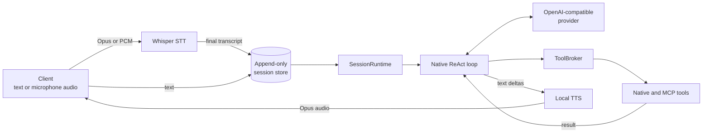

# Gateway

Bun/TypeScript voice gateway for Sentient. The gateway is the native host
process: it terminates client WebSockets, owns durable sessions and the LLM
ReAct loop, mediates tools, and streams local STT/TTS.

## Runtime ownership

Each durable, server-minted `sessionId` maps to one `SessionRuntime`; multiple
browser or mobile connections can attach as windows onto that runtime. The
append-only session store is authoritative for both model context and client
conversation projections.

For each user or background-completion stimulus, `SessionRuntime` starts at
most one turn. `runtime/react-loop.ts` re-reads the store on every iteration,
streams provider text, dispatches mediated tools, appends tool calls/results,
and forces the last allowed iteration to be content-only. Input arriving while
a turn is active is appended first and can steer the next iteration; input not
consumed by that turn starts a back-to-back turn.

Hermes is not the runtime. `delegateTask` may invoke Hermes as a bounded,
one-shot background subprocess. Its completion returns later as a session
stimulus and may start a new turn.

## Live pipeline



- **WebSocket:** `/api/v1/ws` carries live input, `turn.*` output, TTS audio,
  permissions, task state, delegation progress, and resume coordination.
- **STT:** the native gateway dials whisper-stt at `ws://127.0.0.1:8768`.
  The service owns VAD, semantic turn detection, and transcription. The gateway
  downsamples PCM input to 16 kHz when needed; Opus input is forwarded for
  service-side decoding.
- **TTS:** the native gateway dials LocalTTSService at
  `ws://127.0.0.1:8770`. Text is sent over JSON control frames and audio returns
  as binary Opus at 48 kHz.
- **Provider:** the native ReAct loop calls the configured OpenAI-compatible
  provider directly.
- **Tools:** `ToolBroker` enforces role, per-tool policy, capability, validation,
  and timeout boundaries. Model output is never authorization.

## Turns and cancellation

The wire unit is a turn (`turn.started`, `turn.text.delta`,
`turn.completed`, `turn.aborted`) identified by `turnId`.

Barge-in and explicit interrupt both abort the in-flight turn, stop that
session's TTS, and emit `playback.stop`. The committed partial is marked with
the corresponding cutoff. Neither gesture cancels background delegated work;
its completion can still return as a later stimulus.

A new turn never flushes earlier audio. Clients queue turn audio in order and
flush only on `playback.stop`.

## Session and transport lifecycle

1. The client connects to `/api/v1/ws`, authenticates, then sends
   `session.configure` with a stable `deviceId`, required `clientType`, and
   optional conversation/resume state.
2. A connection either attaches to an existing durable session or remains a
   draft until its first message mints a session.
3. Session-lane frames are allocated once in a session-scoped journal and
   fanned out to every attached window. Connection-lane handshake/control
   frames are not sequenced or journaled.
4. A reconnect presenting the same journal epoch and a contiguous cursor gets
   verbatim replay. Otherwise it receives a fresh committed snapshot.
5. A runtime remains resident while a window or observable work holds it, then
   expires after `session.retention_ms`.

REST currently implements only:

- `GET /api/v1/sessions`
- `GET /api/v1/sessions/:id/messages`

Conversation activation remains a lightweight WebSocket control; clients load
that session's history through the messages route. See
[`../shared/protocol/WIRE.md`](../shared/protocol/WIRE.md).

## Deployment

The gateway runs natively on the Mac host. Production uses a compiled binary
supervised by `launchd`; upgrades use the health-gated flow under
`deploy/mac-prod/`. The gateway's system orchestrator supervises native addons
and Docker-backed MCP/infrastructure dependencies. Addon access is through
loopback or the configured ingress path, not Docker DNS.

## Configuration

Operator tunables live in [`config.yaml`](config.yaml). Important sections are
`session`, `orchestrator`, `stt`, `tts`, `access`, `store`, `providers`,
`mcp_catalog`, and `managed_services`. Provider credentials remain in the
secrets store rather than this file.

## Commands

```bash
bun run dev       # gateway only; bun --watch performs a full process restart
bun run test      # gateway tests
bun run build     # production build
bun run typecheck # TypeScript strict check
```

The repository-root `bun run dev` starts the local stack. Never use
`bun --hot` for the gateway: hot reload preserves in-process supervisors and
can duplicate managed services.
