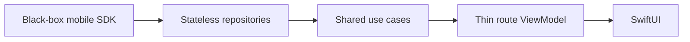

# Sentient — iOS client

Native iOS client for Sentient (the family voice assistant). A **thin SwiftUI UI over the
shared KMP SDK** (`shared/mobile-sdk`), linked as a SKIE-processed **XCFramework**
(`MobileData`, which re-exports `mobile-sdk`). Transport, session/audio state, reconnect,
opus, and logging live in the SDK — this app is UI + scopes + navigation only. STT/TTS are
server-side; no on-device wake word in v1.

- **Project:** `ios/SentientApp.xcodeproj` · **scheme:** `SentientApp`
- **Version:** `1.4.0` (`CFBundleShortVersionString` in authoritative `project.yml`)
- **Deployment target:** iOS 18 (some views carry iOS-17 fallbacks).

## Architecture

Layering — dependencies flow inward only:



- **ViewModels are thin** — per-screen + view-local state only. Stateless repositories
  pass through SDK surfaces; shared usecases fold `SdkEvent` and combine `timeline`,
  full-state `tasks`, and the VM-owned optimistic cache. Kotlin `Flow` bridges through
  SKIE as `AsyncSequence`; a VM never touches the SDK or a repository directly.
- **A conversation is a route.** The root `ChatView` is keyed `.id(activeSessionId)` inside a
  `NavigationStack`; changing the active session rebuilds the view → a fresh `@StateObject`
  VM. That recreation IS the per-screen cleanup boundary — never reset state in place.
- **Three scopes:** App (token/backend/display name) · **Connection** (`UserSession`
  `@StateObject` — the KMP SDK + `ChatComponent`, held ABOVE the `NavigationStack`, alive
  while authenticated so navigation never drops the socket) · Screen (the per-route VM).
- **Presence:** a `scenePhase` relay (`UserSessionHost`) forwards foreground/background with a
  cold-start skip. Background keeps the socket; foreground sends a one-shot liveness probe and
  reconnects only if it's dead.
- **Optimistic send:** `OutboundCache` is per-conversation, VM-owned, and in-memory.
  Entries remain queued until their exact `pendingId` echo, fail after 10 seconds
  unechoed, and are resend-safe because the gateway deduplicates by `pendingId`.

## Layout

```
ios/App/
  SentientApp / RootView / Nav/          @main, auth gate, UserSessionHost (scenePhase)
  Session/UserSession.swift              connection scope over the KMP IosUserSession
  Chat/                                  ChatView/ChatViewModel + composer, message list,
                                         bubbles, tool pills, drawer, banners, voice, brand
  History/                               HistorySidePanel + HistoryViewModel
  Theme/                                 Dusk tokens (mirrors the shared design tokens)
  SDK/                                   AppConfig + KMP bridge glue
```

## Build & run

The app links the `MobileData` XCFramework, so rebuild it after any change in
`shared/mobile-sdk` or `shared/mobile-data`:

```bash
source scripts/env.sh
./scripts/ios-setup.sh   # build/copy the debug MobileData XCFramework + run XcodeGen

xcodebuild -project ios/SentientApp.xcodeproj -scheme SentientApp \
  -destination 'generic/platform=iOS Simulator' build
```

**Always build SIGNED.** Never pass `CODE_SIGNING_ALLOWED=NO` — it strips the keychain
entitlement and breaks WebSocket auth on device. Point the app at a gateway via the
`GatewayWSURL` build setting / in-app backend resolution (local default: the dev gateway
on this host — see the root `deploy/` docs).

## Testing

- **Unit:** `xcodebuild ... test` for Swift VMs/platform boundaries, plus shared KMP tests;
  use controllable async seams and never a real network in unit tests.
- **UI regression:** XCUITest targets `accessibilityIdentifier`.
- **E2E:** checked-in Maestro flows under `qa/mobile/flows/ios/`, run with
  `./qa/mobile/run-e2e.sh ios --tags ...` against the real local stack. Record simulator or
  harness gaps in testing knowledge rather than silently treating them as passes.

## Rules

Read `.claude/rules/ios.md` and `.claude/rules/mobile-shared.md`; follow their linked
detail files under `agents/docs/` when a rule needs expansion.
